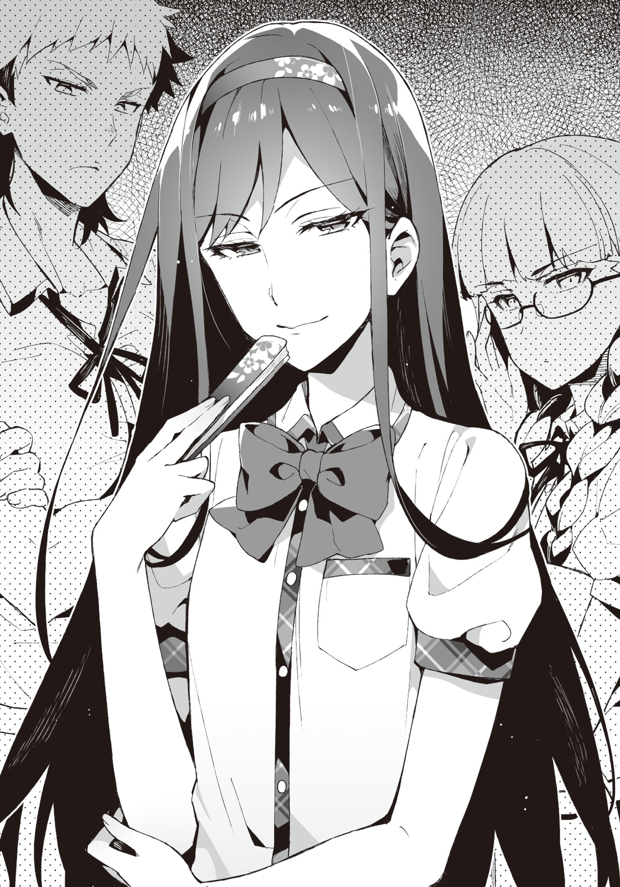

# Chapter 1: Please listen to what I have to say!

### Part 1

It was early summer.
It wasn't that hot since it was the morning, but it'll slowly get worse from here.

It was not yet time to start the AC, so without wind coming in through the windows, the classroom would become too hot to concentrate properly.

"Electric fans are the best for this temperature, right?
Wish they installed them."

Ayame, who walked together with me to school, said so after passing through the school gates.

"The strong winds of a circulator is also good.
Well, even electric fans would turn over the pages of the textbooks or notebooks, hindering concentration."

Plus, it's okay while sitting inside the classroom, but during break time the girls will be troubled with the fans playing mischief on their skirts.

Boys being boys, would also do the "We are aliens" gig in front of the fans.
No doubt there.

> _TL Note:_ "Wareware wa Uchuujin da" or "We are aliens" gig is when you keep an electric fan running and let it distort your voice. You must have done it when you were small. xD I remember this scene from Denpa Onna to Seishun Otoko. Basically, something elementary school children would love to do.

"Wish the season to turn on the AC comes fast."

"Wait, where did you even go while skipping classes during our first year?
Wasn't it hot everywhere?"

"I'd mostly be in the infirmary.
It was really cool and comfortable to sleep."

Oh, there was that option too.
Not that it's useful for me.

"How did the health teacher not bat an eye at you skipping classes..."

... Long story short, the health teacher also was also scared of her, so she had to hold out.

"I-it's not like I was a hindrance.
I left the bed whenever someone who was actually injured needed it."

"Is that so."

We reached the entrance while talking about Ayame during our first year.
After changing to indoor slippers in front of the shoe lockers, we headed towards the classroom.

"Whew..."

"You always get nervous right before entering the classroom these days."

"No, I mean..."

"It's fine, just get in already!"

After being forcefully pressed on by me, Ayame opened the door and entered the classroom, still with a cramped face.

"M-Morning"

She greeted everyone reservedly.

Then,

"M-Morning, Ayame-san." "Morning, Ayame-san." "Mornin' mornin'!" "Good morning."

Nishihara, Class Rep and the other girls, and

"H-hey, morning." "'Sup." "Again with Aramiya, I see. It's become all natural now, eh."

Matoba, Mikamoto and other boys among the classmates replied back.

Since Hatsushiba's announcement (The boys secretly called this event "Hatsushiba-on-stage"), their attitude towards Ayame had softened to the point of them being able to exchange greetings.

Ayame herself still wasn't used to this, and many classmates were throwing puzzled looks, but it was decent progress.

"Haha, it really feels nice when people return your greeting.
Thanks a lot, Aramiya."

Ayame told me in a voice audible to only me.

"It's fully thanks to Hatsushiba though.
I didn't really do anything."

"No, you created the chance for Yuuka to act.
So I'm thankful to everyone."

She then headed towards her desk with light footsteps.

Well, it's all good if Ayame is happy.

&nbsp;

The fourth period ended, and the sun was about to ascend to the highest point.

It was lunch break, and more than half of the classmates had run off to the canteen or school store.
The rest were relishing their lunch by sitting across their familiar friends and opening up lunch boxes.

Glancing out of the window of the classroom, one could see the strong sunlight flooding the cloudless sky.
If used as an eroge background, the blue sky would have seemed like the artist had cut corners.

Although it was already monsoon, there was little rainfall this year.

"Ah-☆ Tasty~"

A nonchalant voice entered our ears.

The source was Suwama Ibu, who was holding a vibrant lunch box with a happy expression.

The twintails made of blonde curly hair had an amazing volume.
The hair clips tying them were shaped like candies, inducing a fairytale-like atmosphere.
There were star-shaped marks on her nails, and the accessories on her uniform and fingers were all over-the-top.
It was a figure of a very modern gal.
If it wasn't for our school, the public morals committee would definitely have been exasperated at her get-up.

"... Isn't this a heavy atmosphere?"

However, my close friend, Tozaki Keita was making an awkward face beside me, looking at Ibu who was acting merry for no reason.
Although it was a rarity to see him bring his own lunch box, the chopsticks holding his side dishes were mildly shaking.

"Is that so?"

Beside him, Hatsushiba Yuuka had a sour look on her face.
Her displeasure was apparent.
Tozaki who was sitting beside was making a painful face, as if unable to bear her curt tone.

"Suwama, you seem very happy while eating."

Ayame, lined up next to Hatsushiba, was likewise eating her lunch.

Sticking together two desks, we were enjoying our lunch boxes, sitting in a circle.

... However, Hatsushiba alone had a facial expression baring hostility.

I remembered how Tozaki had shuddered when Hatsushiba proposed having lunch together.

From the beginning, Hatsushiba was thinking about Ayame first and foremost.
And, Ibu could only be seen as an enemy who had tried to harm us before.

"Hatsushiba-cchi, the food will taste bad if you make such a scary face?"

"Please don't worry about it. This is how my face is."

Hatsushiba was making a face unfit for a voice actress at Ibu, who was oblivious to the disgust directed at her.
Was it an act?
Or was it her characteristic?
Scary...

"Ehh, really? Even though Hatsushiba-cchi is so cute..."

"... I'm not cute."

"Muuu. Let's be good friends! It's more fun that way, right?"

"......"

Hatsushiba looked like she'd get the popped-out-veins effect if it were an eroge.

Tozaki and Ayame, probably sensing that atmosphere, kept their mouths shut.

I was also keeping quiet.
Mob characters don't speak up while heroines are prattling among themselves.
By just speaking up to provide information that can become hints, they hit their assigned dialogue quota.
I also want to be like that.

"Come on, Seiichi~, you also tell her something!"

... Is how it should have been, but why did this girl have to stab at me...

"Don't know. Do something by yourself."

"You meanie!"

It's not my responsibility anyway, you reap what you sow.

> _TL Note:_ Learned what the above proverb is in Japanese: it's 「身から出た錆だ」, which literally means "it's the rust from your body".

That being said, this dicey atmosphere while eating did not do Ayame (her reputation) any good.

While the misunderstandings of our classmates had been resolved, her image in the entire school had not changed that much.

Although, good rumors were just starting to float around, and joint classes like Physical Education had helped improve Ayame's impression among the neighboring class.

Eating lunch together was to prevent the classmates from relapsing to the misunderstandings, it also had the effect of warding off the worsening of her impression on students from other classes.

Therefore, it was quite likely that the countenance of eating as if it was the last supper might create some improper rumors about Ayame again.
Plus, the food also became unappetizing due to the atmosphere, which caused our feelings to go down.

"... Hey, Hatsushiba."

"... What? Aramiya-kun?"

It was a bit scary. Her sullen aura was piercing through my skin.

I started regretting talking to her. However, giving up midway wasn't an option.

"Can you just be a little accommodating?"

I timidly said as if fumbling around.

"... I'll be careful if Aramiya-kun says so."

"It's a request from me as well, Yuuka"

"I can't turn down Cotton's request... but..."

It seemed like she still wasn't fully convinced.
She showed a troubled attitude while furrowing her eyebrows.

Still, her expression more or less softened.

"Mhm, Hatsushiba-cchi is a cutie~☆"

"Nope, not really."

Well, Ibu kinda ruined it though.

After all, we finished our lunch boxes midst the uncomfortable atmosphere.

"Aramiya-kun, can we talk?"

Hatsushiba secretly whispered into my ears as soon as we returned the desks to their original positions after finishing lunch.

"Y-yeah, sure."

There was still time before the lunch break ended.

The place where Hatsushiba led me to was the landing of the stairwell in the edge of the school building.

"Hey, Yuuka still hasn't consented to having that girl in our club."

"It's apparent on your face."

Hatsushiba pouted a little at that remark.

It was a little amusing, like a kid.

"Why did you let her in?"

"Hatsushiba must also have noticed already... the weirdness of the rumors floating around last time."

rumors like Ayame loving to take part in orgies, or eating up girls regardless of gender.

It was unusual how it had spread through all of school in the blink of an eye.
It was not normal how fast it spread out, and how easily people believed in it.

"I understand that, but... wait, didn't she say she wasn't behind spreading it around?
Is it really necessary to let her in..."

"It is highly probable that she spread that rumor, while not realizing it herself."

"So you want to say she just acted as an intermediary?"

"That's right. Or maybe a middleman.
That is, she might have caught the virus and just spread it around.
In that case, the problem is the source of that virus."

"Perhaps, there's someone close to her who is intentionally spreading rumors about Cotton?"

"It looks like that to me.
Since they're hiding this skillfully, it'll be hard to sniff out their tail.
However, that girl is needed to figure out the culprit and their reasoning."

"But in that case, isn't it unnecessary to have her enroll in our club?
It should have been enough to just be careful around her..."

"Ayame also said this, right?
It is unclear what that girl will do if we leave her out of sight, so it's safer to take her in.
Then there would be no worries of her doing anything strange.
It would be unbearable if she turned into a vector like a mosquito carrying malaria or a black rat."

"Muu-"

I did explain my reasoning for the time being, but Hatsushiba's expression was still clouded, as if not entirely convinced.

She really didn't intend to forgive her that easily.

Ayame looked like she already reached a decision.
Sometimes the surrounding people get more heated up about things like rumors and injuries, after all.

"...Hey"

Suddenly Hatsushiba let out a quiet voice.

"Hmm?"

"That person was Aramiya-kun's first love, right?"

Don't remind me what I don't want to remember...

"Y-yeah, well... she's the girl that didn't show up after calling me to a faraway park via a love letter..."

"Yeah, I heard that.
Suwama-san sent out that love letter, but she herself was being tricked, right?"

"She is a complete idiot who never even thought about her actions."

She believed in the "that'll make everything go well" spell... to believe that calling one to a faraway park, making him catch a cold, and then not talking with him at all completed an engagement, was clearly ridiculous.

However, that girl had believed in that.

There was no way of describing this person other than an idiot... you could sugarcoat it into "pure" I guess.

"Umm. It isn't like... you can't forget about her, right?"

"What?"

Hatsushiba's words were incomprehensible.
Understanding them took some effort.

"You don't want to reconcile since the misunderstanding was resolved, or something?"

"That's impossible, you know?
Not even in jokes.
I have severed all connections with 3D."

"... Really?"

"You're doubting me too much.
First of all, what do you mean by reconciling?
We didn't have that kind of a relationship during elementary school.
The talks about engagement and so on are her arbitrary delusions."

In actuality it was mutual love, but it was that.
The saying pops up in not just eroge, but also RL.

First love doesn't bloom.

I myself didn't have any romantic feelings for Ibu anymore.
First of all, love during elementary school is as fleeting as measles.

"Then it's OK."

Hatsushiba heaved a sigh of relief.

However, she pointed her index finger at me, as if not letting it go yet.

"But, Aramiya-kun must not decrease his time with Cotton."

"How did Ayame pop up in this conversation?"

"In terms of priorities, please follow the order of Cotton, Yuuka, Suwama-san."

"Wait. What priority are you talking about..."

She's probably totally misunderstanding something.

Everyone was trying to fill up my outer moat... do they want to tear down my castle that much?
It seemed like they would invade and fill up the inner moat as well if I was in a daze.

"Still, I don't think it is necessary to have her in our club just for the reasons Aramiya-kun gave."

"You're still saying that..."

"Well, that's because..."

She still had complaints even after explaining so much.
It felt more like she was sulking, but Tozaki would probably say "That expression is also cute!" or something.

"Letting her in was also for a few more things.
To protect our room, and to make sure the before hostile Ayame and Ibu are together, as that would be convenient for purging the rumors..."

As I had mentioned before, it was important to keep her under our watch.

But that wasn't all.

"The culprit might also try to use Ibu again.
It would be the best if we can pin them down at that time."

Hatsushiba just tilted her head quizzically.

Well, the other side would also not move until the excitement died down.
It was fine if they didn't show up during the first semester too.
In that case we needed to wait patiently.

As we returned to the classroom, Ayame and Ibu were chatting like friends for some reason.

"I think this year's popular summer coord is going to be a refreshing one-piece~"

"What is summer coord?"

"Coord is short for coordination! As in, the dress most fit for summer!"

"You seem knowledgeable about those stuff."

"Of course! All girls love fashion. Appearance is important!"

"Depends on the person, right?"

"Apart form that, there's also overalls, natucute frill blouses, or girly one-pieces~"

> _TL Note:_ Okay okay wait. What are these terms even. If you are interested in learning more, just google these. I have zero idea about fashion words in Bengali, leave alone Japanese lol. But well, for your curiosity, here are your [Overalls](https://ryuryumall.jp/onlineprod/1P/1000594/1000594_01_700_700_700_700.jpg), [Natural Cute Blouse (without frills)](https://base-ec2.akamaized.net/images/item/origin/d352f7925810cd312965387982e43b34.jpg), [Girly one-piece](https://base-ec2.akamaized.net/images/item/origin/e33df62b26e3b72fde06aa1d1a67c5d9.jpg).

"... What is that? Some sort of incantation?" 

> _TL Note:_ IFKR?

Well, it looked like Ibu was one-sidedly talking to Ayame.

"Ayame-cchi's hair is suuper pretty, so those types of clothes will definitely fit you~"

"Don't touch me."

"Ouch. No U~"

Ayame slapped Ibu's hands as she was trying to touch her twintails.

"Come on, you won't lose anything by just touching~"

"I don't like being touched by people."

Leaning in and acting all clingy.

Really, Ibu is really friendly with everyone. There are people who like that about her too.

Actually, a lot of things had happened (like the exposure of my past or her suspension), but Ibu's reputation was recovering little by little.
Some of the guys would secretly blush while talking too.

Not to mention though, if the incident about her trying to reverse rape me got leaked, our classmates would probably all be shocked. Although there might be some with strange tastes who would like it.

To each their own.
Everyone has different tastes.
Denying them is the same as denying my own inclinations.

It was needless to say though, I couldn't comprehend them.
Keep your mouth shut, silence is money.
The people from old days have spoken wise words.
It was understandable that they would be quoted in eroge.

"Ah, Seiichi, welcome back~"

"Oh, did you finish talking with Yuuka?"

"Yeah, we're done. Rather, aren't you guys pretty friendly already?"

"This girl just keeps talking occasionally."

While making a troubled face, Ayame didn't look like she disliked it that much.

"Ibu has also become pretty attached to Ayame..."

"Yeah, because I like Ayame-cchi!
I'm also jealous since she would become cuter if polished~"

Ayame was a bit troubled at being directed good will, but she didn't seem to completely dislike it.
Otherwise she would have glared daggers at her anyway.

It was also possible that Ibu did a full 180 from disliking Ayame to liking her that much.
It's said that like and dislike are two sides of the same coin, after all.
"The exact opposite of liking is to act indifferent."
A line used in a myriad of eroges, was apparently due to Mother Theresa.

While Ibu and Ayame were getting along with each other, new bad rumors about Ayame would not start spreading.
It was a good thing.

"Hmph!"

Nevertheless, Hatsushiba was still cold towards Ibu.
She also probably had something to say to Ayame, who was (to onlookers) having fun while talking with Ibu.

That being said, she was happy that Ayame was having fun; it was probably complicated.
She probably felt like a mother who was uncomfortable seeing her daughter starting to go out with a delinquent.

Both Ayame and me have gotten over it already; it would be great if Hatsushiba could also do the same.

"A woman's feelings are complicated..."

The Tozaki beside me said with a satisfied expression.
You really aren't one to say though?
Don't try to make a face like a playboy with a lot of experience.

Well, I also agreed on the fact. It was really impossible to understand.

The bell rang as we were talking, signaling the start of the languid afternoon lessons.

&nbsp;

"Well then, that's all from my end. Class Rep, if you please-"

With the sugary voice of Oohara-sensei, the homeroom ended with Class Rep's "stand up - bow".
Today's classes were now over.

The class was wrapped up in hustle and bustle as always. "Where do you wanna go today?", "Let's go to the club!", "I'll be late to cram school if I don't hurry" etc - everyone had different goals.

"Let's also go to our room."

"Yep!" "Ya~"

Hatsushiba and Ibu replied to Ayame.

Then, the three girls glanced at our direction.

"Yeah, yeah. Tozaki is also coming, right?"

"......"

Although I asked him so, Tozaki didn't reply, making a difficult face.

This guy must be holding back from saying something.

"Oi, Tozaki?"

"Ah, Ahh. My bad. Club, right? Let's go."

Well, we could leave it for later. Either way he'll speak up sooner or later.

We left the classroom together, as usual. None of us had cleaning duties today as well.

There was nothing in particular to do, but let's go to the club and spend time in peace.
Maybe I could play some eroge after a long time.
It would help heal my heart from the fuss during lunchtime.

"Ayame-cchi! What should we play today~"

"It's hot, don't stick to me!"

While walking down the hallway, Ayame and Ibu were frolicking around as usual, walking in front of Tozaki and me.
Hatsushiba voiced her complaints from beside us.
It was that type of a scene.

Recently, this had become the norm.

"... Hey Aramiya, you got a moment?"

Tozaki called me as if he wanted to say something, when we left the school building for a moment.

He brought it up unexpectedly early.

"Yeah sure. You have something to talk about?"

Tozaki nodded, and glanced at the girls meaningfully.

I could take a guess.

"... Ah. Could you three go ahead first?"

"'Sup sup, going to the bathroom together~?"

"Whatever, go ahead before us. Also, girls shouldn't say that sort of stuff."

"Hey, Suwama. Let's go already."

"Yea~"

Ayame took Ibu to the wing where the literature club assembled.
Hatsushiba also followed, with a curious expression on her face.

Tozaki and I went over to a place where there were no people around. Tozaki had an awkward expression.

"... So, what's up?
I get the feeling that most of the time it's troublesome when you call me to talk."

"Well, yeah.
It's pretty troublesome.
No, this time I don't have a lot of information... but something curious happened."

Tozaki was scratching his head, as if apologizing for whatever he was about to say being too gloomy.

"Is it that again?"

"Yeah, it's that again. Rumors about Ayame are stirring up again."

"What is it this time?
Something like Ayame is an assassin or an amazoness?"

> _TL Note:_ amazon = a big, strong, warrior-like woman, someone who reminds you of the mythical Greek women-warriors, the Amazons. I think in Japanese a woman amazon is made into an "amazoness", but it's not an english word, amazons are women by default.

No, but he did say it's not something too worrisome..

Prompted on by me, Tozaki conflictedly spoke up.

&nbsp;

"Ayame and Ibu are a yuri couple..."

&nbsp;

Yuri.
The perennial flower that resembles a trumpet, gives off a sweet fragrance that can choke you if you sniffed at it.
They come in a variety of colors such as white, yellow, red, or pink.
Personally, I liked white lily the best.

However, for otakus, 『yuri』 was a metaphor for something entirely different.

"By yuri... do they mean girls loving each other?
Like in 『Hitohane』?"

"Yeah, that type.
If you ask me though, I like 『Raspberry Panic』 more."

The anime that gave birth to the phrase "Kimashitawaa". It was also made into a game, if I remember correctly.

> _TL Note:_ I think Hitohane is referring to 2015 eroge called [Kimihane: Kanojo to Kanojo no Koi Suru Ikkagetsu](https://vndb.org/v16377), Raspberry panic to [Strawberry Panic](https://vndb.org/v965).

> _TL Note:_ Okay now what is "Kimashitawaa"? You can read a pretty descriptive explanation [here](https://dic.pixiv.net/a/%EF%BD%B7%EF%BE%8F%EF%BD%BC%EF%BE%80%EF%BE%9C%EF%BD%B0). Basically "Kimashitawaa" was used by [Suzumi Tamao](https://vndb.org/c26899) in only a scene, as a substitute for "Kitaaa"/"KTKR" which means "It's here!"/"It came!" in english. Well, apparently it's now a slang that can be used when you find out that one of your woman friends is in love with another woman (or a trap). Kinda like a substitute for ["Ara^~"](https://dic.pixiv.net/a/%E3%81%82%E3%82%89%5E%E3%80%9C) (when two girls do kyakya-uwauwa). Research it more on your own if interested. xD

"Why such a rumor again..."

"Probably because the two flirt with each other a lot?"

"But don't other girls also frolic around to a similar degree?"

"That's why I was curious about it."

Only a sigh could come out.

Well, I understood why Tozaki was hesitating to talk about it.

"Has it spread a lot?"

"Well, to some degree...
It started propagating very fast when I noticed."

"SMH. Is that all you had to talk about?"

If it was just about that, he probably didn't have to bother about it that much.

At least it didn't worsen Ayame's reputation.

"It's only that much... but is it really OK?"

"This time should be fine, right?
It'll probably calm down very soon.
Plus, it's not something that portrays Ayame as a scary person."

"Previously there was a rumor about her eating up boys and girls regardless of gender, remember?"

"But, if it's yuri, then it's not that much of a minus point."

"I feel like that only applies to otakus though..."

"... Well, anyhow.
It's a problem between those two; we can't really do anything about it.
We can ignore it since there's no real harm.
I guess we could ban her from being pushed by Ibu's flirting, but that's pretty much it."

We headed towards the club room as Tozaki looked like he was convinced for now.
After all, Hatsushiba could become scary if we didn't return as soon as possible.

Still, what club are we again?
Well, there was no mistake in saying that it was a gathering to exterminate rumors about Ayame though...

We headed towards the club room after finishing our discussion.

"C-Can I have a moment?"

Just as we were about to enter the club room, an unfamiliar boy spoke to us.

Somewhat gloomy, it felt like he was more like one of us, than not.
However, he wasn't an otaku; he didn't give off such a vibe.

Tozaki was shaking his head.
If they weren't acquaintances, just who was this guy?

"... Me?"

"Yeah, I have something to ask you..."

He was making an embarrassed face.

It seemed like he was about to confess or something. No no no, stop it please...

After a few seconds, he spoke up as if he had straightened his resolve.
With an expression resembling that of a samurai about to challenge a once-in-a-lifetime battle,

&nbsp;

"Is it true that Ayame and Suwama are gay for each other?"

&nbsp;

It was an astonishingly idiotic question.

It was sad that there were people who believed in the rumor we were talking about earlier.

"Nope, not at all. Where the heck did you hear that from?"

"N-no, people were talking about it, so..."

"What people?"

"P-people as in, my classmates and such..."

Apparently he's from our neighboring class.
Probably they had seen the two during the joint PE classes.
If they were frolicking around during the girls' PE classes, then it may have permeated from them to the boys...

"It's totally a groundless rumor. Anyway, what's wrong if they were gay for each other?"

"Umm, n-no, it's nothing. Sorry about that!"

The guy sped away.

"Just what was that about?"

Tozaki shrugged.

"Aramiya. I can only get a bad premonition out of this."

"Your premonition might come true, so don't raise the flag..."

&nbsp;

As we entered the club room after wrapping up the pointless and questionable matter, we noticed Kiyomi inside, along with Ayame, Hatsushiba and Ibu.
She was silently sitting in her chair, probably already finished with greeting the others.

Other than them,

"You guys arrived at last."

A rare sight was awaiting us.

"Kotani-sensei?"

Tozaki reacted as if he received a sneak attack.

Kotani Kiriko.
This is her second year as a teacher here, joining right after graduating college.
She taught physics.
And, she also was my cousin from mom's side.

With her suits on, she looked like an up-to-the-task OL.
Fundamentally she's a lazy ass, but her impression in school is that of a nice and cool teacher.
She has everyone tricked.

"What's it, Tozaki? Is it weird for me to show up?"

"N-no,... you're very welcome, ahaha..."

"What's up with that awkward expression, Aramiya?"

"No, nothing... you're our advisor, so there's nothing wrong with you being here, Kotani-sensei."

One should act with discretion in front of other people. At home we call each other Seiichi and Kiriko-nee, but she was probably paying attention to the fact that we were in school.

"So, do you have some business here?"

"Since I'm your advisor, normally I should be here, right?
Well, I'm also here to observe you guys so that you don't do bad things."

> _TL Note:_ Like playing eroge.

"What bad things are you talking about?"

"Several things. Such as illicit sexual relationships and stuff."

Then, she glared at me. Even though there's nothing like that.

"Well, students smoke or bully each other in places where our eyes cannot reach.
The teachers are also being more vigilant now.
Since the blame always falls on us when such incidents happen."

"You don't really need to worry about stuff like that here."

Please turn a blind eye to the 18+ games here.

"Even then. Some of the teachers are making a fuss about things.
Especially, there are people who say 『a club for games is outrageous!』"

"Are they living in caves?
Recently e-sports are also getting popular, so it's nothing out of the ordinary.
Rather, if there are two separate clubs for baseball and soccer, then there should also be clubs like 『LoL Club』 or 『Starcraft　Club』."

Well, we didn't do e-sports though.

"Well, if this club has anything to do with e-sports, I'll talk about that to them though."

"......"

"But still..."

Kiriko-neesan looked over the club members present in the room.

"This is a very strange lineup."

Now that she said it, there really was no uniformity among the members.

"In the end, what do you guys primarily do here? Not gaming, right?"

"We're focusing on exterminating rumors about Cotton... Ayame-san."

Hatsushiba informed thus with a nervous look.

"Ah that's right, I heard you guys were looking to offer assistance to us a while back.
Are you still doing that?"

"Yeah. The misunderstandings have only been cleared up among our classmates, so..."

"So is it fine if I bring over some of the teachers' work to you?"

Hearing that, Ayame raised her hand.

"Bring in as much as y'can... you can!"

Kiriko-neesan lifted her lips up into a smirk. Damn, this is a bad omen!

"O-oi, Ayame?"

"Aramiya. Ayame herself is asking me to assign work. You don't have to worry about anything?"

With an angelic smile on her face that read "leave it all to me!"

However, I could see through her facade... to the devil deep inside this person.

"Yes, please!"

The ignorant Ayame said so vigorously.

... SMH, this is why I was trying to resist.
My feelings were heavy, anticipating what kind of work she would have us do...

"Well, there shouldn't be anything during the first semester, so you can have peace of mind.
My special duties will start from the next semester.
Do look forward to it."

I was not looking forward to it at all.

Kiriko-neesan left, as if after planting the seeds of unease.

"Hey Aramiya. Did we perhaps end up accepting something troublesome?"

Tozaki seemed to be forcing a smile.

"Did you realize it just now? That's why I was opposing it."

"Then say that earlier!"

"I did so!
You guys are at fault for not see through her real nature!"

Ayame spoke up from the side in response.

"Well, she shouldn't be _that_ absurd, right?"

"Innit? She seemed real kind!"

Ibu was totally in agreement with Ayame. "Kind", eh...

During elementary school when she had learned about my story, she had said "I'll sink them to the bottom of Akashi strait!" pretty indignantly.
Are you sure about your impression, Ibu?

> _TL Note:_ [Akashi Kaikyou](https://en.wikipedia.org/wiki/Akashi_Kaiky%C5%8D_Bridge) is a strait in Kobe famous for sinking several ships in the past due to its severe storms.

... Well, whatever.
Truth speaks silently.
It didn't look like Kiriko-neesan had that much misgivings about Ibu too.

"Rather than that, we must properly think about Cotton's rumors today as well!"

"Yeah, yeah."

While letting the chairperson-attribute Hatsushiba lead the meeting, we started thinking about ways to exterminate rumors about Ayame today as well.

We wouldn't have to go through so much hardship if it was that simple to come up with plans though...

- - -

### Part 2

It was morning.
On my way back from the bathroom, I noticed Tozaki nonchalantly coming late to school.

"Yo, Tozaki. It's rare to see you this late."

"I kinda slept late yesterday... The thing from before got announced, right?"

Of course, the thing from before was an eroge.

Its title was "Ikusa no Yaiba, Yurihana no Kouki".
It was made by the same publisher as "Princess Weekday", the first eroge that Ayame had played.

> _TL Note:_ [Princess Holiday](https://august-soft.com/princess_holiday/index.htm) and [Senmomo](https://vndb.org/v15708) are both famous games made by August. They also made Fortune Arterial (referred to in the text somewhere in Volume 2 too), Yoake Mae yori Ruriiro na, Aiyoku no Eustia, Daitoshokan no Hitsujikai. You must have heard of at least some of these titles... Basically the author is an August fan (as me lol).

"While staring daggers at the site, the day had changed without me noticing.
I think I got a taste of something frightening."

"The release date is still not decided, right?"

"Even then, when it comes to that publisher, your imagination keeps gushing forth...
It makes me excited and gives peace of mind at the same time."

Be that as it may, I couldn't make fun of Tozaki.

Albeit being only a teaser site, it was not unusual to check the source code of the homepage to check for hidden information.

Anyway, it was good that it wasn't getting released in summer.
If it had overlapped with "Destiny Zero", I'd have been troubled for at least a day in deciding which game to play first.

> _TL Note:_ I'm pretty sure Destiny Zero refers to Destiny Night/Zero from Volume 2, but I can't find an eroge that was released in 2016 summer that has a similar sounding fantasy name. Well, when I read it in Volume 2 I was pretty sure Destiny/Night refers to Fate/Stay Night, and this would then refer to Fate/Zero, but that was released in 2013. Well, do let me know if you have an idea on what these games refer to! xD

Is it going to be in fall or winter? Or maybe spring... I'd have to concentrate on it for a week.
Let's prepare for it in advance.

"You are really attracted by princesses after all, Tozaki."

"Yep! They also have a loli character, so they cut no corners."

"Deepen your bonds with the girls, and then fall in love with each other.
There's no words other than 'supreme' to describe it."

"Our imaginations can only run wild till the release date..."

Whispering to each other as if detectives on stakeout, we returned to the classroom.

Then, we were met by a hunch-backed guy blocking our way.

"H-hey..."

It was again another unknown entity.

While it was different from yesterday, he emitted the same kind of aura.
There was no proof, but this person might be an otaku himself.

I looked towards Tozaki for confirmation, but he was just shaking his head.
Then, who was this person?

"...What's up?"

I pressed on as he looked confused.
We'd be late for homeroom if we didn't hurry.

"U-umm, can you give me one of Ayame, Suwama, or Hatsushiba?"

"...What?"

"N-no, other girls are also fine. You guys have others, right?"

Is this person actually an ancient Sumerian, and can't speak Japanese?

Other girls? We also have others? Please make some sense.

"Wait. I don't see where this is going.
Just what are you trying to say?
What does 'give me one' mean?
Do you need help for your club or something?"

"Don't you have many girls serving under you?
Give me some too!"

Wait, is this guy talking about 2D!?
Well, in 2D I've literally crossed the boundaries of harem, let alone having girls wait upon me...

... but it's totally different as Ayame's name popped up.

"I don't know what you're talking about.
What was that even?
Where did you hear that rumor?"

"E-everyone is talking about it."

That again... Is there someone named "Everyone" in the school?
Almost like America, that person's name has been popping up a lot recently.

I laid my gaze on the guy in front, after heaving a deep sigh.

"It's a baseless rumor.
Tell that to the person named 'Everyone' as well."

"Wait, am I not good? Do you have some Terms and Cond..."

"BASE-LESS-RU-MOR."

Under my forceful declaration, he shut his mouth while being quite discontent.

Tozaki and I continued towards the classroom, walking around the guy who hung his head.

"What was that about? Isn't it a bit strange ever since yesterday?"

"Well, it does sometimes look like Aramiya is being served by the girls..."

"... You serious?"

"jk lol.
If that was enough to look like you were being served, then our classmate Mikamoto Atari would be a harem king.
The person himself is apparently troubled that he gets friendzoned, though."

That's right...
Mikamoto was now frequently talking midst the girls, all of a sudden.
It wasn't like he was popular, but probably he could talk about topics that girls like, and would get dragged into their conversations.

While we were walking with an unease lingering in our hearts, some other guy was standing in front of us.
Of course, neither me nor Tozaki knew this person.

"C-can we talk for a moment?"

"... Not again."

"A-again?"

"No, nothing. What do you want?"

Suddenly taking out his wallet from his pocket, this person pulled out a 10,000 yen bill.

While we were confused by his action, he suddenly offered me the money.

"Please show me a scene of those two entwined with each other."

... The request had exceeded my brain's comprehension capacity.

Who were 'those two'? What did 'entwined' mean? For what was I being offered money?

"Wait, I don't quite understand... Can I ask you to elaborate?"

"N-no, aren't Ayame, Suwama and Hatsushiba your girlfriends?
I heard you make them entwine with each other and have opened up an appreciation..."

> _TL Note:_ Don't exactly know how to phrase this, but apparently our protagonist has opened up a hell of a sketchy business...

The abnormality of this situation was clearly standing out.

So, did this mean that a rumor about me being served by many girls had osmosed or something?
That can't be it, right?

"That's why... I'll pay, so please let me participate in the appreciation event!
If you need more money, I'll pay later!"

The guy started pressing on even more desperately.

"Don't you guys even think that the rumors are false, huh?!"

"E-everyone is talking about it!"

Everyone, Everyone, Everyone, Everyone, Everyone, Everyone, Everyone!

What the hell, could white become black if Everyone said so!?

I somehow controlled my urge to drive him away right there right then.

"... What kind of rumors is Everyone saying?"

While subduing my temper, I somehow wrung out that question.

The guy immediately spoke up without hesitation.

"While making Ayame and Ibu violate each other, you enjoy the scene of them being entangled."

&nbsp;

This was too much.

For just a meager otaku, that rumor was far estranged.

"It's all a complete lie."

I brushed away the hand that was still offering me the bill.

He put his money back in the wallet regretfully.
If you really want to see yuri scenes that much, just buy eroge.
"Sono Kaben ni Kisu wo" or "Hitohane" have very pleasing visuals.
Other than that there's also "Miko wa Kannushi-sama ni Koi Shiteru", albeit not exactly vanilla yuri.
Eroge titles are just overflowing with yuri!

> _TL Note:_ If you haven't guessed already: [Sono Hanabira ni Kuchizuke wo](https://vndb.org/v917) (EN: Kiss on the petals), [Kimihane: Kanojo to Kanojo no Koi Suru Ikkagetsu](https://vndb.org/v16377) (EN: Kimihane: The one month of girl in love with girl), [Otome wa Boku ni Koishiteru](https://vndb.org/v195) (EN: The maidens are in love with me).

Driven by some strange indignation, I headed towards the classroom.
Tozaki also followed suit without hesitation.

"Damn."

To think that the rumors would involve even me.

It was unbelievable how Ayame could keep up with such stupid rumors.

That being said, people should not be believing such made-up stuff that easily...

Rumors are fundamentally people believing in credible statements.

Me forcing Ayame and Ibu violate each other should be scarcely credible.

"Is there any basis... for such rumors to spread?"

"Well, maybe recently... you've been on good terms with Hatsushiba as well."

"Nah, then aren't you the same?"

"However, you're seen together with Ayame who underwent a sudden change in character.
And there was also that argument with Suwama..."

It was hard to disagree when being said that.

I was definitely the reason behind the transformation in the frightening delinquent that Ayame used to be.

That I also was the reason behind Ibu's change was also engendering.

I was aware that those two held a certain respect towards me.

Especially when a ruler (of terror) admires someone else, there's a tendency for the other person to be feared as well.

I ended up being acknowledged, in a bad way.
The me, who was just an uninteresting otaku.
I was supposed to be standing in a much less conspicuous position...

"On top of that, the rumor of those two and Hatsushiba being yuri could easily tangle up, leading to this rumor, right?
Although it's as far-fetched as it could be..."

While listening to Tozaki's explanation, I was regretting we didn't immediately take action when that rumor had popped up.
We had totally failed in taking the initiative.

Even though the rumor concerned us, we had naively underestimated it...

After the classes ended, we met up with Kiyomi and headed towards the club room as usual.
There were strange gazes upon us.

No, the fact that we were feeling gazes itself was unusual.

This club wing was an area only used by the literature club, so there should be few people walking around here.
So only known faces would pass by each other here.

However, today people who we would normally not see, were stealthily loitering around.
As if waiting for something.
They looked like detectives on stakeout peeking around while concealing themselves, or like snipers completely blending into their surroundings.
Their behavior was extremely unnatural.

As soon as we entered they club room, they started showing signs of flurrying around.

"Is there some sort of event?"

Ayame sent a quizzical look towards the door.

Maybe something like the final club joining event of the semester...
Nah, impossible. That was far too optimistic.

"I haven't heard about such a thing, Ayame-san."
"Yeah, they didn't say anything during homeroom either."

Kiyomi and Hatsushiba voiced their similar opinions.

Glancing at Tozaki, it seemed like he knew something.

"Do you know something, Tozaki?"

"Well, I asked around a bit during break time.
Some people also asked me questions...
Lend me your ears for a bit."

Ignoring the puzzled looks of the four girls, I brought my ear near Tozaki's mouth.

"You heard about your rumor in the morning, right?"

"Well yeah, I remember it."

『Enjoying the scene of Ayame and Ibu entangled』... and on top of that, 『opening up an appreciation event』...
All of this towards the harmless me. It was depressing.

"And, the venue of said appreciation event is the club room, apparently."

So that was it.

"Because the club room is an enclosed space?"

"You won't get caught if you smoke cigarettes or pot here, after all."

No, cigarettes would definitely be exposed, right?
It soaks into the walls and stuff.
Mom complains about Dad's smoking a lot, after all.

"If it's in a place without people, you can always fabricate whatever lie you wish about their actions..."

One can always say 'aren't they doing X?" and attach some kind of reasoning behind it, if the person in question is out of sight.
That alone was enough to give birth to rumors.
If this X was something that one could see the person doing, or if it was something trivial, then it would start disseminating via gossip.

It was too bothersome.

...However, we had no choice but to endure it for now.
Just like frogs hibernating during the winter, waiting for spring to come.

Gossips last for just 75 days.
Summer vacation would start soon after we pull through the first semester.
The rumor was of the degree that would spotlessly disappear once we entered the second semester

"...There's a lot of footsteps outside."

Ayame muttered so for some reason.
"It is getting kind of bothersome", Kiyomi also flurried her eyebrows.

Listening carefully, one could really hear a lot of footsteps.

It's not as if they could peep inside.
The door was also locked, and the glass on the door was opaque, inhibiting visibility.

However, we could understand that the students outside were unnaturally going and returning.

Does every last one of them want to see yuri so much?
You guys, just make yourselves disappear; I wanna play my <span="ロープライスのエロゲ">low price eroges.

"Say, Aramiya. Isn't this the effect of the rumors?"

Tozaki asked while scowling.

There was no choice but to admit it.

This rumor was adversely affecting our club activities... and had the potential to upset our school life as well.

&nbsp;

We talked about the emergence of the recent rumor to the girls camp, who had yet to hear about it.

Ayame and Hatsushiba had a "not again!" expression, while Ibu was totally unfazed.
"It must be difficult for you...", Kiyomi was consoling Ayame.

"What kind of rumors about me are going around this time?"

"Ayame. People have been saying that you and Ibu are a yuri couple."

Being told that, Ayame rolled her eyes in amazement.
Tozaki also unnecessarily supplemented with "There's also a Ayame and Hatsushiba coupling", which made their expressions turn awkward.

"Do people believe it, Tozaki-kun?"

"Ah, no...
Our classmates do not believe in it as expected, but the permeation outside our class has been quite intense...
It has sporadically spread among our upperclassmen and underclassmen as well..."

"Muu..."

Hatsushiba pouted at Tozaki's answer.

"Since it concerns Ayame who was famous in school till now, and Suwama who stood out right after transferring, it has become kind of a sensational topic.
And they say that you're jealous about it, Hatsushiba."

Hatsushiba turned her eyebrows into a "へ" shape at hearing that.

"However, if the permeation is this fast, then it must be intentional.
We don't know who the offender is, and whether they were also responsible for spreading around the last rumor is also unclear."

At that point, Ibu raised her hands cheerfully.

"Hey hey~ by the way, what is 'yuri'?"

I was about to get a cramp.
At least understand what 'yuri' means.

"I also don't know about it, what does it mean?"

Kiyomi also followed suit.

Well, yuri came under a niche subculture. It couldn't be helped.

"Even I know that it is a flower~
Is it that we're sparkly like flowers?"

I guess if one used common sense, people would think yuri to be just a flower.

"Yuri means women loving each other.
As in, you and Ayame are seen as lovers."

"Ayame-cchi and me?
Eh, but, we are both girls?"

"That's why I said women loving each other.
In other words, since you cling to Ayame so much, that kind of rumors have started spurring."

"Eh-, but that much is normal right, normal~"

...It was just as Ibu said.

Ibu had an inclination to cling to Ayame quite a bit, but skinship of that degree would usually just end at them being good friends.
There were a countless number of girls who got along with each other, after all.
Well there were also couples who were actually suspicious.
Overreacting when jokingly asked about it could lead to people thinking they're actually yuri, too.

"I have no intention to get along with this girl, though."

"Eh~ Ayame-cchi, you meanie~"

"That's why I'm saying, don't cling to me!"

Now that I think about it, Ayame never smiled at Ibu when they were together.
While feeling annoyed, it felt as if she would cope with it reluctantly.

Then again, Ayame showing a smile itself was a very rare thing.

"It's kind of hard to digest that I'm agreeing with Suwama-san, but Yuuka also thinks that this rumor is strange.
It's Yuuka who touches Cotton much more."

For some reason she said so while proudly puffing out her chest.
Don't compete with each other!

"To be clear, that's probably what led to circumstances suitable for the circulation."

"What do you mean?"

"So, if it was just Ayame and Hatsushiba being friendly with each other, then it'd just stop there.
However, since Ayame and Ibu are also getting along, it would become suspicious, right?"

"B-but!"

"No, I understand.
Honestly though, I also think that the possibility of this is quite thin."

As it seemed like Hatsushiba wasn't self-aware of it, I couldn't tell this to her directly, but Ayame, Hatsushiba and Ibu looked like they were in a love triangle.

"Whatever. As long as we understand that it is intentional, we must search for the culprit.
It's also possible that they were also responsible for disseminating the rumors from last time."

"But man, Aramiya-"

Tozaki raised his hand at that point.

"The rumors about Ayame till date were clearly intended to drop Ayame's reputation, but this time it's different,right?
The believability this time is also low, and it's also kind of half-assed in terms of ill reputation."

"Well, that's true..."

Kiyomi interjected as I was being troubled.

"If I'm not mistaken, it seems like they are jokingly insinuating something like 'aren't they very close to each other?', but it doesn't feel like they intend to decrease their reputation.
Since it's between girls."

Well, for girls, leaving aside the real intentions, at least on the surface the popularity among the surroundings would not change that much.
If it was between boys, they would probably show their asses towards them.

"It's a worrisome point..."

Honestly, it felt like it'd be fine to leave Ayame and the girls' rumor as-is, but it was also interlinked with the rumor about me.

Even eroges have events where rumors about the protagonist or heroines, but in general, they would be rumors about someone going out with someone, or about some secret about the heroines.
Basically rumors acted as plot devices.

"... For now, nothing can be done if we don't search for the root."

"You don't sound confident."

"Well, I've never experienced rumors about myself..."

It was quite irritating when Tozaki said so, but it was not possible to capitalize on experiences never seen before in eroge.

"How would we ascertain the origin of the rumors?"

"Rumors are probably like Chinese whisper--"

Just as I was about to give an explanation,

&nbsp;

"An unusual rumor has risen again, right?"

&nbsp;

The student council president, Yaotani Airi entered the room, opening the door.
With her two minions in tow.

"You seem pretty mystified.
Is it problematic for me to come over here?"

"No, not really. And, what do you want?"

"I came here to admire the lovely faces of Ayame-san, Hatsushiba-san, Suwama-san and Aramiya Kiyomi-san..."

She sent a meaningful glance towards the four girls.

"You look unhappy insofar, but I also have a separate case."

Thereupon, she looked towards me.
She signaled me to come out to the hallway, with a big swing of her chin.

I stood up from my chair after understanding her intent.

"Eh, what's up, Aramiya?"

Ayame made a worried face.

"It seems the president has something to talk about. I'll return after we're done talking."

"Then, me as well..."

"There are things we can't talk about with you around, so no can do."

This time she made a lonely face. It's troublesome if you make that face.

"Well then, shall we go?"

Then, we went to the furthest end of the school building.
The two minions were looking out so that others did not come this way.
Almost like the figures of two Nio kings.

> _TL Note:_ Check out this [wiki page](https://en.wikipedia.org/wiki/Nio) on Nio. Copying from Wikipedia, they "are two wrathful and muscular guardians of the Buddha standing today at the entrance of many Buddhist temples in East Asian Buddhism in the form of frightening wrestler-like statues."

Then, while glaring sharply at me,

"I'll ask without beating around the bush.
Is it true that you're violating Ayame-san, Hatsushiba-san and Suwama-san?"

As expected.

"I never thought that the student council president would be manipulated by such rumors."

"So it's all a lie..."

"I feel like it's strange to believe in it in the first place."

"That's right, normally one wouldn't believe in such.
However, the more a rumor explodes, the closer it is to the truth.
It can't be helped that the students get manipulated by them."

"Wow, aren't you generous."

"It's only natural.
Obstinately denying rumors can also lead to loss of many things.
Things such as friendship or love."

"Isn't it unnecessary to keep friendships only of that degree?"

"Feeble friendship or affection can turn deep just from a single impetus.
However, there's nothing once cut off."

"Are you saying it's fine to have false friendships?"

"The concept of friendship isn't uniform among all.
Don't you agree?"

I don't know.
I've never thought about such complicated things.

"Well, it's pretty philosophical, so let's leave it at that.
For now, the rumor is false.
That's all."

"I've taken that to mind.
If you happen to find someone who might be spreading the rumors, please let me know.
And also,"

I closed in towards the president.

"Do you know about the other rumor that Ibu and Ayame are yuri?"

Frankly speaking, I doubted the student council president.

Yuri.

It was exactly the kind of rumor that this person would spread around.

"Of course I do."

"That's your reply, eh."

"Yeah.
In the first place, there's no room for doubt.
All girls are essentially yuri, after all."

... It took me a few seconds to comprehend her words, but didn't she just ram an outrageous theory?

"I'll ask you then...
Why do you think heterosexual love is mainstream in the society?"

"Well, that's because it's impossible to connect blood unless it's a man and a woman."

Not that I understand the significance of connecting blood.
Couples out there in the world, try your best!
That was my stance.

"You're right.
However, not too far in the future we will be entering times when two women can give birth to children.
There are several ethical problems filled up, though.

"... What is it that you want to say?"

It seemed like my head would start to hurt, so I really didn't want to keep her company.

"The common sense that man and woman need to be together, will be overturned in the future."

"Aren't you skipping over too fast?
And I still don't understand what point you're trying to make."

"Let's say that the common sense in this regard was toppled over."

The premise itself was quite complicated.
It was following peculiarly sophisticated guidelines.

"Well then. Men might still choose women.
However, do you think women would still choose men?"

"I don't know, since I don't think our world is going in that direction anyway."

"Try spreading the wings of your imagination.
The relationship between girls and boys hitting puberty is very complicated.
However, girls raise up friendship among themselves.
At that point of time, if the common sense of 'bonding between females is strange' is scattered away by the common sense of 'bonding between females is normal', then you could say it'd be inevitable that their relationship would alter into love."

This is bad.
What should I do?
This person's speech totally went over my head.

Is she probably talking about something super difficult?
Was it philosophy?
Help me, Plato-sensei!

"Even if it's hypothetical, it's too sophisticated for me.
We're in present-day Japan, by the way."

"Good grief.
It's something you would understand if you had just a little bit of imagination.
The times when men's desire of having a lover are fulfilled, would just evolve into one where women will also be able to fulfill their desire.
If that happens, women would stop being infatuated with men, all of whom are vulgar creatures with incomprehensible thought processes."

While I thought that it wouldn't possibly happen, it was also probably pointless to say that to this person.

She was talking already after reaching the conclusion that women should only love women.

She had arbitrarily reached that conclusion totally based on her subjective opinion.
Probably she thought that her experiences were absolute.

Even if I used my own words to convince her, not even a fragment of them would reach her heart.

In eroge they'd immediately comprehend the merit of men from doing it once...
Yuri characters in games with male protagonists almost always yield at the end after all.
That, or they are set to be unconquerable

"With that, let me answer your first question.
One could say that it's the truth that's permeating, and not some rumor, and hence it's obvious that I'd know about it.
You don't have to pay heed to that part...
What's with that face?"

"Nope, nothing in particular."

I would have zero surprise if it was this person that spread the rumors.
Or rather, she could be called the front runner in my list.

The rumor that I had opened up a yuri appreciation business might as well be one of her slick ploys to separate me from Ayame.
Or maybe it was in preparation for bringing Ayame under her command.

"I feel like the intention behind the rumor is to forcefully kick us out of the club room"

"Ah, I see. That would be a good method."

The student council president made a slim smile.

It was very fishy...

&nbsp;

"It might be the president who is spreading such rumors..."

As I said so after returning to the club room, Tozaki somewhat got my point with an "Ah!".

However, the girls looked like they had absolutely no clue.
No matter how one thought about it, she was a beast extremely dangerous for the girls.
How come did they not have any sense of danger?

From the point of view of girls, she might not be reflected as a poisonous creature.

"Why would the president do such a thing?"

Kiyomi asked in disgruntlement.
It seemed like she believed in the president from the beginning.

... Was it okay to tell them?

Rather, Ayame and Hatsushiba both have recently been at the receiving end of her solicitation, and were probably oblivious to the reason as well.

Just to be sure, we should share all the information.

"Just in case, please keep in mind that what I'm about to say is completely a rumor."

I told them the stories about the student council president.

That she apparently gathers girls as external cooperative workers for the student council, and does indecent things night after night.

"Seriously?" "Wha~" "That kind of a side..." "... are you serious?"

All four girls stiffened their expressions.

"Didn't I say it was a rumor?
I haven't really seen it in person.
It's just quite credible if boys have seen it happen up close."

I was also hesitant to talk about it since it was just hearsay.

"What I'm doing right now is the same as the rumors spread to drop Ayame's reputation.
I don't want to propagate this irresponsibly, so please don't completely believe in it."

"It's not good to suspect her without definite proof, I guess~"

Ibu said so lightly... Did she understand the point?

"Well, how do you say it...
Leaving aside Ayame, won't girls be vigilant if they have boys following them at night?
For example, they might be alone together in the elevator with someone they aren't even acquaintances with."

"You're right! Maybe one would walk faster, or let them go past by just doing nothing~"

"Well, just thinking about the possibilities.
Suspecting people whom you don't even hate doesn't feel right, though."

Ibu and Hatsushiba said so apologetically.

For some reason I turned towards Tozaki.
As if to say "Why are you looking at me...", he dropped his shoulders in depression.
That's how it looked.

"No, that's fine.
We also get a bit hurt when girls walking in front start walking faster, but I get the feeling.
It is always good to exercise caution."

In the end, one must protect their bodies themselves.
Wise people keep away from danger.

"Umm, why was I made an exception by Tozaki?
Anyway, I was left out..."

Nervously raising her hand, Ayame squinted in displeasure.

"Well, even if a guy tries to attack you while you're together alone, you can beat them up easily."

"Uu...", she was at a loss for words when pointed out.

"If it's Ayame-san, then you can annihilate them in one punch!"

> _TL Note:_ The JP expression used here is "郷鎮", which means sinking a ship within a minute with bombardment/lightning/explosives. Basically, don't go against this girl 1v1.

Kiyomi's follow acted more like an agitation than a cover, and Ayame hung her face while fidgeting her index fingers in front of her chest.

"That may be true, but! What if it's someone super strong that attacks me!"

"...Well, you even won against a bear, right?"

"As if that can be true! Don't make light of bears!"

She suddenly got irritated and stood up for some reason.

Almost as if she knew just how strong bears were.

There are rumors out there about a middle school girl who drove away a bear with a kick... surely not?

"Even I want to be worried about...
If there are several opponents, or if they train in martial arts, I'd be easily done for.
Also, human bodies can't resist if they're locked into positions where they can't muster strength in!"

That reminds me, she was driven to a corner by Songou when we first met.

So that meant even Ayame was not invincible. "That was informative", Kiyomi uttered in respect.
Where the hell did she plan on using that knowledge?

"... Well, that's that. Ayame, you should also be careful.
I understand that even you cannot win against anyone and everyone."

"I-is that so?"

As if taken aback by my response, Ayame reddened her cheeks embarrassedly.

"So, here's the thing.
Although we got distracted while talking about it, the president has such rumors about her.
Be cautious in your own ways."

"What do we do about the rumors about ourselves?"

"For now, grassroots activities. While declining them, let's keep searching for the main culprit."

After all, there was no other way of dealing with rumors that have already started spreading around.

- - -

## Part 3

The sun was getting stronger as it was mid-July.

The clouds floating also did not block any of the sunlight, but instead just kept passing by.

Although we were in summer uniforms, sweat started trickling through anyway.
The ground flooded with sunlight since the morning, had started radiating the heat upwards little by little.
It was hot and humid.

Looking over the ground, almost everyone was fanning their faces with their hands, or trying to get some air into their shirts with eyes of dead fishes, just like me.

Although it wasn't under the blazing sun, it was still very hot.
The principal's speech about various topics in this heat was torture, if said in clear words.
In this situation, if the principal was a comedian, I wonder if he would be trying to make us blast off in laughter?

> _TL Note:_ This line is very unclear to me. こういう時、校⻑が漫才師だったらドッカンドッカン笑わせてくれるのだろうか。 Let me know if anyone has better suggestions.

"Finally, the Student Council has an announcement."

In the morning assembly stage, the principal and student council president walk past each other.

Was that person really the council president...
I was made aware of this fact all over again.

However, the bored atmosphere of the students changed to a certain extent.
The flow had changed.

"Recently, irresponsible rumors have been spreading around throughout campus."

Cautiously giving sidelong glances at the other students, many people seemed to be listening to her seriously.

Both boys and girls reddened their cheeks in a mechanism different from body temperature.

"She really is popular, eh."

Tozaki, who was standing right behind, muttered so.

"Well, she's a beauty after all."

On the basis of 3D.

"She's kind to the girls, and is charismatic.
Although she's strict towards boys."

"Charisma, eh... I don't feel even a fraction of any of that."

"Although she looks like that, she has reformed the school a lot.
The council might not be super privileged and powerful, but they stand up fortuitously against the teachers and all.
They also puts in the effort in places people cannot see, and safeguard clubs with small numbers that are motivated."

"... Our club almost got disbanded though."

"Well, we don't have motivation or anything like that."

"Agreed."

Even our activities were unclear.
That's why they wanted to quickly evacuate the room.

Guess she would talk with serious people steadfastly.

"By the way, those small clubs only had female members or something?"

"That's correct."

Wait, that was a completely unfair treatment!

"However, although it's after all this time, but would the president start spreading such rumors about us?
It feels like she has no benefit from spreading them around."

"It is probably a rumor originating from the student council president's vicinity.
Whether it's intentional or not is a different question."

That Ayame and others are yuri...
Well, spreading this rumor would clear obstacles from their path, that much was clear.
But it was a very roundabout way of doing things.
Plus, if the rumor was seen to be permeating, people might get desperate and help spreading it around as well.
Moreover, if Ayame and Hatsushiba get to the flow of "wanna do it for a bit?", it would be a congratulatory occasion for the student council president.

However, that I gaze at their act lecherously... was a rumor that has zero benefit for the president.
If she was trying to remove Ayame and the others from my surroundings by lowering my reputation, she would be using the names of other girls.

In that case, they would probably be like "Is it true that you violated X!? I'm disappointed in you!".
But if the people involved were Ayame and the others, then there was no route where they would be disappointed in me.
They themselves would understand that it was groundless, after all.

It was also possible that the rumor about me spontaneously sprouted from that of Ayame and the others being yuri...
in that case, there must be some basis for people thinking that I have such a character...

I didn't want to admit it.

Well, in some 18+ scenes, completely harmless protagonists also sometimes see changes in their characters.
But it was usually due to unusual circumstances like a change in the scenario writer...

"Hmm..."

Everything was unclear.

It was as unpleasant as sweat trickling on the forehead.

&nbsp;

After class today as well, as we were headed towards the club room, unknown students started following us secretively.

Did they think they were concealed...
No, if they came this far, it probably meant that they weren't scared to tail us while flocking together.

"We should not go to the club room."

Hatsushiba nodded, guessing my intent.

"Hmm, that sounds like a safer option. Should we return home?"

"No..."

I looked at Ayame and Ibu.

They inclined their heads in confusion.

"There's somewhere we should go.
It's a good opportunity, so let's focus on _that_."

"_That_?"

"Final exams."

Ayame and Ibu's faces cramped up in unison.

However, without leniency we took Ayame and Ibu towards the library.

"No one should enter and exit the club room until the heat calms down."

After the five of us reached a vacant table passing through students who were reading, I said thus to the others.
It seemed like accessing the club room at this time would only catalyze the spread of the rumors.

"Let's focus on studying until the end of term.
Ayame, you got a terrible score in the Math unit test, right?"

"T-that was umm, just due to careless mistakes."

Was that some kind of mistake that recovers HP that's already lost?

"Careless mistakes eh.
That excuse won't work in the test, and won't be reflected in the report card.
It seems we also need to work on your English..."

"... Yes."

Ayame dropped her shoulders, as if she had given up.

Although we somehow survived the midterms, it was knowledge gained by cramming overnight.
One had to study to maintain the knowledge.

When she let us see her unit test, it actually had a lot of trivial mistakes, but it was already done, and there was no way of undoing those mistakes.

It was wasteful to drop points that were certain.

"Ayame-cchi, do your best~"

... Ibu being Ibu, had probably forgotten about her poor grades.

"Your grades are also terrible, though. How did you even get admitted?"

"There were a lot of multiple-choice questions!"

Was it heaven's luck?
When you don't know the answer to an MCQ with four options, the probability of choosing the right option  was just 25%.
I felt like in practice it was less than 15%.

"Well, at this rate you'll definitely fail the finals, so good luck taking supplementary lessons during the vacation."

"Ee, what did you say?"

All of a sudden, Ibu's face changed color.

"Our school has that kind of a system."

"What happens if I skip?"

"They might make you repeat the year."

Ayame still got promoted after bunking all her lessons last year, so I didn't think the school was that strict about it.

However, it was unknown how they would proceed in the case of transfer students.

"T-this is baad. Seiichi, save mee..."

She appealed with teary eyes.

"Why?"

"You're teaching Ayame-cchi, right? I don't want to repeat a year."

"Isn't that good? You can just play around for a whole year then."

"But I want to be with everyone..."

She despondently looked around at all the club members one by one.

"Why don't you look after her?"

Tozaki said as carefreely as expected.

"I have no benefit from teaching her though."

"You won't be able to keep an eye on her if she takes supplementary lessons during the vacation."

"I can't keep an eye during summer vacation itself, right?"

After all, there was no way of keeping an eye on this gal outside school.

It couldn't be helped if someone deceived her at home.

However, if she had to take supplementary lessons, there might be a bunch of terrible people trying to take advantage of this girl by deceiving her.

"Seiichiii..."

"... Okay I got it."

I was no match for her if I went on quarreling about this anyway, and it would be a hassle if she started making a fuss in the library.

I guess it's fine while teaching Ayame anyway.

"... After all,  Aramiya-kun-"

Hatsushiba looked at me amazedly.

"What?"

"Does your personality prevent you from saying no to requests from girls?"

"I do say no. Depends on the time and occasion."

"... You seem to agree to whatever girls would ask you while crying."

"What was that? Give me a break already!"

I was not shilly-shally to that extent.
... No, maybe a little bit, but not as much as a protagonist who does totally opposite to what choice he makes.
I did painfully understand their feelings, but I really didn't want to betray the chosen route.

"Well then, should we start from the Math in question?"

Starting with reviewing the unit test, we focused on doing away with the problems which they got wrong.

While letting them solve problems from the workbook, when we were preparing for the tests on our own...

"Hello, Senpai. You're working quite hard."

A beautiful girl came over, with eyes that carried an (illusionary) twinkling effect.

"O-ou, is that Saitani..."

It was troubling that he was like a heroine, all the same.
Why was he a boy...
The world is strange.
Saitani was the only one wouldn't look out-of-place in an eroge.
No, wait.
If inside an eroge, she would be conquered from head to toe by the protagonist.
I could not come to agree with that.

"W-were we too loud?
I wanted to teach quietly though."

"No, I was just about to take a break from work. Are all of you studying?"

"Well, it's almost the end of term. Is Saitani good at studying?"

"I don't know if I am good at it, but I like studying!"

"Eh? Like?"

Studying?
Are you serious?
No, well, you do see people of that species sometimes.

"It is really fun when the knowledge keeps gathering in your brain!
You feel as if the world is opening up in front of you.
While studying different subjects, don't you suddenly discover unexpected connections between them?
I find it really enjoyable!"

"O, Oh."

He suddenly became a lot more talkative.
Moreover, it was surprising that he liked studying that much.

"Then well, why are you in our school?
It doesn't feel right to say this, but our school doesn't have that high of a standardized test score requirement, right?"

"E-erm..."

Saitani hung his head embarrassedly.
What the hell was this heroine, she was almost like Live2D.
When I had looked up Live2D, it was written that making it took a huge amount of time and effort.

"Actually, I really hated studying until eight grade...
I was at the level where I didn't know the multiplication table, or even write my own name.
The letters for 'ryou' and 'ma' were also hard for me."

> _TL Note:_ The kanji for Ryouma is ⿓⾺.

"Eh? You couldn't write your own name in kanji?"

What pro baseball coach were you?

> _TL Note:_ I couldn't find the reference here.

"After a certain incident during ninth grade, I started studying and got an interest in it.
But... at that time, I was an idiot who could not get into any high school...
This school was my limit in the last year of study."

Well, no matter how much you started liking studying, there were limits if your past was like that.

There might have been a gal who was at the bottom of her class and wanted to get into Tokyo University in a year, and eventually got into Keio.
However, she probably had considerable knowledge already.

For someone who was dubious about writing their own name or the multiplication table, even getting into our school was a brilliant achievement.

"That was unexpected...
Wait how much was your standardized test score?"

"Before I started studying... it was below 30..."

Is he seeing himself in Ayame, who was studying desperately right now?

"However, you hated studying that much before.
Just what was the impetus for your change?"

Saitani averted his eyes, reddening his cheeks.

"E-erm, I was taught by someone online...
It's embarrassing, so the rest is a secret..."

What kind of a picturesque heroine was this!
He was good enough for standing sprites, or even still illustrations.

Such a character was unfair, right?

While embracing the euphoria of Saitani's actions, the atmosphere of the library changed all of a sudden.
The quiet conversations that could be heard also clearly changed their content.

The student council president and two of her minions could be seen at the entrance.

While searching for someone, she started walking straight towards us as soon as our eyes met.

"Good afternoon, Ayame-san.
You're as cute as always today as well.
Hatsushiba-san and Suwama-san are also as pretty as bougainvillea.
You make me want to decorate you in flower vases."

The first words out of her mouth were that of complimenting the girls.
The three were puzzled.
Well, that was to be expected.

"W-what's your business here?"

"While I have loads to talk about, today I've come for a different business.
Sorry about that."

Saying thus, the president approached me and asked in a small voice.

"Ara-whatever, do you have some time?"

"I do not, but what do you need?"

"I have something to talk about."

"... Well, if it's only something to talk about."

As always, it was probably some good-for-nothing topic, but it would be exceedingly meaningless to decline her here.
It would also be an annoyance for Saitani if we exchanged dialog in the library.

We left the library and faced each other in the hallway.

Apart from us, there were only her two minions.
People who came to the library were always fixed...
As long as it wasn't on a whim, the people who visited the library would not change.

The president opened up her folding hand-fan vigorously, and hid her mouth.
That action meant... probably nothing.

"OK then, let's promptly go to the main question at hand.
Can you lend us Ayame-san?"

"... Why would you ask _me_ that?"

"That's because previously, when I asked her, she told me to ask you."

"Now that you mention it, you tried inviting her to the student council while Tozaki and I were yet to go to the club room."

"Yes.
I got declined though.
With that reply."

"Then, please ask the person in question."

"However, she says that she won't come over unless it's with you.
I, for one, do not particularly want to be with you.
She should come over by herself."

What a bother...

"Then, why don't you just give up?"

"I really want to talk one-to-one with Ayame-san, though."

"Please listen to what I have to say."

> _TL Note:_ Chapter name much?

It was dubious whether she even wanted to engage in a conversation.

No, since she was passing through me, she probably did want to talk.

"You don't want to be forceful lest Ayame hates you, eh..."

"Well understood.
Thankfully your wits work pretty quick, even though you're a guy."

"Thinking logically, anybody would get that though."

If she wanted to take Ayame, she had to persuade me first.

Since she didn't really want to talk with guys, and yet she was here talking to me, it was easy to infer that she had reasons compelling to that extent.

"That's exactly it.
If you don't say it, it'll become forcing someone against their will.
That kind of stuff isn't my preference.
Of course, I won't ask to give her for free."

"What will you offer? Club expenses or something?"

"It's not money.
If you give Ayame-san and the others to us, we'll erase their rumors, and also ascertain their origins.
You don't like it when people... spy on your club room, right?"

It was pretty impudent of her, being the top suspect for spreading the rumors.

"Was this your plan all along?"

> _TL Note:_ Match-pump is a JP idiom that basically means stirring up trouble oneself and then getting credit for resolving it. The origin is lighting a match and then putting it out with a water pump.

"... What did you say?"

"Nah, never mind. Only that much is..."

"Is it not enough?
Then, how about we also investigate the rumors about Ayame-san from before?"

"Can you do that even?"

"The student council can do it if we are serious.
However, we can't do things arbitrarily.
So, we cannot keep doing these kinds of favors again and again."

... The rumors about Ayame.

It was true that currently we were in stalemate, and didn't have any way of taking action on our end...

"It's not like we want them rightaway, but please think about it during the first term."

Saying just that much, the president and her two minions took their leave.

... Really, do the minions not show any kind of expressions?
If they didn't blink, they'd totally look like still images without eye-flicker or lip-sync.

Still, the rumors...
What should we do?

&nbsp;

Since today all the bookshelves were supposed to be simultaneously sorted, the library closed earlier than usual, and we were chased out.
Let's keep it a secret that the apologetic face of Saitani was a little bit stimulating.

Since it was a half-assed time not yet to return home, we had nothing to do.

After changing shoes, we went outside.

"Uuu... formulas are tormenting mee..."

"It's your imagination."

"Hatsushiba-cchi, you're so cold!"

"There's no reason to be kind to you, right?
In all actuality, there was no obligation to teach you, so at least remember the stuff we went over."

Ibu and Hatsushiba were like oil and water, as usual.

Although Hatsushiba called me a guy unable to reject requests from girls, wasn't she pretty softhearted herself?

"... Aramiya-kun, what's up?
Do you have any business with Yuuka?"

"Nope, nothing much."

"Yuuka is curious..."

Don't be curious.

However, Hatsushiba was sticking close and staring at me, as if fixing her aim on a target.

"It's hot, so please move away."

"I'll move away if you tell me what you were thinking."

She was as obstinate as a soft-shelled turtle.

Ayame and Ibu were talking among themselves sluggishly, so maybe it was fine.

"I was thinking that you also like looking after people..."

"Is that so?
Not as much as Aramiya-kun, though."

"Even though you say all that, you're taking care of Ibu.
It's impossible for me."

"It isn't like that though...
Yuuka also, kind of cannot leave her alone."

That was exactly what it meant to be softhearted.

"Plus, it got clear in the past few days that she is not a bad person."

"That so?"

"Suwama-san is very innocent. For good or for bad..."

As she was too gullible.

"So unless Yuuka teaches her strictly, she would probably get tricked again."

"Well, you're right."

"When people were speaking ill of Cotton in the hallway the other day, she charged in with 『Ayame-cchi is a suuper good girl!』, after all."

Was she behaving like that...

"She was clumsily explaining it to three boys by herself.
It wasn't as if Aramiya-kun or Cotton or Yuuka were watching her...
But Yuuka saw her covering for Cotton..."

"That so?"

What was it...

Right now, a word perfectly describing Hatsushiba came to mind... but she'd probably be angry if I told her.

"... Aramiya-kun, aren't you thinking about something terribly rude?"

"Nope, not at all."

How did she know...
Does everything show on my face?
Nope, that shouldn't be it.

"Yuuka cannot overlook it this time."

"...Meh.
Don't get angry even if I say it out.
I kind of thought that you were like a mom."

"Eh... Do I look that old?"

For some reason she gave a worried look.

"It's not about appearance.
It's about how you interact with Ayame and Ibu."

"I never really noticed, but is that how it is..."

"The way you're spartan about their studies perfectly resembles a mom strict about education."

"Ahaha.
Then is the similar Aramiya-kun who takes care of others the dad?"

My heart skipped a beat at the sight of Hatsushiba really enjoying herself with a full smile on her face.

The smile that wasn't forced, was really transparent, and honestly cute.
If she was on the other side of the monitor, I'd have liked to take a screenshot.

"You love saying strange things."

"Wasn't it Aramiya-kun who said that I looked like a mom?"

"True that."

Well, whatever...

"I won't ask you to get along well... but please try to be good with Ibu so as to not make the atmosphere bad."

"If Aramiya-kun says so, then it can't be helped~"

She said impishly.

Well, at this rate, she'd have probably done it anyway even without me asking.

"Well, let's make it a favor.
Someday Yuuka will also ask back for something."

"... When is someday?"

"That cannot be said.
Maybe in ten years, or twenty years?"

That was pretty far out in the future.

"At my, limit~"

Just when our conversation ended, Ibu's miserable scream could be heard from the front.

"Sugar... I lack sugarr~"

While staggering like a zombie, Ibu went over to a vending machine and bought an apple juice.

And then proceeded to gulp down the contents of the can in one go.
Was this some kind of CM?

However, it was still hot even in the dusk.
There was also someone who got thirsty, drawn in by the impression.

"Maybe I'll also get something..."

Ayame was also lured towards the vending machine, with a hanging head.
She bought a carbonated drink.

"Yuuka will also get something...
This is not a loss, but it's a step necessary to avoid heatstroke..."

Hatsushiba also proceeded towards the vending machine like a dog that has lost a fight.

I was also unable to win against the vending machine...

Buying oolong tea and having a toast with Tozaki, we moistened our throats.

"So good..."

"Vending machine juices are tasty in this season.
It penetrates through the internal organs."

> _TL Note:_ That sounds kind of dangerous... JP is scary!

Tozaki was saying stuff as if he was drinking beer.
It was the same as what my dad says at night.

Well, what he was drinking was cola though.

"Haa..."

Ayame was making a content face.

... Maybe I should warn her for now.

"Ayame."

I started a conversation in a small voice.

"What's up?"

"The student council president might be all-out aiming for you.
Do be cautious."

Ayame knit her brows.

"How do you know that?
Is it related to the talk you had earlier with the president?"

"Well, so far as it goes."

"What did you talk about? Please tell me."

"No, it was nothing much."

"Judging by your explanation from before, it was strange by itself that the president would talk with you.
Then, she probably told you something uncalled for."

This girl is quite sharp...

"Just tell me, OK?"

Ayame's eyes were earnestly looking at me.
She'd probably not let me go if I didn't talk about it.

Can't be helped. Let's give a short explanation.

"... What we were talking about earlier was that, if we hand you over to the student council president, then she would solve all of our problems."

Extermination of the rumors and investigation of their origins.

In exchange for Ayame, she offered to solve all our problems.

After hearing all of it,

"If that saves you, then I'm fine with going."

Just like that.

"No, you..."

"Although you call it yuri, isn't it just girls getting along with each other?
She's the student council president, so wouldn't probably do strange things.
It's a piece of cake."

She didn't get it.

That the president was super serious about her.

It probably would enter the domain of lesbian, crossing the boundaries of yuri.

I felt like letting Ayame go like this to the student council would lead to a result which could not be undone.

While it was a light talk earlier, after coming all the way here, strong uneasiness started stirring up in my heart.

"It's not needed, after all.
Don't go.
For now, don't get close to the student council president."

"Why?"

"There is no guarantee that asking that student council president would help the current situation in any way.
There's not much harm in the rumor that you are yuri for each other, and even I don't care that much.
While we probably can't use the club room during the first semester, it's not really that inconvenient for us.
If we get to our wits' end in the future, we could maybe think about the proposal."

Hearing that, a bashfully happy Ayame said,

"Okay, gotcha. I'll leave it to you."

She gave a cozy smile.

- - -