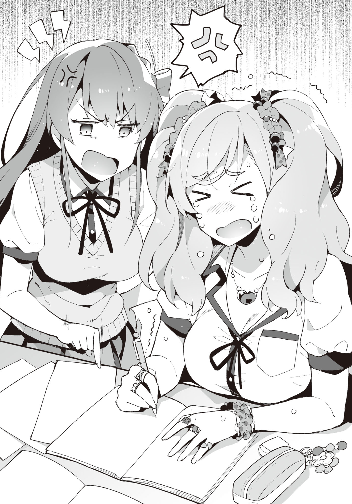

# Chapter 2: Then, should we go buy swimsuits?
_Note:_ _From this chapter on I'll be shifting to present tense for Seiichi's thoughts, and keep past tense for narration._

Ever since the club room became unusable, we tried to search for the culprit behind the rumors, but as expected, it wasn't as easy.

The rumors kept spreading around day by day, all the while getting more and more exaggerated.

"They say Aramiya-kun is actually super rich, and is doing as he pleases with girls..."

According to Hatsushiba's report to me in the classroom, even such a topic had been coming up.

"If it was possible to do whatever you like to the opposite sex using the money from something like part time jobs, companies would cease to exist.
In the first place my dad is a humble salaryman who complains to me saying 'there's not enough money to drink this month!'..."

Sometimes he even tries to extort money from me.
Usually it ends with mom yelling at him, though.

"Well, rumors progress without careful investigation about the details..."

"It's easy nowadays for rumors to spread via the internet after all.
Are they exchanging such messages over smartphones or something?"

"You mean like those underground sites?"

"Also including that.
I think it's more mainstream nowadays to use group messages though.
There's even this gigantic group chat that includes ordinary people like students from other schools."

The influence of celebrities is not something to be sneezed at, after all.
Anyone with an influential voice can make a single statement, and it will spread like wildfire, with a high permeation ratio as well.
Even more so if it was something that cannot be reversed.

I don't have accounts on almost all SNS sites, so am not really sure about the details.
I have a twitter account on which I follow eroge makers... is as far as it goes.
I myself have tweeted absolutely nothing.

"In that case, we need to look into the smartphones of other people."

"Going that far though..."

Searching around for personal stuff arbitrarily is a no-go, no matter what reasons one might have.

Even if decisive evidence comes out of it, the police will get involved after that.

That being said, very soon we would be unable to search for the culprit or even exterminate the rumors about Ayame.

The final exams coming close, it was around time to start preparing for them.

"This formula is very basic.
Beat it into your head."

Like a thunder god as always, Tadokoro was exerting his demonic aura during the math lecture today as well.

After erasing the blackboard packed with formulas and solutions, he moved his hand and started writing with force again in the space that got empty.
His expression of the eyes that glared at the classroom looked like that of a ferocious hawk.
It was really scary.

In order to eliminate pointlessly studying the same part again, Ayame was listening to the lecture intently.

"For this problem... Ayame. Come front and solve it."

"Y-yes!"

While jolting her twintails, Ayame somewhat nervously went up to the front.

Then, with mannerisms that seemed to lack confidence, she started writing on the chalkboard with a strange handwriting.

"Hmm, correct.
You escaped death."

_TL Note: Wow this is actually scary xD_

Ayame let out a sigh of relief.

"If you had gotten this one wrong, you would have to take supplementary lessons over summer break without having to wait for the finals."

Tadokoro said so while smirking, as if having fun.

After receiving the "not guilty" verdict, Ayame was relieved from the bottom of her heart.

She returned to her desk, making a tired face.

"You must be able to do problems of this level.
In order to gauge the understanding of this class, we'll have another short test before the finals.
Make sure to review the material properly before then."

"Eee~...", a negative tone erupted from the class.

However, everyone went silent the moment Tadokoro sharply glared at the classroom with a glint in his eyes.

As expected of the Thunder god.
Those eyes hold impressive power.

"Mu..."

The chime started ringing from the speakers.

That marked the end of class.
My classmates relaxed after unfastening their nerves.

"Good timing.
Let's end class here today.
Everyone, be careful not to neglect your preparations."

After deftly collecting everything left on the teacher's desk, Tadokoro swiftly left the classroom -- but he looked back before leaving.

... Is he looking in my direction?

"... Right, I had forgotten.
Aramiya, I have something to ask you.
Come with me."

"Eh..."

Being suddenly called on like that, I got confused about what was happening for a bit.

Everyone's eyes looked at me at once.
They were looks of sympathy.
Or rather, they silently conveyed 'just what did you do'?
I haven't done anything!

"I asked you to come with me.
Could you not hear me?"

Tadokoro's eyes shrunk like a string within moments.
Just five seconds until he starts yelling.
This is bad.
I must hurry.

"I have a question."

"Ha, haa. What is it?"

We faced each other after going out to the hallway.
He had a different pressure compared to Ayame.

Even though there were a lot of people in the hallway, it being right after the end of a period.
Although no one seemed to be blatantly eavesdropping.

Then, Tadokoro spoke up in a small voice inaudible to the surroundings."

"Aramiya.
Is it true that you are violating girls and doing indecent things in the clubroom?"

"Eh?"

"I'm asking if it's true."

No way.

Certainly even Tadokoro did not believe in the rumors and now wants me to show him?...
Haha, definitely not.
That can't be called character breaking anymore.

"Why, do you..."

"It was a topic of discussion during the staff meeting."

... Don't the teachers have too much free time?

But still, this is a serious issue.
Looking at it from the other side, that the teachers are making a big deal out of it was proof that the rumor had permeated quite thoroughly.

"Isn't it obvious that it's a fake rumor?
It'd help if the teachers also didn't start getting fooled by it.
I'm super troubled here."

"Guessed so.
However, there is meaning behind me getting the word of rejection from your mouth."

"Hmm?
But staff meeting... isn't our homeroom teacher supposed to ask me instead?"

I don't remember Oohara-sensei asking me anything like that?

"That's because Ms. Oohara outright rejected it.
'Aramiya-kun isn't a child who would do something like that.', is what she said.
Plus, she isn't fit for interrogating students.
She still has places she lacks experience in."

Oh, as expected of sensei!
Her trust really hit it home.

"And, Ms. Kotani also rejected it."

Kiriko-neesan as well, eh.
That was very nice of her.
As expected of my cousin.

"'He probably doesn't have that kind of ability'"

I take back my last thoughts.
... No, it's the truth, but is irritating.

"Erm... did Tadokoro-sensei believe in it?"

"I don't know, is my true opinion.
... What, is it surprising?"

"Frankly speaking, yes.
Sensei seems to be the type to conclude to zero or one immediately."

Tadokoro gave an uncharacteristic small sigh.

"Even if I've seen students for so long, I cannot determine their true intentions or true character.
Sometimes students with good conduct and no black marks in their record take part in swindles after school, and sometimes students who are good for nothing start non-profit organizations for betterment of society...
the hearts of people can change from one end to another through just one impetus.
In other words, seeing through people by just their appearance or attitude is impossible."

Sounded like he had real experience mixed in the last statement.

He can probably say that after seeing off any huge number of students.

"In that sense, Ayame is unusual.
Aramiya, you too."

"Eh? Me?"

"Yes.
I never thought you would be someone to run full speed through the hallway."

"... If you don't mind me asking, I'd like to know your evaluation (of me)."

"You'd give full effort on things that you're interested in.
However, you'd not put more than the minimum effort in things that don't interest you, and try to avoid standing out.
Am I right?"

... Woah, he's right.
He observes very closely.

"That's exactly why it was unexpected for me that you'd try stopping Ayame, or even run for that.
The image of you dispassionately spending your school days was strong in my mind, after all."

"I see.
Even I used to think the same..."

"There are things people themselves don't understand.
It is presumptious to think that others could understand your nature, even if they're adults.
Of course, there are a lot of students who are exactly how I imagine them to be, but there are exceptions everywhere."

Tadokoro always taught his classes full of confidence, so I thought he was the type of teacher who would think that they are omnipotent.

But in reality, he was different.

It felt more like he was trying his hardest to get close to his ideal, all the while worrying about various things.

"That's why."

Then, Tadokoro sharply glared at me.
You're scary!

"That you have been violating girls is also not totally impossible.
The possibility that you might be one of those exceptions cannot be thrown away."

"No no no... that's impossible.
I'm a good person at heart..."

While it was strange saying it myself, I'm pretty harmless.

"I don't believe in people being good-natured or bad-natured.
Good and evil both change with the era.
The person I talked about earlier that got into swindles after graduation was actually in trouble with money for his family, and the good-for-nothing student who started the NPO got his determination after visiting a war-tridden country, from what I heard.
Due to various circumstances, people can easily switch sides."

"So, it is possible that I have such a component?"

"In good words, human possibilities are infinite.
In bad words, humans don't have any integrity."

Well, if I hadn't received Ibu's love letter during childhood, my personality would have probably not turned out like this.

"For now, I'll believe in your words.
However, don't forget that I'm constantly keeping watch on you.
Don't do suspicious things in order to not betray the trust of Ms. Oohara.
That's all."

After ending our talk like this, I let out a sigh of relief.

Talking with Tadokoro is really tiring.
It felt as if I just sprinted 100 meters.

"Well, I got a lot of information, so it's OK."

But, since it already reached the teachers, it would probably be difficult to exterminate the rumor that fast.

&nbsp;

"It's turning out really difficult to find the ringleader, right Aramiya-kun?"

"I was expecting the content to have changed in the neighboring class, but it wasn't so.
There is no great difference with the original rumor."

While returning from the transfer class of the third period, I return with Hatsushiba.

We were having a music lesson in the audio-visual classroom, but the chorus totally sounds different when this girl is with us.
I was made to realize the abilities of a voice actress all over again.

"By the way, do you not get big jobs?"

"It's still difficult. With Yuuka's competency..."

"The world of voice acting is harsh, eh..."

Even though her acting of scary people was totally at point.

She seemed to be very fit for roles like yandere characters interrogating the protagonist or something.
There was a great difference between her cute voice and scary voice.

"What happened, Aramiya-kun?
Are you not thinking something very rude?"

"N-no, not really..."

Are you an esper?

"But, I have a role I really want to act for in a winter anime.
The company is also trying their best for that.
It's still private information, so a secret though."

"Winter anime eh...
It's a story of next year for us."

"Yuuka will be happy if Aramiya-kun listens to my voice when it happens."

"Try your best to not get dropped after three episodes."

"Eh?
Please watch till the end if someone you know appears in it.
It's still not decided, though."

"Anime is, well..."

I don't hate watching all the recorded episodes at once, but not being able to watch at my own pace doesn't fit my taste.

It is hard having to wait for a whole week, after all.
Especially two-cour anime are physically exhausting.

However, watching the recordings means that you're not up-to-date with real time.

Nonetheless, if I watch anime, I want to enjoy it to the fullest in my own way.
So, it is possible that I'm still searching around for the best way to enjoy anime.

Well, even eroge heroines fall into accidents during trial versions which are only resolved when the original version is released: it's not applicable to only anime.

"However, we never really brought this up, but Hatsushiba is actually _working_ as a seiyuu, right?"

"That's right.
If you start associating now, you might be able to enjoy some perks later on?"

"What associating..."

"But Aramiya-kun, you must give first priority to Cotton."

"You know what...
Talk about association or whatnot to Tozaki instead.
He'll totally spring up in joy.
I think he would listen to anything as long as it's Hatsushiba's order."

That guy would probably gladly turn into a dog if it's for Hatsushiba.
Through hell and high water.
Inside grassfields, forests, mud, cloud, skirts even.
If mankind turned into monsters and the world started to look like goblets, that guy would be able to distinguish Hatsushiba at a glance.

"Eh? Why Tozaki-kun?"

Is she being serious.
From Hatsushiba's expression it was clear that her emotions didn't waver a bit.
She is making a puzzled face while tilting her head to the side.
This is the most prominent "you don't have a chance" pattern.

Well, student life is long.
Work hard, Tozaki.
It doesn't seem like you'll be compensated for it though.

While we were rambling in amusement like that, a girl came running towards us while avoiding the students that were walking in the hallway.

Just after passing by each other -

"Kya..." "Ara ara"

Suddenly, she gave a tiny scream.

Looking over, it seemed that she bumped into another girl right around the corner, and fell down on her butt.

"Ouch..."

"Running in the hallways is no good."

"P-president! S, sorry..."

Crouching down, the student council president took out a pack of napkins from her pocket.

"Are you OK?
Did you hurt yourself?
Looks like you grazed your knee though."

"N,no, it doesn't hurt-"

"That's not good.
You must treat your body with care."

Rubbing some disinfectant on the girl who had just fallen down, she stuck a band-aid on her knee.

Her movements were as flowy as a stream of water.
The girl wasn't even given a chance to find the right timing for rebuttal.
The president is probably used to these types of situations.

"T, thank you very much."

"No need to thank me.
You are a treasured flower of this school.
Even while hurrying, please do not forget to walk elegantly."

The girl who had fallen down gave an energetic "Yes!" as a reply, and left the place.

She became red upto neck.
I don't know if she already belonged to the student council, but she surely fell in love all over again.

"Ara, if it isn't Hatsushiba-san.
... and Ara too."

She frowned the moment she noticed me.
Isn't she too clear smh.

"Hello, Yaotani President."

"If you say that much, then how about saying my full name, president?"

"Hatsushiba-san is always really cute, and on top of that, your voice is as adorable as the chirping birds in the forest.
To the point that I want to record it and listen to it."

_TL Note:_ Please teach me these cheesy lines Yaotani kaichou! :bocchiCry:

Utterly ignored.

Moreover, what is this person?
She said something similar to Tozaki.
Are you an otaku? smh.

"T, thanks... U-um...?"

"Your skin is also moist and beautiful.
Tell me the secret behind sometime?"

"Ha, haa..."

The president's hand gently stroked Hatsushiba's cheeks.

Hatsushiba looked like a pet cat.
Her cheeks were becoming redder maybe due to their faces being close.

"Well then, have a good day."

After doing as she pleases, the president left us, as if satisfied.

... Other than Hatsushiba, she didn't even meet my gaze.

Disliking guys has its limits.
How the hell did she manage to collect the boys' votes?
This school should have a one-to-one sex ratio though.

If her attitude would have been the same for boys, she'd have become a huge charismatic figure.
Tozaki and boys like him would have no doubt become complete followers of the president.
That would have led her to overwhelming victory against her opponents.

"Fuu... that was surprising."

After the president disappeared from sight, Hatsushiba finally exhaled, as if relaxing her strained mind.

"That president really has no integrity..."

"But she's kind.
She even treated the girl that bumped into her."

"If a guy bumped into her she'd have abused the living hell out of him though."

On top of that, she would probably force the guy to prostrate himself while she steps on their head.
With a queenly smile on her face.

"But she really doesn't have any interest in guys whatsoever.
It is kind of clear that she's yuri..."

"More than yuri... you could probably call her a lesbian."

"The line between those is kind of difficult though.
It probably varies between people."

"From the typical border that I know of, the parties involved in yuri don't think of it as homosexual love, don't have sexual contact, or sometimes don't portray their feelings.
On the other hand, lesbian people recognize homosexual love, and try to actively pursue sexual contact.
At least, that's how I feel."

"Yuuka also heard something similar from one of her seiyuu friends."

While it is a bit unexpected, Hatsushiba also seems somewhat knowledgeable about this stuff.

Well, she is in close proximity with otaku contents for work, I guess.

It won't be surprising even if she is well-acquainted with yuri.
There are even seiyuus that are enthusiastic about their jobs to the point of doing research on different stuff in case they need to act those roles.

"In the end, I think it's yuri if the depiction is lenient, and it's lesbian if it is intense.
At least for the people who know about these stuff."

"Hmm..."

"But for the people involved it's not a story or anything.
Liking girls is the same for both anyway.
Well, maybe there's the difference of passion and love."

"Both feelings ensue homosexuality anyway."

While talking about such a topic, suddenly the president's words come to mind.

"... Hypothetically, if it was possible to marry people of the same sex, would Hatsushiba have chosen a girl for marriage?"

"Huh? Eh... what do you mean...?"

As if sensing danger, she took some distance from me.
Her expression also seemingly became cramped.

"No, it was something the president told me before!
It's not something I came up with!"

"Well, it did feel strange for Aramiya-kun to say that."

I gave a simplified summary of the president's speech from last time.

Hatsushiba listened while nodding with a serious expression.

"Who would you choose for a lover if both guys and girls were options, eh...
It's hard to tell unless we enter that era, but it feels like the amount of homosexual people would definitely increase compared to now.
That every girl will choose another girl is taking it to the extreme, though."

"But well, during elementary school, girls do apparently think that boys are childish, right?
What if their sense of love solidifies at that time?"

"There certainly is that type of an inclination, but it's probably just some pointless childish bragging.
In the first place romance itself was a very vague concept during elementarty school...
It's not like there wasn't the feeling of liking someone, but thinking about it now, they weren't really that serious.
So the sense of love would not solidify to _that_ extent."

Well, my feelings for Ibu were also pretty suspicious.
I had thought about this earlier too, but it was probably just at the level of seasonal measles.

In some sense my philosophy of love had probably solidified at that time.
That 3D girls were not trustworthy.

"What would Hatsushiba do if one of your girl friends got a girl lover?"

"Friend as in... for example Cotton?"

"... Not just limited to Ayame."

"It's really hard to imagine...
After asking whether they will regret it ot not, if they reply with a yes, Yuuka will probably cheer them on... maybe?
But it's really hard to tell unless it actually happens."

"I know, right?
Sorry for asking such a strange thing."

"That's right.
That surprised me."

It really seems like the president's story is quite extreme, or rather, a failure.

The way she says it with confidence can almost barely make you believe in her words.

I deepened my conviction via the conversation with Hatsushiba, and we returned to the classroom.

Although school had ended, going to the clubroom was out of question, so we went towards the library.
Recently we have been going there a lot.

All the club members gathered around the table today as well.
It was overflowing with textbooks and notebooks.

"Yu, Yuuka.
Umm, about this thing right here."

"... Cotton, weren't you taught this just now?"

"S, sorry."

Ayame had also lost her face.

The Demon Sergeant with her imaginary horns on her head today as well, was spreading her devlish aura like a raksasha.
If this wasn't the library, she'd have probably striked her whip on the ground.
The scene was all in my head, though.

"Aramiya-kun, aren't you thinking about something rude?"

"No.
Not in the slightest..."

So sharp.
So scary.

"Good grief.
Sorry for my impolite brother."

"Eh?
No, not to that extent..."

Hatsushiba got agitated after being suddenly said so by Kiyomi.

She came here immediately when I texted her that we'll be studying at the library since the clubroom could not be used at the moment.
Although I thought she would go back home thinking it was too bothersome.

While sitting beside Ayame and peeking into her textbook, Kiyomi was saying some random stuff like "everything in the 2nd year syllabus looks so hard, right..."

"Ah, I'm thirsty. 
Ryouma, can you bring some water?"

"Ki, Kiyomi-chan...
This is not a cafe.
Food and drinks are also prohibited..."

"Although the library near our home recently made PET bottles OK..."

Don't compare libraries run by the school and the municipality.

Rather, why are these two talking like it's normal?

"Were you acquaintances with Saitani?"

"Well, somewhat.
Ryouma stands out a lot after all.
I went to talk immediately."

Then, Saitani alternately looked at us, blinking in amazement.
His behavior of being puzzled about which one of us to look at was kind of cute.

"... By any chance, is Kiyomi-chan Senpai's sister?"

"We have the same last names, right?"

"No, Kiyomi-chan said that she didn't have siblings, right?"

"... Well, she makes it that way while in school."

Kiyomi turned her face away while saying so.

"Isn't that obvious?
It's disgusting to just be siblings with this guy.
It'd have been great if he was actually born from a cabbage or something...
But after checking the official family register, it was clear that we are real siblings, and I couldn't take it anymore."

"It's me who cannot take it anymore.
If you hate it, you can just go home.
Rather, please go home."

"I didn't come here for you, but for Ayame-san!
Don't get so conceited!"

"U-um... Ki, Kiyomi-chan, p-please be quiet!"

Kiyomi got scolded by Saitani for raising her voice.

All the while looking like she had several complaints, maybe common sense made my impolite sister closed her mouth.

"Please pardon my idiot sister, Saitani."

"W-what did you just-"

"Be quiet here."

After being pointed at, her expression became a rare difficult, while twitching her eyebrows.

Kukkukku.
It felt good.

"Grow up already, Aramiya..."

The Tozaki sitting beside me said so with a self-satisfied look.

No, even I don't say anything if the other side doesn't provoke me.
If I just get insulted one-sidedly, it hurts my pride as an elder brother.

"Isn't it the job of a protagonist to tenderly embrace his foul-mouthed sister?
Am I wrong, Aramiya?"

Even more words came my way.

Eroge protagonists are really amazing.
They are full of sympathy to the very end, after all.

While I have said this several times before, it's impossible for me.

"S, sorry for being late~"

Ibu came in at that timing.

She went to the toilet just before coming to the library, but is quite late for that.

"Ibu-san, hey!"

"Ah, Kiyomin, hey!"

Kiyomi and Ibu are also quite friendly.
Since long ago, Kiyomi has been good at quickly making friends with lots of people.
It was the same for Ayame as well.

However, one personage was displeased at her being late.

"... You are late, Suwama-san.
Your studies are getting late as well."

"Hauu.
Y-your face is scary, Hatsushibacchi!
I was called by the student council president, and got late..."

"Student council president?"

When Hatsushiba asked her back with a moody expression, Ibu animatedly nodded and said,

"She was trying to pursuade me to help the student council for a looong while.
Even though I rejected her saying that I have to attend club activities, she just kept going on and on...
She even suddenly brought up her assets and stuff..."

What does she mean by assets?
Ransom?
Does she want money or something in exchange for not asking her to join the council?

_TL Note_: This is a bit confusing. In the raw, Ibu says "いきなり[身代話](https://kotobank.jp/word/%E8%BA%AB%E4%BB%A3-538275)までされたんだからねー". Here I'm guessing "minoshirobanashi" would mean something like amassing one's fortune/assets. Clearly the president wants to increase her harem lol. But well, Seiichi thinks maybe she's talking about "身代金" which means ransom or some sort of compensation asked for by blackmailing.

"Doesn't she say the same to every girl in our school?"

Tozaki's conjecture sounded very plausible.

Ibu who had just transferred was probably not marked until now though.

"Then, quickly sit down and open up your textbook and notebook."

While I still wanted to ask her about other stuff she talked with the president about, Hatsushiba has already switched into her demon instructor mode.
Ibu sat down in a fluster and took out her textbooks, notebooks and writing utensils.

It was not the atmosphere to ask any questions.
Hatsushiba will be scary if I interrupt her studies; I'll ask later.

"Uu~. Even though the sky is so blue, why do we have to study inside?"

"Do you want to stay back a year?
Just start working already.
Isn't it cool inside cause of the AC?"

Hatsushiba mercilessly urged the complaining Ibu on.
Even Tozaki seemed to have attained nirvana, pretending to not see anything.
A century's worth of love can get cold seeing this side.

Although Hatsushiba's attitude towards Ibu looked harsh, she was basically like this when it came to studying.
She was severe even with Ayame.
There was no discrimination in her eyes.
It could really not be said that they were close... but her attitude was softening little by little.

"Hatsushiba's expressions while acting S is not bad either."

Tozaki's mental health is steadily getting complicated.
At this point this guy would be happy no matter what Hatsushiba does.

While looking at Hatsushiba's spartan coaching with sidelong glances, Tozaki and I also continued studying.

Kiyomi was not studying, rather talking about something with Saitani.
Her status was pretty convenient.
Even I want to blabber without meaning with Saitani.

"By the way, Kiyomi-chan, you don't have to study?"

"Everything on the test comes from the lessons, so why does one even need studying out of classroom?"

_TL Note:_ There we go, another honour student...

So full of confidence.

Now that I think about it, I have never seen Kiyomi study at home.

"You should have gone to some school with a higher level..."

What Saitani said was extremely logical.

That's right, that's right!
You tell her!
It's not still too late.
She should take the extrance exam at an even better high school!

"The closer the better... I don't want to attend schools far away.
Commuting would be a waste of time."

"M, Mmm... maybe that's true, but...
Did you really want to attend the same school as your brother that much?"

"What?"

"Ki-Kiyomi-chan, your voice...!"

Every student in the library turned towards Kiyomi.
Her voice was just that much loud.

Kiyomi immediately put her hands on her mouth, and awkwardly bowed in apology to the surrounding people.

"Uh Ryouma, don't say such strange things."

"I don't think it was that strange though..."

"It was hard for me to not faint from that."

"But then, if you go that far, why are you guys going to the same school..."

So justified.

Since she could have easily gone to a better high school, and she hates staying with me, she should have just chosen some other more suitable high school.
Then it would be a win-win situation for both of us.

'Proximity > hatred towards me'... sounds pretty half-baked as an explanation to me.

There were other schools nearby that had higher standardized test score cutoffs than ours.

By any chance, does her lover whom we are yet to know about attends this school?
Or maybe someone she has a crush on?
In that case her actions are consistent.

"I hate wasting time, so chose this school.
Any objections?"

Saying so, Kiyomi forcefully made Saitani agree with her.

If you hate wasting time, then don't enter this type of a club...
I resisted my urge to say that out loud.
A light mouth leads to calamities.
Careless comments can destroy oneself. 

In that manner, with some conversations in-between, the noise of turning pages of books and writing on notebooks could be heard for a while.

"I'm~... done...
Dying... I'll die..."

"No you won't.
Look, only ten more problems.
If you don't finish within ten minutes, you have to do ten more.
It won't end if you don't solve one problem in less than a minute."

_TL Note:_ Wow, this is so harsh... For the first time in this LN I'm feeling sympathy for Ibu lol.

Hatsushiba's demonic coaching had reached its climax.
And Ibu was making teary eyes, giving up on finishing her questions which had been piling up.

"I wanna plaayy"

"Just do your work OK?
Do you want to repeat a year?
Yuuka is fine either way though."

"Don't wanna..."

Ibu faced her notebook head-to-head with watery eyes.
Well, do your best.

"It's really terrible for you right, Hatsushiba."

"Really.
But right now there's no other way than to keep hitting.
When someone doesn't even know how to study, in order to make them remember something, you must keep cramming until it enters their head.
Especially since Suwama-san desparately lacks even the fundamentals."

Sometimes I honestly wonder how Ibu even managed to get admission into our school.

"If someone is the hit-hard-until-they-get-it type, they really need to focus to get results I guess...
Smart people would immediately catch on, but if their basics are faulty, there really is no way to make it easier for them."

"Making it easier has a bad ring to it, but practically it's just as you say."

People should always try to find ways of learning things more easily.

Moreover, if such a strategy is not possible to find, one should resort to exhaustive memorization...
In other words, they should transition to memorizing everything.
After all, studying is often described as something you gotta contest until you get the hang of.

"Rather than lazing around for ten hours, it's always better to concentrate for one hour."

"Guess it varies from person to person..."

No matter how you think about it, studying for one hour and playing eroge for the remaining nine is definitely better.

Anyway concentration power of people has its limit.
Crossing those limits leads to burden on the head, and breaks your health.
I really don't want to study to the point of decreasing my life span.

_TL Note:_ Yeah, don't ever try doing a PhD. I've forgotten when I last slept peacefully.

"..."

Ayame is facing her notebook and textbook, but keeps playing with her pencil or crossing her arms... it doesn't seem like she is making any progress.
Probably she has already used up all her concentration power.

It's apparent that she is getting bored.

Of course, Hatsushiba is not one to overlook that attitude.

"... Cotton?"

"I-I'm studying seriously..!"

Hatsushiba's ice-cold voice made Ayame shake her whole body.

Seeing her this scared feels pretty strange.

"Hey", Kiyomi whispered in a small voice only audible to me.
"Do they not get any prizes?"

"Prize?"

"Ayame-san and Ibu-san are both studying so desparately."

"Is it not satisfactory enough if they get better scores in the finals?"

"That's not a prize, but the result.
Since you're making them work this hard, their willpower won't last long unless there's some candy or something."

If putting in effort as usual required to be rewarded every time, then they would be working for the prizes and put their priorities the other way round.
If they start working for the prizes and not for their goals, then once you stop rewarding, they might also stop working hard.

Ayame was really happy with the brooch that came with a first time limited edition eroge release that I gave her before, and still has it attached to her bag, but that's a different story.

That being said, maybe not prize but at least they might need some goal to increase their motivation.

"Should we go somewhere once the finals are over?"

To my nonchalant suggestion, Ayame, Hatsushiba, and Ibu all showed a surprised expression.

"Somewhere as in, where?"

Ayame asked back, slightly interested.

While I wanted to say "Comic Market", it is customary wander those holy lands myself.
Roaming around with several beginners could become huge trouble.
They can be useful as porters, but it would be worrying to leave carrying around the stuff to newbies.
In the first place, people start melting even standing inside Big Sight in the middle of summer.
Also, one must wake up at dawn to be fully prepared, which is also painful.

_TL Note:_ Summer comiket is a fight for your life, I kid you not. How I wished Covid19 didn't happen... I even had a summer internship in Tokyo. :(

So, for now Comiket is a no-go.
What place is good at these times...

"Let's see..."

Well, there's no meaning in conforming to and thinking in three dimensions.

What if this was an eroge?

After studying like it's the end of the world, the final exams happen.

Everyone looks forward to the summer vacation after that, and make plans for a summer trip.

To the clear blue skies, the shiny white sandy beach, the huge ocean dyed in emerald blue, and the heroines dressed in attractive swimsuits.

"Sea, maybe?"

I dropped such a whisper.

Well, the emerald blue sea is probably out of question unless we go abroad or something.
At least, the nearby seas are not like that.

... But let's try thinking back for a bit.
Sea and all is very troublesome, right?
It's not like I like swimming or anything, and I don't really want to see swimsuits in 3D.

However--

"Sea!! ISN'T THAT SUUPER GOOD!"

"Yuuka hasn't visited recently, so that might be good!"

"Ah, they also went to the sea after finals in that game!"

Ibu, Hatsushiba, and Ayame were all raising favourable voices together.

Kiyomi also looked surprised, muttering a "... that's rare".
Guess she didn't think I'd bring up the sea out of all things.

"Ah, no..."

However, I want you to wait a bit.
I just brought it up because it appears frequently in eroge, and it isn't like I want to go to the sea or anything.

"Swimsuits~, what kind should I wearr~"

"The top won't fit anymore, so must buy a new one..."

"Maybe I should just use the one from last time."

They had completely hooked onto this idea.

What to do.

If I go back now everyone will boo for sure.

"Senpais, please keep quiet here!"

Saitani pouted, trying to appeal his anger.

Umu, he's so cute.
Really a feast for the eyes.

"Then, should we go buy swimsuits?"

_TL Note:_ Finally the chapter name makes some sense. Whew, I've come a long way. xD

Hatsushiba splurted out as if unable to hold it in any longer.
Her Demon Sergeant mode had been totally thrown out.
Where did it disappear?

"This much studying should be enough for today.
Let's dismiss."

If Hatsushiba et al go shopping for swimsuits, I'll just go back home.

While I was preparing to go back,

"What's the point if you don't come!"

Kiyomi snatched my bag away.

"What are you doing?
Return my bag!"

"Come with us.
This inconsiderate dumbass!
Even trees grow when you give them water..."

"Don't give confusing analogies!
Why do I have to join them if they want to buy swimsuits?"

"There's no point if you don't come.
Just come with us.
No more questions.
I'll take along Ryouma as well."

"Eh? Me?"

Being suddenly the centre of the topic, Saitani widely opened his eyes.

"The librarian's work is also ending soon, right.
Then there's no problem."

"Uu, Kiyomi-chan, you're too pushy..."

If I return home now, for sure Saitani would be dragged along.

I cannot bring myself to leave Saitani alone, surrounded by four girls.

That's right.
She's still a guy, and I'm getting more and more cognizant about it.

_TL Note:_ What? _She_? :concerned:

Well, even if he stood near the lingerie department, no would would probably talk ill of him.

"Good grief.
Okay, got it."

Can't be helped.
It's all to protect Saitani.

Then, we left school, heading towards the swimsuit shop.

Yet, Tozaki returned home while shredding tears of blood, saying he had some other thing to attend to.

... Did he have to go that far?

&nbsp;

Leaving the usual school street, we headed towards the station.

Since I don't know where the shop is, I blindly followed the others.

Ayame and Hatsushiba at the front, then Saitani and Kiyomi in the middle, and Ibu and I were walking behind them.
Since we were having conversations in these pairs, it naturally led to this formation.
It's times like these when the relation between friends shows up.

"We used to return home together with everyone like this in the past..."

Ibu who was walking beside me, spilled out so with a spiritless downcast gaze.
This is rare.

"Was this during your elementary school days?
I don't know about it though."

I always returned home alone.
My home was also very close.

"At that time everyone paid attention to Seiichi after all.
There was also this rule that no one should steal a step on you...
People would get angry on girls that wanted to return home with you."

Was there such a thing?
I don't have any such recollections.

Or maybe they were made to keep their mouths shut by Ako.

"... By the way, do you know what happened to the girls from that time?"

"Akocchi and the others?"

"That's right.
Ako, Mii, Kyouya, Hizumi... the girls who used to hang around with you."

During my elementary school days, these five were the most influential students in my class... no, maybe in the whole school year.

They had formed a group, and would always take the initiative before others.

I'd also indomitably competed with the Kyouya who was good at sports or the Hizumi who was smart...
but it's all a story of the past.

"I asked them which school they went to~"

"Where did they go?"

"... Umm... where was it again?"

Oi.

"Sorry, I forgot..."

"You...
People don't usually forget these things, right?
They're not attending our school, right?"

"... Probably."

Well, it's Ibu.
Can't be helped if she doesn't remember.

"Well, let's leave their topic.
Then... who blew in Ayame's rumor into your ears?"

"Eh, everyone used to speak about it at that time..."

"I know.
That's why I'm asking who blew it into your ear.
When did you first come to know about Ayame's rumors?"

"Hmm...
I think it was immediately after I became friends with people from our class.
But, people were talking about it from before already, so I had also heard about it before...
It was probably someone like Nishiharacchi.
Or maybe Yamamotocchi?
Or maybe Hosoecchi the class rep..."

So the centre was the girls who got attached to Ibu.

That's right, when she locked me up in the PE shed...

"You were working together with Nishihara, right?"

"Yep.
Nishiharacchi is a good girl.
She's plain, but with some brushing she'll surpass even me for sure!
If only she put more care into her hair or eyelashes..."

I'll get troubled if you talk about that with me.

I don't care if someone's plain or flashy in RL to be frank.

In games though, I like it when plain girls turn cute.
But if the transformation happens via throwing away their glasses, then it's unacceptable.

Girls with glasses should aim to become cuter while keeping their glasses.
It's not like I am a glasses girl type, but to me it is unacceptable to throw away one's own characteristic.

"Well, setting aside her sparkling potential, you guys made it really terrible for me."

"... Sorry."

At that moment, she shrunk her shoulders.

It's good that she is repenting about it.

If she realizes that what she did wasn't right, it means she has grown up a little.

"Good grief...
It's all because you believed in the pure-looking Nishihara.
Since when were you planning that?"

"On that very day.
Right after Seiichi adamantly rejected me...
Nishihara said something like in comics, that's what you would do."

"What comic?"

"It was a manga named _Kanojora no Jouseki_."

_TL Note:_ If any of you play Go/Shougi/Othello, you would know that jouseki is like "standard sequences". So this manga is titled something like "Established tactics of the girls".

My brain froze for a moment.

Isn't that an eroge!!
A guy gets attacked by a girl, who was a werewolf.

No, wait.
Was that even made into a comic?
Don't think it was...

"I want to confirm something, but how was that comic?
Was it around this big?"

She shook her head when I showed her the approximate size of a weekly comic book.

Apparently it was not A5 size either.

"... Is it around this big?"

"Yep, like that!
Just that size!"

She firmly nodded to A4 size.

I then proceeded to get her estimate of the thickness.
Starting with showing around 5mm with my thumb.

"Ah yep, it was pretty thin.
I always thought manga was around 1cm in size, so was quite surprised."

I was aghast.

A4 size, and that thickness.

It was absolutely a doujinshi - a 2D manga made by an amateur or pro.

Is Nishihara someone who is on this side of the river?
Can we actually have discussions on the same page?
That type of girls seem to like BL a lot... well, it's just my bias though.

