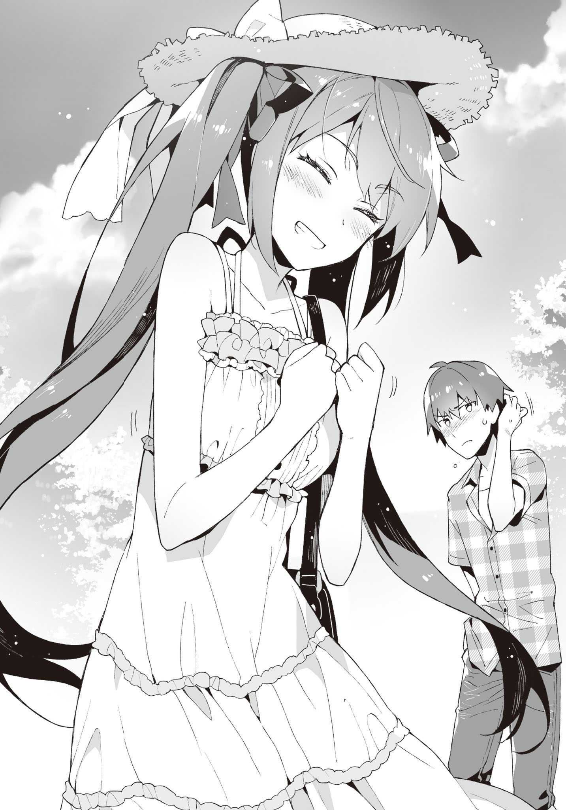
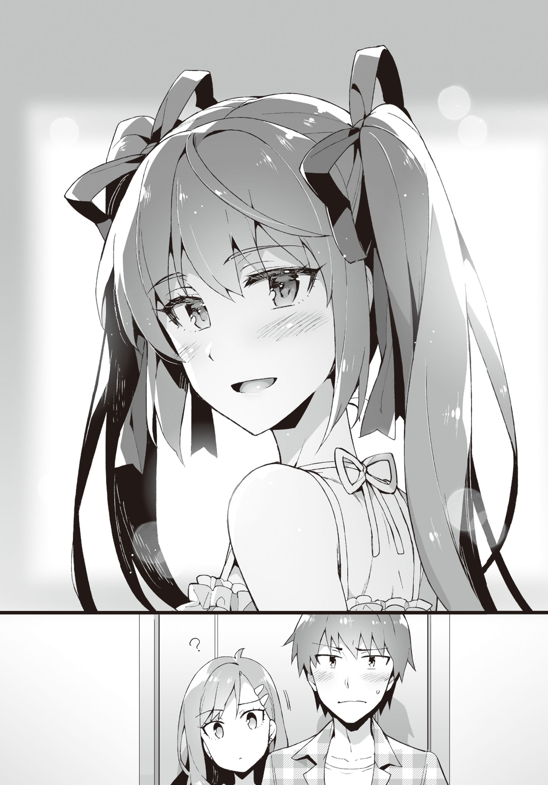

# Chapter 3: For me, you're good.
> Disqus volume 3 on [this page](https://potla1995.github.io/Chuuko-demo-Koi-ga-Shitai/3/). Feel free to join [my discord server](https://discord.gg/qwa8YgPxrP) as well.

The morning sun is bright.

The sunlight mercilessly shining into the room from the window leads to uncomfortable sweating.

However, my mood is great!

After all, today is a holiday.

I can finally consume the eroge that I bought after a long while.
Until now the midterm exams, Ayame's rumours and Ibu's matter etc had been keeping me busy, leading to no time to play eroge after school!

Along with drinks and snacks, my preparation is also flawless.
The headphones are also brand-new.
Haven't changed the sound card though!

The installation was also completed late last night.

While there also was the option of staying up all night playing, it would be too much to do so during summer vacations.
Rather, playing at full health potential is how you should honor playing VNs.

After a night's sound sleep in preparation for today, there is no one in this world that can stop me!

So, let's start!
"Magician's Joker", here we--.

> _TL Note:_ Probably referring to [Sorcery Jokers](https://vndb.org/v16337).

"Yo, onii-chan♪"

!?

... What was that voice just now?

It wasn't the voice effect that pops up before the title screen.

It sounded like it came from someone at home, almost as if it was Kiyomi's voice...

"Ki-Kiyomi?"

"Yes, that's right♪
Can I come in?
I'm coming in~"

Not waiting for my reply, she entered the room.

Her attire was that for going out, not the usual roomwear.
It was clearly different from usual.

A white short-sleeved frilly blouse and a black skirt with suspenders.
The colour scheme resembled a maid's clothes, just a little.
She had these clothes, eh.

While her smile appeals a sweet purity, her behaviour is quite suspicious.
Remember how fraudsters try to hide their true colours?
This looks very similar to that.

"What are you scheming?"

"Oh come on--.
Onii-chan and your assumptions.
Kiyomi is a bit shocked."

Did she hit her head or something?
Is there a hole in her brain?

"As if you would call me onii-chan without any ulterior motive!
Is it money?
Is it my life?"

"Nothing like that--.
I just wanted to go out for a bit with onii-chan~."

"... Go out?"

"Yep! Shopping at the station!"

"So you want me to carry your luggage?
What heavy stuff do you want to buy?
A fridge for your own room?
Then get it delivered or something..."

"Nothing of that sort--.
Let's just go!"

"Don't wanna!
Why do I have to go out with you on my long awaited holiday?"

Ask again after reducing a dimension. (JP: "Come back after becoming 2D" xD)

"Don't say such mean things--. Please♪"

Being pulled at, I'm forcefully made to stand up from the chair.

She embraces my arm, acting spoiled.
Her mood is also so great that it's uncomparable with the usual.
Did she get possessed by her past life's spirit?

"Look, let's go~"

"Am I not saying that I don't wanna!
Did you just forget how you talked with me till yesterday?
Calling me a virgin over and over again with scorn, we now don't even have the relationship to hang out together, right?!"

"... Onii-chan."

"Pretend tears won't work.
It's easy to understand when your tears are real and when they aren't."

"You won't come with me?"

"Absolutely not."

My stance is that of firm refusal.
Using sweet words is not going to be effective!

Right at that moment, something creaked up making a whooshing sound.

Kiyomi's lowkick had already connected.

Followed by a sharp pain.

At the impact that shook my very core, I kneel down holding my leg.

"GUOOOOO...!"

> _TL Note:_ RIP. My condolences.

"When I asked nicely once, just accept it!
Come with me right now!
You never had the right to reject my request from the beginning!"

"S-such a c-coercion...!"

Kiyomi's face turned beet red in pure anger.

If you send her to hell together with a golden staff, she will surely make a living out there.

"So, what'll be it?
You coming?
Or not?
I'll keep kicking until you answer yes though."

In front of that tone with no trace of tolerance, my life felt like in danger.

&nbsp;

After changing into outdoor clothes, I go out with Kiyomi.

... It's not like I lost. It's not like I gave in!

In order to save one's body from ruination, it is sometimes inevitable to accept the opponent's demands.
Just like how Finland ultimately succumbed to the Soviet Union in order to defend its independence.

If it's obvious that you'll face a terrible outcome, then sometimes accepting the unjust demands at the beginning is wise.
Maybe that option can help you protect things that are important.

> _TL Note:_ Yeah, very convincing argument. Just admit it already, your sister is too stonks.

"Can you not show a more pleasant face?"

"You even want to demand that..."

This type of abuse will not be tolerated by the United Nations.

While heading towards the station with pouting faces,

"Oh? Kiyomi--!"

Three girls come up to us while waving.
Tall, Chubby, Loli - were the outer characteristics of the three, and their clothes were also red, blue and pink in colour.
What a non-uniform trio.

Looking beside me, Kiyomi seems to be having a fit of cold sweat that cries "what bad timing".
Then, her glare towards me told "don't say anything unnecessary".
Her eyes are easy to understand.

"Sup! What are the three of you upto, at a place like this?"

"Just some shopping.
And, this person is..."

All three of them face in my direction.
Since I don't know their names, let's name the tall person "Dog", the chubby girl "Mag", and the loli "Rag".

"It's a date, right?"

Mag was smiling complacently while teasingly throwing that question at Kiyomi.

"Nope. This is caregiving."

However, Kiyomi immediately replies back with a disgruntled face.
It's not right to call this caregiving.
I want to hit her.

... Not knowing what to say, I stay silent.
Getting another lowkick driven into would make my legs useless.
I'll definitely be in bed for a whole day.

And, it's very troublesome if they call this a date.

"He's not your lover?"

Rag inclines her head to the side while sending an innocent gaze.
Apparently it was already determined that I'm her lover in their heads.

"As if! I'd definitely tell you if I get a lover anyway."

Kiyomi who rejects with a troubled face.
She starts emitting an aura that she wants to quickly leave the area.

However, it seems like she isn't able to shake off her friends.
As if stuck in a hard place, her eyes also start rolling around uncomfortably.

"By any chance, are you the rumoured onii-san?"

When Dog said so calmly, Kiyomi's face instantly cramps.
It's a very satisfying one-hit attack.

Kiyomi became flustered, unsure about how to answer.

... It's not like we need to lie.
She was already defeated when she made this kind of an expression.

"Yeah, that's right.
Are you guys Kiyomi's classmates?"

"Yes.
You really are her onii-san, right?"

"Doesn't she always deny my existence in class?"

"Ahaha, did you know that already.
But she would always overreact, so we were talking amongst ourselves how the brother must exist."

Even if no one asks you, if you out of the blue say something like "I don't have an elder brother, okay?", then no wonder the cat would be out of the bag. I can even imagine that scene right now.

After Dog finishes speaking, Mag butted in from the side.

"Moreover, the person that tamed that Ayame-senpai famous in underground also went by the name of 'Aramiya', so--"

"... Underground? Ayame?"

"Is that wrong?"

Well, it can't be helped if they misunderstood her from her previous appearance.

But it's different now.

No, she was probably never even involved with underground agencies.
Plus who is their representative?
I don't recall seeing anyone like that in school.

> _TL Note:_ I'm a bit confused about this part. Mag said before that Ayame was a part of the underground world (裏番), and Aramiya wants to know what the overground (表番) person looked like. So I interpreted 表番 as a front face of these underground agencies.

"She's just a normal girl.
Please try not to be fooled by rumors that much, guys..."

The three said a "ye~s" together.

Wow, aren't these girls nice and docile!

"But, Aramiya-senpai is also being scared of nowadays.
We hear that you're a dangerous person.
Looking at you like this though, it really seems unfounded..."

Rag says cheerfully with a pure smile.

"... That's also false, OK?"

"Men are wolves, they say."

"Wolves = men is not true, OK?"

"Sometimes it's the wolves that are more popular though?"

"It's not like I wanna be popular anyway."

I'm already popular in 2D, and don't have any interest in 3D anyway.

Via eroge I have lived several first press limited lifetimes, and that's enough for me.

"But, has that rumour even permeated among the first years?"

"It came out very recently.
And everytime it did, Kiyomi-chan would knit her brows..."

"Waaawaaa! Waaawaaa!" (TN: flustered screaming)

The frozen Kiyomi suddenly rebooted.

"Let's go already!
Sorry guys, see you next week!"

"Bye bye, Kiyomi-chan" "Kiyomi, don't forget about next week's promise--" "Kiyomin, bye!"

Receiving their greetings on our backs, we start wallking towards our goal.

For a while, Kiyomi kept up her red faced anger. Are you a [red demon](https://nohmask21.com/onimen/aka-ao/aka-oni2b.jpg)?

"Good grief...! Must remind them later to keep this a secret."

"Isn't that very bothersome?
Is it not fine if they know?
We don't really meet that frequently in school anyway."

"Then just be more resolute!
Like how you were during elementary school... get good scores in tests, and first place in the sports tournament too..."

"Oh, so you want a competent elder brother?"

"Obviously. I am--"

"Just kidding.
At this point, what will come out of trying hard?
Plus, elementary school and high school are very different in the nature of studies and athletics.
During elementary school, just putting in a little effort can get you first place, but starting high school it becomes impossible with just a little effort.
One needs to pile up proportional effort on top of proportional effort, and your free time would also decrease just by that much."

In other words, the time for playing eroge would decrease.

"Stop with your pretentious speech!
It's not like I have any expectation from you, do whatever you like!
Either way, let's go quickly!"

"Yeah, yeah."

Dear me! Such a high-maintenance sister.

&nbsp;

We reach the fountain plaza in front of the station.
Continuously pumping up however much water, the fountain shows the current time in a consistent rhythm.
First time when I saw this it was super exciting a technology, but after seeing the same scene for around ten years, the same scene doesn't really move me that much.
Rather, it feels rather inconvenient that the fountain doesn't show the current time immediately.
Makes me think how humans are so selfish about their conveniences.

> _TL Note:_ If you don't know, Kanazawa station has a [spectacular fountain clock](https://www.youtube.com/watch?v=pzGuf7enE7o). Gotta check it out next time I visit Japan!

Due to the constant flux of people, this place is pretty restless.
Everyone who just stare at the view absent-mindedly kind of seem like otakus who stare at the circles of their admiration during comiket.

"So, where are we going?"

"Mm, just wait a bit."

The big culprit who brought me to this place was currently staring daggers at her smartphone.
Seems like she's looking something up; not sure what.

When I tried sneaking a peek at the display, I was rebuked with a "pervert!", so I just obediently pulled back.
As mentioned countless times already, the wise don't approach trouble on their own.
That's exactly how one survives life just riding the flow of current.

"Yosh."

Seems like her search ended, leading to an enthusiastic utterance.

"You, wait here for a bit."

"Haa?"

What does she mean by waiting?

I don't understand the meaning of taking me this far and then making me wait/

"I'll be right back.
You're dead if you return home."

Threatening me however much she likes, Kiyomi went off somewhere.

It's not like I'll be killed if I go back home...
But the continuous lowkicks would probably break my bones.

Well, this kind of stuff can be fine sometimes... or not.
If you're making me wait here, return my eroge playtime.

『Well, it's a good opportunity, so try to get along a bit better.
If you only squabble all the time, you'll eternally never make up.
Just grow up.』

Were the words of a wise Tozaki a while ago that I suddenly remembered.

... Well, even I don't think of our current relationship as healthy.

It'll be troublesome if she starts saying stuff like "Onii-chan, love you♪" or "Onii-sama, please let me be by your side forever" like 2D imoutos, but her calling me "virgin" and me calling her "bitch" is not good for the public eyes.
Not like we call each other those names in public,

At least I won't hesitate for us to return to a "Yo" or "Hey you" level.

It's not like I want her to start conversation while in school, or cross each other.

If we settle down to a generally distant sister and elder brother, I guess my life would be much more calmer.
I wouldn't have to be so much wary as well.

"... Should I try start talking with her a little?"

Why does she despise my guts this much?

Earlier she said something like she wants me to take first place in academics and athletics in school, but is that somehow related?

I can't even remember exactly when we started squabbling like this, and don't remember the stimulus that started all this.
And we never really talked face-to-face about this topic.

I do remember she stopped calling me "Onii-chan" after elementary school...

"Well, it's also the big brother's responsibility to break the barrier."

As I was heaving a deep sigh, my smartphone vibrated.
A message had arrived apparently.

Looking at the display, three simple words had popped up.

"I'm returning. Bye~"

......

...Huh?

What the hell is up?
Telling me not to go back and then returning by yourself, just what are you thinking?

I have no idea why she dragged me all the way out here too. Jus what is this?

Harrassment!? Real sisters are really the darkest of the evil creatures!

Wasn't all this just a waste of time then?
Damn, seriously, give back my past.
Give me back my one hour of eroge playtime!

After all, it is impossible for me to compromise for her!

&nbsp;

"Y-yo, Aramiya."

&nbsp;

I turn around at the voice from behind.

Frankly speaking, I knew it was Ayame the moment she called over.

But--.

"I-isn't it a coincidence..."

The Ayame that had appeared was nothing like the usual.
To the point that I almost looked around, searching the surroundings for her figure.

Like a white lily fully bloomed, she was clad in a tidy white one-piece.

Complete with a straw hat that some young woman might wear on a trip to a summer resort.

And a fancy handbag hanging from her shoulder.

The twintails, face, and body composition that stands out is clearly that of Ayame, however...

One could not think her to be the same Ayame I was habituated with.

"A princess travelling incognito" would be an apt description of her current figure.

Totally a get-up that would one-shot virgins.
Frankly, it feels like she's aiming at my head.

"..."

"Aramiya...?"

"A-Ayame,... right?"

"That's right... do you not recognize me if I'm not in my uniform or something?"

"No, nothing like that..."

Can't say it.

That she appeared just like a 2D sprite...

For a moment she actually stole my eyes.
My whole attention could focus on nowhere else.

To think that such beautiful girls existed in 3D-- wait, aaaa what the hell is wrong!

"Rather, this is Kiyomi's instigation eh..."

"Uh, umm... what are you talking about?"

Hiding her mouth with the bag, Ayame averts her eyes, playing dumb.

Isn't it completely obvious from just that gesture.

"SMH. Why did you guys do such a thing?"

"N-no, I, umm..."

Her cheeks become slightly red.

"I thought... it would be great... if we could go out together..."

Danger.

I'm in complete chaos.

For some reason, my heart tightened.
Clearly the me right now is strange.
It might be arteriosclerosis.
Let's intake vegetables and seaweed more positively from now on.

"Y-you could have just asked me directly."

"No, well. You are probably busy playing gammes on the weekend..."

Truly.

Especially recently, as Ayame's rumour takes up a lot of resources, I haven't been able to play eroge after school that much. Thus weekends have become the only time when I'd be playing.

"Ki-Kiyomi said that she'll bring you out of the home naturally, so..."

"It was anything but natural, though!?"

After telling me we're going out today morning, she even threw me a lowkick.

It was even stretching the limits of "unnatural".

Calling me "onii-chan!" first thing in the morning itself could be called a bizarre occurrence.

"U-um... If it's a bother, I'll return rightaway..."

It is a bother.

However, her current appearance was definitely put on for me, right?

Plus, her goodwill towards me is nothing half-hearted.

You'll be gaming so it's hard to invite you out... these words are very difficult to manage.

For example, suppose you're busy cooking or radio calisthenics as a hobby on a weekend.
Or even some outdoor activity like hiking.

Then people would be like, 『oh, can't be helped I guess』 when you reject their invitation to go out, right?

On the other hand, if you tell them that you're busy playing games,

『Gaming on a weekend? You're free right, just come over!』 is what they'd say.

Aren't all of these your hobbies? Why the discrimination?

I want to enjoy gaming _because_ it is the weekend, and I _am not free_!

"Aramiya?"

"No, well, I don't really have games that I have to play rightaway."

The main title we talked about is releasing after summer vacations start anyway.

The game I thought of playing today isn't something I want to play as a top priority.
It's also been a while since it was released.
While it's the perfect timing to discuss about it online, but it's not like I have to have a review right now.

"We came out so far after all."

"T-then,"

"OK. Should be good sometimes."

"Hell yeah!"

Ayame took a cutesy guts pose while grasping her palm.

I realized this just now, but this guy seems to be attracting a lot of attention.
The gazes of the drooling boys looking at this direction, and the girls besides pinching them... is this all due to Ayame...?

They're clearly clicking their tongues... wait, I can feel clear hostility pointed at me.
My skin is tingling.
At least out here.

"Aight, let's go, Ayame."

"Yeah"

Don't know where to, though.

Well, let's first escape out of range of these harsh stares.

&nbsp;

For now, we are not going anywhere but just roaming around the station area in circles...

"〜♪ 〜♪"

Ayame seems to be in a great mood.
She's even humming something.

In contrast, I'm super lost about what to do.

At this situation chaotic in every sense, I wound up only thinking to myself.

In the first place, what should I do?

I really have no clue what to do on an outing with a girl.

I know of the existence of magazines like XYZ Walker and so on, solely because I came across them in the convenience stores.
However, I've never opened such a magazine.

I haven't even browsed websites on these topics.

In this town, the only places known to me are fast food chains, book stores and shops with otaku goods.

... No, wait.
What the hell did I learn in all these years?

It's times like this that eroge knowledge comes in handy, right?

Talking about places where two people go out together...

-- The park.

Ah, but where is the park near this station?

While I walk around this area a lot, I've never seen a park nearby.
Well, not that it'd be strange if one exists nearby.

Since basically I only go to places where I have something to do, my memory about everything else is bleak.
And I use the same road all the time, so have never really gone out of my way looking around.

Other places that are standard includes movies.

... But even if we go to the movie theater...

I have no idea what movie is running at the moment, and it's fine to just watch them on rental.
Anyway if we have the time to watch a movie I'd just play VNs.

Well, sometimes the movies that I watch while eating turn out to be interesting, but to decide on a movie and watch it requires a lot of energy, or well, the feelings of 'why am I watching this' ends up being a hindrance.

It's purely a problem of my internal priorities.

... Not good, not good.
Right now, I need to do something about this situation.

Why doesn't some idea just conveniently pop out at these times?

Even though usually so many scenarios from VNs come to mind.

Why is my brain so slow right now?
Just because we're doing something other than the usual, don't just laze around. Please work hard, my synapse.

"... Do you want to go somewhere?"

"I do, but let's leave it for the last.
It'll become a lot of baggage.
At first... let's go to somewhere that you wanna go!"

A lot of baggage... so related to shopping, I guess.

But leaving that for the end means that I need to think up about something.

While I was using the brain cells at full processing power, my smartphone vibrated inside my pocket.

I sneak a peek at the display.

『Go eat food or something.
Here's the place -> [https://......](https://......)』

Is a message from Kiyomi.

Flustered, I check my surroundings.

However, her figure was nowhere to be found.
Where is she hiding?

At that timing my smartphone vibrated again.

『Suspecting that I'm watching? I'm not, btw.』

This girl must be watching me, right!?

Why does she know that I'm troubled about where to go.
Plus, what's with that message in sync with my flustered actions?
Is she keeping watch by hacking the security cameras or something?

"Ah, Aramiya, something the matter?"

"N-no. I think I was hallucinating."

Maybe because of my suspicious behavior, Ayame had noticed my inner turmoil.

For now I typed back 『You're getting interrogated thoroughly on today's matter later』.
She replied immediately, but I don't even have to check the contents.
It's probably just her jeers.

Moreover, resting our backs somewhere doesn't seem like a bad choice.

"... Should we go to some cafe?"

"Good idea.
Thinking back, I haven't had breakfast yet."

I open the map via the URL Kiyomi sent. It's close. Wait, it's right around that corner.

While it irks me that I'm dancing in her palms, there's no time to consider other options.

"Is it here..."

On the opposite side across the river from the station, it was a three-storied fancy wooden building.

My brain's internal wikipedia doesn't contain such an entry.
The place is called "Germoglio Cafe".

If I'm not wrong, it probably means something like a bud or　gemmation in Italian.
I think I saw that phrase in "Fukuin no Campanella".

> _TL Note_: Referring to [Shukufuku no Campanella](https://vndb.org/v1337).

"You sure know about a very fancy place..."

"... Well, previously by chance."

It would have been better to tell her the truth about Kiyomi leading me here, but for some reason I ended up hesitating to say so.

It can become a bit dicey if she comes to know that Kiyomi might be following us.

If it's Ayame she'd probably forgive me with a "can't be helped", but getting spoiled by that is a loss by itself.
No, just by having the destination sent via mail was a loss on my part.

Entering through the door, we place our orders at the counter and head towards the second floor which had no-smoking seats.
It feels more like a coffeehouse or a private house.
The paintings hanging around everywhere had illustrations of patterns resembling those found in picture books.

Wooden tables and chairs showing considerable age.
Wooden planters hanging from the walls using cords.
The wallpapers also had pictures of forestation and leaves full of vibrant green energy.
It almost felt like we were inside a forest appearing in fairy tales for children.

... This place really isn't something in my territory.
Totally different from places like Doutor or Starbucks or Renoir, this shop has a very handmade and homey atmosphere to it.

Kiyomi sure knows about such a place. Did some guy bring her here before?

Taking a vacant two-people seat, as we wait for our order, Ayame keeps peeking around at our surroundings.

"Oo... this looks like a place I'd go with Nee-chan!"

"Ah, you did say you have an elder sister."

"Yep. She stays with my father though.
Whenever free, she comes to visit me.
And hugs me every time we meet."

"Sounds like a very anxious elder sister."

"By your terms, she kind of feels like Kotani-sensei."

"... Kiriko-neesan, eh? Is that so?"

"Well, when we were saved by the police, the first thing she did was to hug you tight, right?"

"Yeah, you're right."

"Aren't they also close in age? She's 8 years older than me."

"Ah, then must be the same. Kiriko-neesan is 23."

She also purchased my cellphone and pays for the bills, after all.

I'm always being taken care of. At school she's kind of noisy, but still saves me this way or other. She also accepted our advisor role rightaway.

"Nee-chan also helped a lot when our mom fell ill, so this time I wanna give her my thanks. I was looking for something nice to present her."

"Present, eh..."

Should I also give my thanks to Kiriko-neesan?

... No, wait. She pushes mundane stuff down my throat just by that amount.
That should offset each other.
Dismissed, dismissed.
But well, on this occassion, maybe I should get her a present for checking up on her condition...

"Thank you for waiting."

A waitress brought the menu to our seats.

Ayame ordered omelette rice, and I ordered hashed meat rice.

Taking one mouthful, it was considerably tasty.
With the feeling of homemadeness, it had a taste of relief.
Although western, it was like a mother's cooking.

I ended up devouring around half of it at once without making conversation.

"That's right, I could have made bentous.
Sorry for not being considerate."

Ayame spilled out the words as if remembering it all of a sudden.

"N-no. It's not anything about being considerate or not, right?
It's fine even if you don't bring it."

"You didn't want to eat?"

"Not like that.
At least at these times, isn't it fine to just relax and eat outside?
It's a very rare occassion after all."

Originally, I didn't even leave the house to go out with Ayame.

"But isn't it also good to eat together spreading a sheet on the lawns in a park? It's a common scenario, right?"

"Hmm, it's certainly a situation one could easily imagine.
But you see... ever since I played _that_ game, the image of the protagonist throwing up has set strong in my mind with the word 'bentou'"

"Ah, that game.
It certainly left an impression.
T'was quite impactful."

"All the same, I can't support just taking out that scene.
No well, I understand the feeling of waiting in vain for several hours.
But the other person also didn't make you wait for no reason."

"I also don't support throwing up the bentou, but the heroine could also have contacted a bit earlier right?
If she was in a standing to be able to predict that, she should have just gone ahead and contacted him..."

"Both of them being too careful about each other must have led to stress."

Kuku-- Ayame gave a small laugh.

"I've really evolved into being able to have these types of conversations smoothly."

"You're also being influenced by the evil...
Is that OK?
Plunging forward like this."

"It's fun, so it's fine.
It's impactful in various ways.
I never thought I'd be moved to tears just by pictures and sound and composition."

I was the same at first.

Nonchalantly picking them up, playing them, and then being moved to tears without even realizing.

What we are doing is illegal. That's why it's not right to feel rightful about it though...

But because we are at this age, there are things we can sympathize with.
Surely after becoming university students or joining companies, our viewpoints would change little by little as well.

Because I am breaking the rules to play eroge, I want to cherish my present feelings.

"Well, it'd be bad if mom or Nee-chan find out about it, so I meticulously hide the games.
Such as wrapped in clothes in the drawer."

"It's really harsh..."

It's as reasonable as it gets.
My family's ethical senses are all over the place.
And it's not like I'm causing any kind of problems.
That's why maybe they think it's fine to leave me alone.

... At least it's totally better than refusing to go to school.

"I don't really understand because mom is always so carefree.
But Nee-chan is very fastidious, so...
Once when she mistakenly picked up a slightly risqué book with a lot of exposed skin in the convenience store, she tore it apart and threw it away.
Since she's usually so calm and quiet, I was surprised.
Ah, after that, she reimbursed the money to the store, OK?"

... This is bad.

I'll definitely receive hostility if I meet her.

Sounds like someone who would blurt out that non-real youths are the reason behind the increase in sexual crime rates.

"She's always very kind; don't misunderstand her."

"O- OK..."

Well, I don't really need to worry because we probably won't meet anyway.

However, it would be wise to avoid each other, if possible...

It's best to not raise unnecessary flags.
There are cases when collecting every flag can lead to scenes or carnage or create unnecessary trouble.

"Thanks for introducing me to this nice place, Aramiya!"

"Well, you should bring your elder sister here sometime."

"Yeah. It was delicious, so I wanna come again."

"Mmm, the taste was really formidable."

Although my true opinion was that Ayame's bentous are more delicious than this.

... This is bad, I feel like I'm being domesticated with food.

"But... mmm.
I wanna bring bentous next time."

"Nah it's fine. Isn't it a bother?"

"It's not a bother at all!"

"Isn't it a super bother to cook stuff?
You'd feel hot cooking during summer cause of the heat..."

Even I can make easy stuff like meat sauce.
Albeit to the degree of boiling pasta and splattering tomato sauce on it.

But after making pasta, don't you have to wash the pot and all?
Especially on days when you make peperoncino, you even have to use the frying pan and wash it, right?

The more stuff you cook, the more cooking utensils you have to wash.
You can reuse the utensils without washing in some cases, but even that is limited in number.

On top of that, Ayame's bentou contains four to five different side dishes.
It can be easily guessed how much　time and labour it takes.
That's why I always eat them while savoring the taste...

"It's not even a trouble for me."

"Do you love cooking that much?"

"I neither like it nor hate it.
But I like it right now.
You eat it and say that it's tasty, after all.
Making food for the guy you like is totally not bothersome."

"..."

I feel like she just said something amazing very nonchalantly.

Somehow, I'm getting restless, and can't calm down.
It's not like I feel bad or anything, but an indescribable feeling is slowly seeping into my heart.

"Plus, I really want to eat on the lawn with you."

"I-is that so... Then, I'll rely on you for that next time."

"Ou!"

Without thinking I had blurted out something like "next time".

It'll be troublesome to do this time and again, but well... throwing water on her hopes would also be boorish.

"So, where should we go next?"

Trying to gloss over the issue, we left the coffeehouse.

We again start loitering around the station area.

And, again start worrying about where to go next.

"U-um, Aramiya..."

"Sup?"

"You don't have to do the unreasonable.
For me... it's fun just being with you.
Even walking together is... umm, sufficient, so..."

"..."

Breathing out lines sounding like they're from a VN.

Is she aiming at me, or just an airhead?

Well, if she says that it's comfortable for me... but is it fine with you, Aramiya Seiichi?
Something resembling a man's pride still fractionally remaining inside whispered at me.

Think, think.

According to my play logs, usually the heroine brings the protagonist around here and there.
Recalling some scenes, they were usually...

"How about window shopping?
Although I proposed it, not buying anything is also kind of..."

"It's fine.
I was thinking of getting summer goods as well.
I also wanted to set a goal to walk to."

If I remember correctly, the lower floor of the building with Uniqlo had a ladies corner...

Well, we decided on a place to go, so let's set off.

We still have a lot of time, so no need to hurry.

"Ah right, Aramiya. You buy your own clothes and shoes and stuff, right?"

"The bare minimum necessities.
Stuff that my parents buy are basically checkered shirts, so it's always just otaku-type clothings."

"You don't look like you'd care about fashion.
Don't you use the money for clothes for buying VNs?"

"If you use otaku-type fashion near those kinds of shops, you'd get attacked by otaku-hunters when you enter the back alleys.
You can also get inquired about your job and stuff...
And if they do a personal belongings check during the inquiry, after I'm done shopping, that can get bad really fast.
Those creeps with smirks on their face... how great it'd be if all of them lose their luck with women..."

"S-seems like you go through a lot."

"That's why I can now evade otaku-hunters and police inquiries a bit now.
People who hunt otakus cannot hurt normal people, so disguising as normal people can deter them from attacking.
If they really come at me, it'd be very troublesome so it results in less damage if I spend money on my attire."

> _TL Note:_ Wow that's scary. Good advice though!

"After all that you say, you're not that afraid of delinquents after all."

"What are you saying?
I'm always on guard against them.
Wise men avoid trouble, is my mentality."

"But don't you pin down delinquents?"

"T-that was just sheer willpower. Won't pull that off a second time."

"Then, why were you so afraid of me at first..."

"As I explained, I'm basically a scaredy-cat, and don't want to be punched at.
The rumors about you at that time were totally off the charts after all."

Kusu~ Ayame gave a reserved laugh.

"But thanks to that, less and less people are avoiding me too. Thanks a bunch!"

At the very least, Hatsushiba's explanation must have worked, and so there's now no wall between her and our classmates.

They also talk about it to their acquaintances, so it's also permeating little by little.

Well, on the flipside, rumors about me are going rampant now though.

Can't the summer vacations start any earlier...

"Your rumors... most definitely have a culprit behind it.
It's not something people would normally misunderstand carelessly."

"I know, I know.
I don't bunk classes anymore, and don't pick fights as well."

"Also, when some unknown person starts a conversation, don't glare at them."

"... T-that's just an old habit."

After that, we went towards the shopping mall, and go further in to head up towards the ladies' floor.

While crossing the food court on our way, Ayame stopped her feet suddenly.

"What happened?"

Ayame's gaze was fixed at a softcream shop.

It's not a random softcream shop, but has the famous name "CREMIA" written on it.

"This place!
Actually, Nee-chan very highly recommended this softcream shop to me!"

"Hmm? Then how about you try?"

"Is it fine?"

"It's not like I have any reason to refuse, right?
I also have some interest in it."

And so both of us bought softcreams.
There weren't really a lot of types, so we got the same flavor.

Sitting down on chairs in the food court, we immediately give it a try.

""Delicious!""

I got addicted immediately.

"I don't eat softcreams that frequently, but it's very apparent that this is different from just one bite."

With sparkling eyes, Ayame took another bite.

"This is very dense.
As expected of 25% fresh cream.
Not that I understand the numbers haha."

It's really good.
To the point of sobering you up.
It's really soft to the tongue, and the comforting coolness gently slips down the trought.
Well, it's really hot outside so that must play some role as well.

"The cone below is also crispy! Just how I like it!" (Ayame)

Why are you eating so fast!
Savor the taste and eat!
No, it's not like I don't understand the feeling of gulping it all at once.

Thinking about that, she finished up without even noticing.
Even though not a lot of time has passed since we had food in the cafe.
Do all girls have a separate stomach for snacks?

"Should I go buy another one..."

"You still want to eat?"

I'm surprised.
Does her stomach contain a separate universe or something?

"Ah--"

Just before going to buy, she realizes something looking at me.
What's it?
Why're you staring at me?

Though making an embarrassed face and rocking her pupils, she doesn't look away.
Even I'm starting to feel a bit embarrassed...

"D-don't move for a bit."

Ayame stretches out her hand while saying that.

She traces my cheek with her finger.

"Wha-..."

"You had cream on your face, so..."

Ayame licked at the cream on her finger just like that.

And then, holding her hand in the same position,

"U, Uhehehe"

She broke into an uncontrollable smile.

Ah, so she wanted to do this.
The softcream scenario is a must for any VN!
And, this action is something that must happen in any softcream scene.

While I'm a bit embarrassed to be made into a VN character... let's close our eyes for the deliciousness of this softcream.

&nbsp;

After enjoying the softcream, we head over to the ladies' and mens' floors and give each other our impressions.

Although we didn't buy anything in the end, it was quite interesting.

Then we leave the shopping mall and head towards our next destination, the coastal park.

"Ohh. The waves are amazing!"

"The wind is also very strong."

The blue sea in front of our eyes...
Well, not like I can start singing out of it, but just being the sea kind of gave it a non-daily-lifey feeling to it.

> _TL Note_: Pardon my english, it's 02:00 here. What the hell is non-daily-lifey feeling lol?

I never really go to the sea, or have opportunities to look at it.

The walkway by the sea got hit by the waves, and the scene of the spraying water is pretty impressive.
As the wind is strong today, the waves are also high.
The smell of salt is also wafting nearby.

Ayame suddenly shoots me a strange look.

"Anyway, Aramiya.
Why did you suddenly bring up coming to the sea?"

"Well, no reason in particular."

I remembered about it from VNs. Ayame must have guessed that already.

"It feels nice..."

We walk slowly on the walkway, looking at the sea.

Doing this, if someone calls this a date, there would be no room for explanation.

"N〜♪"

Spreading out her arms, Ayame looks like she's having fun.

Her refreshing attire and appearance is very picturesque.

I don't really want to admit it, but she has turned into a perfect event CG.

Looking at her like this, I really start wondering if this girl is trying to become 2D.

"Say,"

"Mm?"

"... Do you really not want to have eyes on anyone other than me?"

Ayame burst out like coughing,

"What are you saying...?",

Sending me a puzzled look.

No, she's just too beautiful, and that got me insecure... is not something I can say out loud.
I used to think of her as just a delinquent, but got captured by the gap.

"For me, you're good.
I don't want anyone else.
I've said this before as well."

> _TL Note_: This hits hard. So moeeeeeeeeeeee!!!

"It doesn't balance out.
I don't intend on making you my lover, so it's pointless."

"It doesn't matter if it balances out or not, right?
Also I get to decide whether it's pointless or not.
The current happy time is fully something you gave me.
Without you, the current situation won't be viable, so it's definitely not pointless."

"How are you that confident..."

"Well, because I'm correct.
What do you think would have happened to me if we didn't meet?
I'd have spent a boring school life without making up with Yuuka ever, and embraced only anguish and gloominess.
In the first place without being saved, I'd have been raped and in the depths of depression.
The one who pulled me up to this happy place... is none other than you, Aramiya."

I don't have that much of a real feeling of saving Ayame though...
It was just on the spur of the moment.
If Ayame is happy, I really had nothing to say other than "isn't that good for you!"

And right now, this girl is just living her life normally...

Maybe that's the difference in our awarenesses.

"So... this time, I want to save you."

"... Save me?"

"I don't intend to deny 2D, however...
I want you to look at women properly.
It's true that there are garbage among women, and I'm not defending them.
But, not everyone is awful.
Well, me saying this might as well be knocking on the wrong door."

"That..."

That I know already.
Kiriko-neesan was super nice after all.

People in general, irrespective of gender, are not all cut out of the same stone.

Everyone has their own personality and their own borders between good and evil.

"I want you to overcome your fear of women and trauma...
and then if you decide that 3D is not for you after that... then it's fine.
But it's not fair that you have that dimensional filter in your head, right?"

"... Going by that logic, I might not choose you though?"

"Even that's fine.
If you reject me after your filter is gone, then it can't be helped.
If you think Yuuka is good, then that's also fine.
If Ibu is good, that's also OK."

Her personality is that of someone who breaks bamboo...

> _TL　Note:_ 竹を割ったようなやつ basically means someone who has a very determined personality with their own beliefs and values, and who doesn't waver at all in saying what they think to your face.

"Well, when your filter disappears, I'll be happy if you choose me.
And, I'll definitely remove that filter from your head.
In the first place, I'll turn myself into 2D so there's no problem there."

"... Umm, I can't say anything but, just do it if you think you can."

"You said it, eh?"

With that, Ayame spreads her hand.

And, links it with mine.

"What?!"

"Look, let's go!"

"Wha-wha-wha-wha-wha...!"

"Isn't it fine just holding hands? Everyone's doing it."

You're right that all couples around us are holding hands, but...!

Maybe because Ayame's tension is also in full swing, she's too hyper!

On top of that, it's very unusual but she has tightly entwined our fingers even.

"L-let me go."

"Well, isn't it fine?
Just for today.
Conversely, isn't it strange not to hold hands?"

"What's with that logic!"

After all, we walked from one end to the other all the while holding hands.

I don't want to say this, but my heartrate had not calmed down even for a single moment.

"Haha, that was fun."

"I was constantly sweating cold sweat though."

"Don't say that.
It was a first time for me too!"

"What are you saying?
Did you not pull me out to the back of the school building while linking arms?"

"N-now that you mention it.
B-but then, you also suddenly shouted and linked arms when I asked you about eroge in the classroom, right?"

So nostalgic. Has it been three months already?

"But before, we had only linked arms. This is our first time holding hands."

Ayame smiles wholeheartedly.

My heart jumped up.
Does this girl's smile have some special effect of exciting the heart or something?

Not good. I've been getting poisoned recently...

&nbsp;

After spending an hour in the seaside, we decided that it was time to go to where Ayame wanted to take me.

Then, I follow Ayame to--

"--and the place you wanted to visit is an eroge shop!?"

"Isn't it fine?"

As she said before, it _will_ become some luggage.

Entering the 18+ corner, we talk to each other in a low voice, discussing about the packages lined up in the shelf in front.
Getting close to each other in this place is a big load on my heart, but at least it's better than talking loudly.

"It's fine, but why again?"

"I-I wanted to pick something together."

> _TL Note:_ LOL. I can't imagine picking my VN with someone else. Especially a girl. On a date. Not that I've ever been on a date, haha. No, really, don't pity me... I'll cry. :sadcool:

"Like picking clothes?!"

How is this eroge? Does it fit?

Ahh, that tentacle eroge fits you really well!
Especially the warts and slimy liquid combination is godly.

... Is this how the conversation is supposed to go!?

"Hmmm, I can't really see anything that I want to play from here."

"Is it that phase for you already?"

An eroge gamer who has completed a certain number of VNs will never _not find anything to play_.

Limited by the budget, simply titles that catch the eye -- that is, titles that you wanna play become so many in number, that you have no idea where to point your　index finger, and that bewilderment is wrongly perceived as being unable to find something to play.

Especially when similar games are lined up one after the other.

"Maybe I can recommend something old..."

Older games can be interesting, but there are many titles that you enjoy because they are new.

UI development and the improvement in production development is also a part of VNs.
Creators pile up work on top of work to get it done.

Just so that it can get a bit more interesting than before!

"That's right, I gave up on buying some VNs because of lack of funds..."

"Then, I'll buy something among one of those."

"Aren't you the simple one!?"

"Aramiya's recommendations never go wrong, after all."

I feel like she's being too blind...

I also go wrong sometimes.

Especially _that title with a non-virgin heroine_...
Just remembering it makes me sad.
I might start crying even.
Fujiaki Shiori, why did you deceive me...

> _TL Note:_ If you don't remember, go back to the first scene of Volume 1. :P

So it's troublesome if you believe in me too much.

"What's the title that you couldn't buy?"

『Henta~i!!! ~Garter Belt ni Natte Peropero Rerorero~』

> _TL Note:_ [Henshin!!! ~Pantsu ni Natte Kunkun Peropero~](https://vndb.org/v6472) I think. Also, it translates to "lickity lick after turning into garter belt" lol.

... Can't say that.

If it was Tozaki, I wouldn't feel constrained about it. But since it's Ayame, she might actually end up buying it.

It's quite erotic, and the CGs were to my preference.
I'd have bought it if only I had the money.
I'm thinking of buying it once I get the paycheck.

"... Ayame, you basically like VNs for the story, right?"

"Mm? Well, that's about right.
Empire, school, fantasy are good settings, but the story is the most important."

Should I recommend nukige with gags at their core?

Well, telling someone who is expecting a good story, to buy nukige is also not good.
If you order a hamburger, you probably want to taste meat. If you're given the world's best karauto udon, you'd probably only scowl at it.

For her, nukige is still to early.

Then... how about this one?

I pick up a package with around five heroines.

"Then, how about this 『Lily x Link』?
I heard that the characters are all strange people, and it's interesting."

> _TL Note:_ The only corresponding VN that comes to mind is [Pure x Connect](https://vndb.org/v16166). Don't think this is the right reference though, because not all characters are strange. xD

"Okk. Will give ya my reviews after playing it."

"That'd be helpful.
Not that I have played it yet, so don't know if it's actually interesting."

"No, this is also an experience.
The package also got me kind of curious."

That's good then.

Taking the package in hand, Ayame walks towards the register.
Now we can only pray that she buys it safely.

While Ayame is at the register, I look around the other corners.
Sometimes titles that I could not buy go on sale, so I can't not check it once.

"Not here. How about the next shelf..."

Going further inside, I find a certain girl standing in front of the shelf.

I scrambled back behind the shelf.

"T-that's..."

She's someone I know.

No, she shouldn't be at this kind of a place.
It's probably an illusion.

Hiding behind the shelf, I stealthily sneak a peek.

"Which one to pick..."

The target is looking at two packages in anguish.

Both are a bit old yuri titles.
I remember them being reviewed a while ago on the internet.

Inspecting the titles with a serious expression was -- the student council president, Yaotani.

"Are you serious... why is the president..."

"?"

Signs of her looking this way!

I immediately pulled my face behind the shelf.
That was dangerous...
I was almost made into a statue in a bit.

Then, after letting some time pass, I take another stealthy peek at her.

"Hmmmm..."

The president is also below 18 years of age, but does she also play eroge? Or is it just that she is showing some interest?

No, that's not a beginner user without a doubt.
Otherwise she wouldn't be this outgoing in this kind of a place.
Her atmosphere was almost like it was natural to be here.

"... Don't know if it'll be useful later, but should I take a picture?"

No no, taking secret photos is definitely bad. Let's not do it.

"O--i, Aramiya--"

"Ba...!"

> _TL Note_: Baka without the ka. xD

After finishing shopping, Ayame is heading in this direction.

Immediately I take Ayame's hand, and scaredly pull ourselves out of the eroge corner while ignoring her.

I stop after getting on the escalator.

It all being too sudden for Ayame, she gives me a perplexed look.

"W-what happened, all of a sudden?"

"You won't believe me, but... I saw the council president."

"Student council president? Why?"

"... Of course, she came here to buy eroge, right?"

"You really can't judge people by their looks, eh..."

You don't say.

But, did she hear Ayame?
Her voice wasn't really that loud, and Aramiya is also not an absolutely rare last name.

If she finds out it will be troublesome... but it's the same for her as well, I guess.

If she does something, let's use it against her.

Rather, if she becomes a kindred soul about eroge, that by itself would be an interesting development.

And then, we started going back home.

... That being said, Ayame is now coming with me.

"Ahaha, Kiyomi told me to drop by your place on my way back."

"... I only get a bad premonition."

"Don't say that, isn't she a good sister?"

"Please don't hesitate and adopt her."

"Nah, if our household size increases, the finances will get tough..."

I didn't think she'd seriously consider it.

"What business does she have with you though?"

"What indeed...
She only said 'just drop by'.
I was only asked to go together with you."

After returning home and going to the hallway, there was no sign of Kiyomi.

The lights are also off, and it's very quiet.

"Eh? This is strange..."

Suddenly Ayame's smartphone starts vibrating.

"From Kiyomi. Let's see let's see..."

This pattern leads to...

"She says she has something to do and is out, so I should wait here."

"Again? Just what is she planning..."

"Don't say that. You're the elder brother, so don't doubt her that much."

"You spoil Kiyomi too much..."

As for me, I've been had at so many times recently.
It's natural to be wary of her.

If only Ayame's kindness reaches Kiyomi.

"Kiyomi feels like a sister.
It's kind of new for me.
I want her to call me 'onii-chan'."

Don't you mean "onee-chan"?

"Well, can't be helped.
Until she returns, let's wait in my room."

After all, making her wait in the living room is a no-go.
Since it's unclear when Kiyomi will return.

And anyway, Ayame has visited my room several times now, so nothing strange in that now.

Walking up the hallway and climbing up the stairs, we head towards my room.

"Ah, anyhow, I wanna play the VN I bought."

"... Well, that's fine, but what about a PC?"

"Mhm, I brought my notebook.
Do you have an external optical drive?"

"Yeah I do..."

Isn't she getting better with computers little by little?
Is it the result of gathering information?
No, probably she's learning all of it from playing VNs.
Including troubleshooting in case things go wrong.

"Here you go, external drive."

After I bring her the external drive, Ayame takes out her small PC and plugs it into a USB port.

And then she neatly opens the packaging and takes out the installation disc.
Isn't she really good at opening packages?
Even though I sometimes end up breaking the packaging, and feel uneasy while opening...
Can't these be made easier to open?

"Okk."

After putting the disc into the drive, she starts installing the VN.

... Maybe I'll also play something.

"Ah, can you lend me a headphone?"

"Sure, sure."

I remember about the time when we played VNs in this room before.

same as that time, I start playing without looking at Ayame.

&nbsp;

6pm. Since it's that season, it's still light outside, but will soon become darker.

Kiyomi still hasn't returned home.

"Say, Aramiya."

"Mm?"

As I turn around after being called, Ayame was making an awkward face.

... I only get bad premonitions.

I feel like something similar happened before as well...

"What's up? Did you clear it?"

"No, not yet.
2 hours is too little time after all.
But, I reached _that_ scene with the heroine.
I think this is the type which does _that_ two or three times."

"How about your evaluation?"

"It's been fun till now.
The smartphone messaging functionality is an unexpectedly good addition.
And then the heroine's attire also changes depending on your choices -- that's quite fun too.
But above all, it makes you laugh a lot.
Maybe because everyone has loose screws in their heads?
Every single character's actions are so random that it makes you roll on the floor."

Certainly, the sounds of restraining laughter kept coming from the back. Is that why?

"If this was my room, I'd have probably started gasping for breath by now haha."

Is it that good?

But well, that's not a reason for pausing the gameplay.

"And so, I have a question."

"If possible, I'd prefer it if it's unobtrusive."

Hearing that, Ayame turned beet red and looked down.

And then, showed me the display of her notebook.

It's the scene of a naked girl sleeping on the bed.
Rather, it's an H scene.

> _TL Note_: ... oh shit.

And white bodily fluids covering every single surface was also portrayed there.

It looked as if someone spilled kefir (fermented milk) or undiluted lactic acid or something everywhere.

While I was thinking that she again let it outside, I guess now's not the time for that.

"D-does _that_, come out _this much_?"

> _TL Note_: PFFFFFFFFTTTT

"That's too much obtrusive!!"

Ayame's straight balls are leveling up!

"It's fine! You know the answer right!"

"There's no way one can come that much! Are you an idiot?!"

It's just a problem of production or glorification. Of course _that_ doesn't come out _that much_.

"I-is that so... not that much?"

"Good grief, won't you know from AV's or something!"

"I don't watch AV's! Do you watch them??"

"There's no way I'd watch 3D porn, right!?
Anyway, this is just a special characteristic of eroge!
If you ask that --"

Do girls also come that much... was what I almost asked without thinking, but I stopped just in time.

Even if it's Ayame, I can't ask her.
That was dangerous.
Sexual harrassment also has its limits.
I feel like she would answer if I ask, but after listening to the answer, it would become super uncomfortable.

"Any! Way! It doesn't come that much!
The usual quantity is around one teaspoon!"

"I-is that so.
I guess this much is really abnormal haha..."

After getting her answer, she probably got back in the mood, and returned to the VN.

... Actually, the amount during the first ejaculation was quite scary.

So nostalgic...

&nbsp;

"I'm back!"

Shortly after that, Kiyomi returned home.

"Oh, is she back now?"

"Good grief...
After making the guest wait.
I apologize for the shortcomings of my sister."

"I don't care really.
Please don't get angry.
I had fun spending time with you, so."

"We just played VNs though?"

"That's fine.
It's our hobbies.
Isn't it similar to　making potteries together?"

Not sure if it's something people should be doing together though.

> _TL Note:_ Nope. I will never play an eroge with someone else playing eroge behind me. Especially not H scenes lmao.

But well, that's right.

Doing your hobbies together is fun.

We can exchange impressions with each other directly too.
This is something just texting using smartphones can't achieve.

"Kotoko-san, sorry for making you wait~"

"Ou!"

Without knocking, Kiyomi entered the room and sniffed the air a bit.

... What's up with her?

On top of that, she is giving me a scornful gaze!

"You suck."

"At what!?"

"I went through all that trouble to let you guys stay alone..."

"As I thought, it's all your shallow thinking!"

"What do you mean by shallow thinking!?"

Bishi! With a shrill sound reverbating, I felt a terrific sharp pain.

This girl's lowkicks are so damn painful...

On top of that, she controls the force so as to not break my bones, which shows that she's not seriously aiming to hurt me. Guuuuuuuu...

"Kotoko-san, our parents will come back soon, so how about having dinner together?"

"No, sorry. Today I'll eat together with my parents."

"Ah, I see... that's a bummer."

It's your brain that's a bummer.
Please also worry about me.

As I stand up while enduring the pain, Ayame looks at me with a heated expression.

"Aramiya,"

"Mm?"

"Today was... the best day in my entire life."

"..."

I fumble for words.

The best day in her entire life, apparently...

It's definitely way more than a flattery or a social greeting.

"W-what happened, Aramiya?"

"N-no, nothing. If you had fun... then it's good."

"Yeah!"

And then Ayame left with a "See you next time!"

Kiyomi told me "send her back you idiot", but my leg was paining so much that I could not even move!

Well, maybe it'd have also been good to see her off...

Just because I wanted to hear about her impressions on the VN!
Only that!
Nothing more than that!

"... Aaaa, what kind of poor excuses am I making..."

"What's with that monologue you virgin?
Rather, isn't your expression loose?
Gross."

"Ha? No way that's true!"

"What's with that pitiful reaction to 'the best day in my entire life'?
Why don't you jump around in joy like a dog?"

"Apologize to all the dogs in the world!
They aren't idiots."

I don't even feel concerned about Kiyomi's words which usually piss me off.

After all, am I also satisfied with today...?

It's... due to Ayame. No matter how you think about it.

While I feel tired, my heart feels very content right now.

This comfortable fatigue is almost like that of clearing a masterpiece of a VN, or --.

- - -
