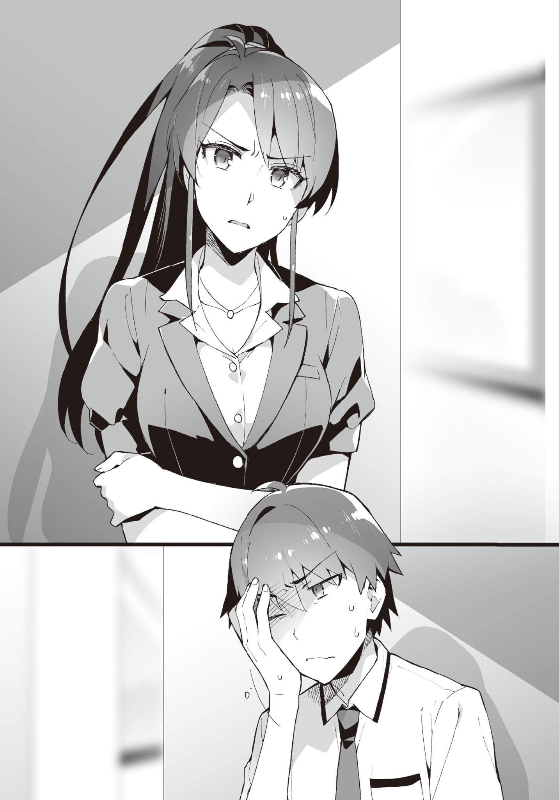

# Chapter 4: At the very best, only as friends, OK!?

> _ETA_: October 2020. Life is busy... Also, a spoiler about the title. It's just Aramiya acting all tsundere. This chapter is very intense and has a lot of POV switching. Look forward to it!

> _Progress_: 200-233 out of 200-249 pages (68%)

- - -

## Part 1

The day after I went out with Ayame.

The weather was a bit gloomy.

Dark clouds spread out as if it would rain down at any time, but for now they were enduring.
Although it seems like rainfall is not far ahead.

During our commute to school as usual, I was looking up at the sky with Ayame.

"I hate this weather. Aramiya, did you bring a folding umbrella?"

"Well, it's monsoon. I keep one in my bag all the time."

"Is that so..."

Why are you disappointed about it?

"Even though I thought we could come back sharing an umbrella."

"Was that the thing going through your head..."

_Aiaigasa_ (people sharing the same umbrella) can be seen often in VNs as well as RL.
Well, in RL people blocking the entire street receive a lot of ill intent.
It's not people getting along well with each other that angers me, rather, it's their inconsiderate blocking of the whole road without thinking about the surroundings that's annoying.
I almost want to tell them "you're being a bother so move aside".

"Like you know, how the umbrella not being wide enough will lead to one of our shoulders getting wet."

"Even the situation has to be how you want, eh?"

The person whose shoulder doesn't get wet ends up falling all over with the considerate person...
That's too conventional.

> _TL Note_: The author means something like it's a trope that's overused.

While having conversations of no substance, we reach the classroom.

Just as I enter, my classmates looked this way.

"W-what?"

Their gazes were fixed not at Ayame, but at me...

"So you're finally here.
Come with me for a moment."

Tozaki catches me by the arm and leads me towards a corner of the classroom.

"What's happening?"

"Just come with me."

In front of the back window, Tozaki said while sighing,

"So you've now apparently turned into a shameless profligate..."

"Ha? For real?"

"For real.
People from the other classes suddenly came in to ask.
Apparently you are conducting debauchery with Ayame, Hatsushiba and Ibu."

"No no no no, that's not possible.
In the first place no way you would do stuff like that in school!"

"Of course you're right, but..."

Has that rumor from before instead of calming down, spread out even further?

"To think such a rumor would spread out... something is wrong with our school."

"Going by your logic, don't you have the skills for debauchery?"

He got me there... not!

Where the heck will you find a profligate quality in me?
No matter how you think about it, someone is maliciously spreading these lies around.

Just when the wall between Ayame and the rest of the class dissolved, now a new one being born around me is nothing to joke about.

Well, no, it's just that they're being somewhat cold at the moment...

"Be careful about your actions.
Right now, you can apparently just wave your right hand a little and adult toys switch on to tease girls."

"What is this trainer type protagonist..."

Are there some girls in this school that act suspiciously?

&nbsp;

Classes started with the miscomfort in the air, but luckily, nothing negative happened.

The problems started after school ended.

While going to the club room to get my stuff, I noticed a bunch of guys intently making clattering sounds in front of the door.

"Hey, what are you guys doing here?"

"Geh, Ayame!"

Seeing Ayame's figure, they all dispersed hurriedly.
The rumors of her being scary is still in solid grounding for people not in our class, after all.

However, all that doesn't matter right now.

A piece of wire was left on the ground. I pick it up.

"... Were they trying to pick the lock with this thing?"

"Well, the working of the lock isn't that different from a padlock.
The structure is made to be a bit complicated, and it's a pain to pick them though.
... If it's of this level, I can't pick it."

"That's not what I wanted to know."

However, there's a chance that the door might be unlocked by coincidence.

To think that idiots who would go this far to uncover evidence behind the yuri profligacy...

This time we came to the clubroom because I had something to pick up, but things could have gone terribly wrong.

There are no adult toys in this room. I mean, no debauchery even occurs inside, so they clearly don't exist.

Well, if they do search the interior, the suspicion of my being a brute will be blown away.

However, they'll definitely find the eroge, and everyone in school would come to know.
If things go wrong then even rumors that I'm making them do stuff like in eroge H scenes might be born instead.

They'll also find out that I'm a deep otaku, and in the worst case, I'll be suspended.
It'll totally be a _deep impact_... wait this is not the time!

> _TL Note:_ I think the author refers to the disaster english film called "Deep Impact". Not sure if a Japanese reference exists here haha.

"Isn't it better to transfer all the eroge inside to home?"

"Well, I also thought the same, but..."

There's two pretty sizeable cardboard boxes filled to the brim with eroge in the room.

If I try bringing them home stuffing my bag, it'll take around a month to transfer all of them.

For sending them in a package, a teacher's permission is required.
It's not like I can't ask Kiriko nee-chan for help, but the problem is that it also needs a sign by the deputy head.
If it is deemed as a matter of mixing private matters with work, it will be a terrible inconvenience to Kiriko nee-chan, and in case they want to look inside, things will go really really south.

Then how about dashing to the convenience store while hiding the cardboard boxes?
No, we're out bold if a teacher inspects the contents while we leave.

> _TL Note:_ Hope you got the cricket reference. xD

Inside the school, it's not an issue to carry around cardboard boxes, but we'll definitely be seen if we move outside.
Every gate also has some teacher overlooking it.
It's also hard to climb up the high walls to escape.

"Isn't it safe if we stay inside the clubroom from now on?", Ibu says nonchalantly.

Unexpectedly, her suggestion has some credit to it.

"Now people are trying to enter even if they have to pick the lock after all..."

"So it's safer to do club activities inside, is it?"

Ayame nods as if convinced.

"How about bringing this attempted break-in incident to the teachers?"

"Not good, Hatsushiba.
An inspection might be carried out if we do that."

If that happens, the teachers will definitely sniff out the VNs.

If the inspecting teacher is Kiriko nee-chan, then we can still dodge it...
And if she's not in charge of inspection, then her reputation as the one allowing us to use this room will be damaged.

"Can't be helped. Let's restart club activities from today."

Not like we have anything to do here.

We enter the clubroom unlocking the door after a long while.

&nbsp;

"Good day."

While we were holding a conference about the rumors inside the clubroom, student council president Yaotani dropped by.
She really doesn't get tired of it.

"Hana, Asuka. Keep a watch on the surroundings outside.
Don't let suspicious people come around."

"Yes." "Leave it to us."

The two accompanying her went outside.

Closing the door, the president looks at us intensely.

"The rumors got even worse."

"Thanks to you."

"I didn't ask you."

"Is that so?"

The president gives Ayame a kind smile.

"How about we at the Student Council take care of this rumor, Ayame-san?"

"Seriously? Erm, I mean, Are you really going to do it?
Ah, but... it's not like you'd do it for free though..."

The president gives a calm nod, answering Ayame's cautious question.

"Of course.
We'll have you quit this club and become a full time member of the student council."

Ayame's expression becomes stiff from hearing the condition.

Hatsushiba and Ibu's eyebrows also twitch.
Although they're still refraining from speaking up.
Hatsushiba is shaking her lips even now, and will probably jump the gun any moment soon.

"I want to clear up the rumors.
But, making me leave the club for that is..."

It's as if the bitter feelings inside her heart were surfacing up.

Judging from Ayame's expression, she is clearly worrying about it.

There's no need to make her quit our club.
It's also annoying to have everything go by the president's plans.

"Please wait a moment, president."

"I remember telling you to shut up?"

"You didn't.
You just told me that you didn't ask me to talk."

"There's nothing to talk about."

"I do have something to say.
I really wish you would clear up the rumor for free."

"Did you really think I'd agree to such a convenient term?"

"Yeah. Aren't you a fellow comrade?"

"Comrade...?"

"Yeah. So in the end, which 18+ game did you buy yesterday?
You were very seriously thinking about which one to buy, after all."

> _TL Note_: YES! Give it to her! Punch in the face!

The president's eyebrows visibly twitched.

Every club member opened their eyes in shock.
It really was unexpected, after all.
Well, even I thought my eyes were deceiving me when I saw her in the shop.

Kukuku, she can't give excuses for buying eroge.

"I'll ask once more, but can you do it for free?"

I feel like I'm making a sleazy face right now.

Well, she's not someone I can deal with straight, but how will she respond?

The president however, just narrows her eyes without losing her cool at all.

"Are you... threatening me?"

"As if.
Do you think I can do such fearless things?
Well, your actions have also tormented us in various ways, so let's call it even after this."

Her eyes are cold, making me shudder.
It's as if she put ice in her gaze.
It's perfect for the summer, dammit.

"What will you do after... spreading it?
It's possible to mark that rumor as one trying to slander my reputation.
You do know how I behave in the school, right?
Do you think the students of this school will believe in you?"

This girl really understands her position well.
It'll be hard to have other students believe.

So should I have just taken a quick picture in my smartphone?
Nah stealing shots are a bit...

"And if you start such a rumor, the inspection of this room will also become definite.
Who do you think will be in trouble?"

So she knew all along.
I did guess it before.

"On top of that... since you know that I was in that place, you were also in that place. Together with Ayame-san..."

After saying that, the president shows us her the screen of her smartphone.

A picture of us dashing out of the shop interior while holding hands.
Complete with 18+ posters hanging around, it was impossible to make excuses.

The president gives a ferocious smile after closing her smartphone.

"You really don't go easy... stealing a photo like that."

"Nope. I just coincidentally clicked this photo, it's not stealing."

"... Such coincidences also happen, I see."

"But of course. The world is full of mysteries, after all."

"Well, it'll be good if Ayame doesn't think she misjudged you."

Hearing that, her whole body shook.
This time the effect was outstanding.

"W-well, even I don't want to go through such futile charades.
If we continue further, we really won't go anywhere.
Should we talk in private? Ara-whatever?"

She makes a gesture towards me to follow her.

"... That's exactly what I wanted."

I stand up while glaring at her.

And I follow the president who is about to leave.

"A-Aramiya!?"

"Don't worry. Just wait a bit."

As soon as I enter the hallway, I see the two from before keeping watch back-to-back. Aren't they diligent...?

After walking up to the president, we move to the deepest corner of the clubroom wing.

Entering shadows that no one is supposed to pass by, we look at each other.

"So, what did you want to talk about?"

Did we have anything new to talk about, again?

"I want you to lend us Ayame-san... is what I want to talk about.
We did have a similar conversation before, right?"

"If it's about that, we're done here. Please directly ask Ayame."

"I'm asking you because she declined.
I still haven't given up."

She really pesters a lot. Such a pain...

"Then, what do you want to demand from me this time?"

"Let me also compromise from my end."

"Compromise? What will you compromise...?"

Because she's running the train too fast, I've no idea what she wants.

"Let me give up on making Ayame-san my own.
So, let us have joint ownership.
You'll be her male lover, and I'll be her female lover."

... What?

> _TL Note:_ Indeed, what? Are you nuts?

"Just what did you say right now?"

"Did you not hear me?
You'll be her male lover, and I'll be her female lover, is what I'm proposing."

"Is your brain fried or something...?"

_Just what she saying..._ inadvertently my brain makes a typo.

It's such a bizarre topic. Seriously, what the hell is this president thinking?

"If you do so, I'll also take care of your rumor.
Then everything will be wrapped up nicely, right?"

"Nicely, eh..."

"As a plan in the current situation, I think it's pretty reasonable?"

I have no intention of selling away Ayame, though...

Although it is quite interesting that she's saying something that contradicts my mental image of her type...

"You seem to be the type of person who wouldn't tolerate the girl she likes going out with another boy though, am I wrong?"

"Well, I used to think like that... but I realized something.
Did you not realize it already?"

"Realize what?"

The president smirks condescendingly at me.
As if truimphing that she's the one who knows Ayame better...

"Only after all this time did I come to understand... the reason behind Ayame's cuteness and beauty-"

Opening her folding fan, she thrusts it horizontally towards me.

&nbsp;

"- is because she's in love."

&nbsp;

The president said so with an extremely serious look.

"I remember the names of every female student in this school.
Of course, I naturally knew about Ayame when she used to be a delinquent."

Well, kind of expected with how she used to stand out.
She was probably the number one famous person in school.

"At some point of time... she had suddenly bloomed.
In full glory.
Among all the beautiful flowers in the flower bed, as a beautiful woman emitting incomparable charm.
No matter how hard I thought, I could not figure out the reason behind this transformation... but then I realized.
She became like this because she fell in love with you."

"..."

> _TL Note:_ Oof what is with this president and her overly poetic language and choice of words? It's testing my vocabulary to the limit. Please stop talking already. You know you can't buy Ayame...

"Ayame's brilliance... although I hate to admit it, exists _because_ you are with her, and it won't be complete without you.
I desire for that beautiful Ayame-san.
She's absolutely wonderful.
Just like an angel descended onto this school.
If she's with me, my ambition will also definitely be accomplished."

"Ambition...?"

"Yes. To turn this school into an orchard of females... an all-girls school!"

... Is the scale of this topic too big, or too small, or just idiotic?

"This is not an eroge, and I don't think you can do that overnight?
It's not like the student council has that much authority, right?"

"You're correct.
If we had that much influence, I'd have turned this into an all-girls school a year ago.
That's why, we have to commit to a grassroots operation."

"Towards whom?"

"The city mayor or PTA I guess." 

>_TL Note:_ PTA = Parent-teacher association.

"Rather, turning this school into an all-girls school itself will take ages.
You're not going to be even here next year."

"However, I can sow the seeds.
If the seeds are sown properly... I can repeat a year or even get myself expelled, or maybe as a faculty, I'll return here.
It's at that time... that my hunger will be satiated!"

... Why did the students of this school elect _this person_ as their president?

She's even worse than the perverted student council presidents that appear in eroge.

"And you too, seem to be somewhat scared that Ayame-san will be taken away."

"I am not even thinking about that, though."

"Nope. You must be scared right now...
That Ayame's hymen will be gone.
Am I right, virgin-nerd-san?"

Calling people virgin addicts while pointing a folding fan at them, doesn't this person have a wonderful personality?

"You are misunderstanding something."

While I'm a virgin nerd, I have never once thought that I wanted Ayame's virginity.

"No, I understand from your smell.
While I don't want to think about it that much, you're an otaku just like me.
Therefore, let me promise that I'll not tear her hymen."

She doesn't understand a thing.

But...

It really is impossible.

There's no way I can hand Ayame over to this person - no, this freak.

While I had a fleeting thought that she could become a fellow eroge enthusiast, it seems like it was impossible for us to get along right from the start.

"You."

I glare at the president.

"Don't fuck around!
Virginity is not about the existence of a membrane.
It gets taken the moment someone offers their heart."

"I see.
Seems like you have some opinions about the definition of virginity."

"Not that it matters.
In the first place, I don't have any such relation with her.
I've been saying this from the beginning, but if you want her, persuade her by yourself.
If you think you're yuri, don't drag the existence of a guy in the middle!"

While I'm not an expert in the field, I feel like this freak is even wrong as a yuri.

Finally, handing over Ayame to this person is something I will not agree to even if heaven and hell flip around.

"Well, even if you do end up persuading Ayame, I'll obstruct it to the bitter end."

Hearing that, the president's eyes turned a dangerous shade.

Oof, scary AF.

"Guess I'll just ask for now, but why?"

"It's easy. I can't digest the fact that you're treating her like an object."

"Object? How so?"

"The fact that you're talking about tearing or not tearing her hymen.
It's something that neither me nor you can decide on.
We don't even have that right from the beginning.
It's to be given to the person that Ayame decides on."

The president hides her mouth behind the folding fan after opening it.

"... So negotiations are off?"

"It's not like there was any sign of it being established from the very onset."

Waving my hand at the president, I turn my back on her.

She's totally the king of wasting time.

Passing by the two attendants, I head towards our clubroom.

"I'm back."

Everyone looked back at me in worry as soon as I entered the room.

"W-welcome back. H-how did it go?"

Ayame asks, taking the initiative.

It's a bit hard to answer the person in question...

"She talked about her dreams."

"... what?"

Everyone makes a strange face.

Well, let's not talk about her proposal of "joint ownership" of Ayame and stuff... it's something that doesn't need to be said out.

Flumping onto a chair, I tiredly look up at the ceiling.

"Aramiya-kun, you look like a salaryman that just returned from a business talk."

"Aren't you watching too much drama or whatever?"

Didn't think I'll get told that by Hatsushiba.

Or rather, of course you'd get tired. Talking with that person is tiring.

In the first place, forcing conversation with people whose thought process is different is exhausting.
Not like my words reached her in any capacity.

It's still good if we had something common to talk about, but our tastes in eroge titles even would probably be conflicting.

"Good grief... why is that person so obsessed with women?"

Does she grasp the existence of Saitani?
If they still haven't met each other, I should thrust him at her as an absolute defense.

"She said she was cheated by a guy before tho..."

The person who seemed to have suddenly realized the reason, was none other than the girl with a face as lax as that of a mascot character, Ibu.

Since the input came from an unexpected person, everyone, including me, had round eyes.

"Who did you hear that from? Ibu?"

"From the council president herself."

"When?"

"Probably a long time back~
I feel like I went through hell by studying after that."

Now that she says it, she was once late because the president had called her.
It totally slipped our minds to ask her why she was called.
Wasn't it a talk about "assets" or something?

"And then, when I declined her, she told me that it's bad to go out with boys.
Even though Seiichi is a good boy..."

"Nah, leave the part about me. What did she say about being cheated?"

"Umm, if I remember correctly...
Probably when she was in middle or elementary school, she went out with a guy apparently-.
She told me his name, but I forgot.
Although it seemed like I have heard that name somewhere..."

"The fact that you don't remember if it was middle or elementary school, I think your story is pretty shaky..."

"P-president did go out with a guy before!!"

Well, it's probably fine to believe in that much.
Since she's going this far...

"So, she's pretty, right?
And the guy was also super cool-.
So everyone was jealous that they were such a great couple."

A couple to envy eh.
If people think about it that way, it probably sounds like middle school?
During elementary school even if people become a couple they'd just be jeered at.

Well, let's leave aside the time period for now.
Rather, it's not a talk about her assets but rather her personal history...

"So wasn't she also quite happy about it?"

"Yeah, at that time. 
But... apparently she was told on the graduation day..."

"... What was she told?"

"『Thank you for granting my school life with vibrant colors.
But, I already found a cute girl, so I don't need you anymore.』, apparently."

... We were all at a loss for words for a moment.

It's Ibu's words.
I don't think she can remember the conversation word by word.

But, the content was probably not that far off.

"Cruel..."

"...That guy's the worst."

Hatsushiba and Tozaki agreed with each other, frowning in distaste.

It's a story that hits home.
If such a rival character appears in a VN, you cannot gain catharsis if there isn't an episode where they get chastised.
If such an episode doesn't exist, I give those VN's a 1☆ rating.

"You kind of end up... pitying her."

Ayame's pupils shadow in sadness.

"That president had such a history..."

"She also said that the boy went out with another cute girl in his next school.
She was super angry that in the end, she was treated as just an accessory."

"Of course she would.
But if he treated her that badly, wouldn't have he become the victim of rumors?"

"That you see-.
He was apparently a very serious type, and no one believed her even if she told them.
In the end the president was called 『mean』, 『demon』 etc..."

So that's why she stopped believing in guys and turned towards yuri.

Whether eroge came first or her turning into yuri came first is something we don't know... but there's not a lot of difference.

"..."

I suddenly thought.

Her story is very familiar to me.

Since she's the same as me.

After being thoroughly deceived by the opposite sex, she also became unable to believe in them.

Teachers or classmates didn't even believe her when she talked with them about being cheated.

And then she dug into the world of VNs, pretty much like a female version of myself.

Being deceived by the person you love tears apart your mentality by that much.
Especially if during puberty, that wound becomes deep and doesn't heal easily.
Even more so if you purely believed in that person.

Nowadays I can get along well with Ibu, and since she's been very sincere... I can now believe that she never had it in her to do such a terrible thing. That itself was a huge jolt between trust and suspicion.

I had also become unable to go to school for a while, and probably the president also probably received shock to a similar degree.

... Although I didn't head over to homosexuality.

Also, it had become clear that even Ibu was being manipulated.

"Is that how she achieved such an over-the-top hobby..."

"Well... something like that, maybe."

At my words, Hatsushiba made a painful expression that conveyed that she couldn't really say anything.

"It's very painful... when the person you believe in betrays you."

Hatsushiba also had to encounter something similar during Songou's case.

We all sympathize with the president.
She is pitiful.
Although she probably doesn't want guys to think of her that way.

However, no matter in what form, she stood up on her own even after the tragedy.

That's something I can sincerely respect.

"However... this time, she has become unable to look at her surroundings."

"Did ya say something? Aramiya?"

Ayame asks in wonder.

I ended up muttering that in a small voice, but apparently she didn't hear it.

"... No, nothing in particular."

I won't really stop the president if she wants to be tied together with a girl.
No one has the right to judge others or deny them for their preferences.

Romance is free.
Even if you love 2D.

But then, there's a huge prerequisite: that you don't cause hindrance to the person you're aiming for.

The president is already too much obsessed with Ayame.

You never know what she might be up to.
We must be careful at all times...

&nbsp;

- - -

## Part 1.5

"Was it not possible, after all?"

Yaotani frustratingly bit her fingernails while looking at the back of Seiichi.

"President, your beautiful fingernails will break."

"... You're... correct."

Although she let go of her nails, her eyebrows were still knit together.

It seemed as if her anger was overflowing up from within.

"... Should we do it?"

The secretary proposed something ominous.

However, the president shook her head.

"Violence is bad.
We must always move smartly."

"Hmm..."

"However... we need to use our final means.
Not that I really want to use _that_... it leaves a bad taste in my mouth as the student council president."

Such dangerous words dispersed into the hallway.

&nbsp;

- - -

## Part 2

After the secret conversation with the president, the rumor, instead of calming down, was spreading even further.

After finishing our packed lunches during the lunch break, as we were quietly gathered in a corner of the classroom, Tozaki told us with a bitter smile...

"So apparently now you have taken the virginity of half of the girls of this school."

"Don't kid with me, as if such a thing can even be acceptable!"

If they were 2D girls, it'd be the best, but my heart doesn't move even a bit if it's in 3D.

In the first place, does such a VN-type rumor also find fuel somehow?

"Well, most of them don't really believe it though."

"Most of them... so saying backwards, many people believe in the rumor?"

"Although there was only one such example, but they were like 『seriously?』.
Not sure if it was a joke or not."

Isn't the average intellect of our school too low!?

Just what evidence do they have to believe in it...
What is the factor behind their thoughts?

No matter how think about it, I've been maintaining proper conduct.
At least in the exterior.
Don't tell me, my true nature that even I don't know about, somehow got exposed?
... Nah, not possible.

"It's just that...
There's also a troublesome rumor that is starting to get mixed."

"What do you mean by troublesome?"

Just how more troublesome can this even get?

"That you're doing stuff like in 『Classmate Paradise!』..."

For a moment, my CPU hung up.

"What... did you..."

『Classmate Paradise!』.

A VN where you screw 15 classmates in order after school, or doing XX stuff together.
So, it's the title of a full-fledged eroge.

> _TL Note:_ After some digging through VNDB, I think the author here refers to the old VN called [Doukyuusei](https://vndb.org/v185) where there are 14 heroines and you can select any (or multiple) of their routes... Way to go, Aramiya! xD

"Why did that title come up...!?"

"No clue.
It's possible that otakus are fueling the rumors even further...
Rather, the name of eroge mixed into rumors is rare..."

"Please tell me you're lying..."

Isn't it the same as the fact that I'm a deep otaku is coming out of the bag!?

The unnatural development speed of the rumor is already out of control; no matter what I say it'll just be the same as spilling water on hot stone.

That being said, as long as the clubroom is not broken into, my hobby should not get found out...

"Hey, how about you try doing something good in order to spread good rumors, like during Cotton's time?"

Hatsushiba proposed in a worried tone.

Not that I didn't think of that...

"It's different from Ayame's time - I don't have a chance of leaving such a good impression like Ayame did.
It's futile."

"But"

"That kind of action had meaning because Ayame's original impression was bad, and for me, the impression I have is $\pm0$...
It's not clear how effective it would be.
Not that it will be meaningless, but doing such a thing in the face of the fresh rumor will only make it seem deliberate."

> _TL Note:_ Trying to make it too literal kind of obfuscates the meaning, but basically Ayame's rumor was old but Aramiya's rumor is new. Doing good stuff only now has a chance of backfiring.

"Then, I could tell everyone..."

She probably is thinking of doing the podium thingy from Ayame's time.

"While I'm happy about your feelings, even that won't have a lot of effect..."

Our podium declaration also had impeccable timing, after all.

"How about just giving up and doing stuff like the rumor~"

Ibu brings up a moronic opinion as usual.

"That kind of stuff you can do after the rumors calm down and you just wanna laugh it off.
If we do it now..."

"But well~.
Once you pierce through, sometimes it turns into a good flow-.
_If pushing doesn't work, push harder_, or something?"

"... Well, not like that kind of methods don't exist.
By the way, the correct proverb is _if pushing doesn't work, try pulling_.
What good would pushing harder do?"

For example, let's say the rumor was that I love porn magazines.

Then if I bring an abnormal amount of porn mags, it's not impossible that there's some chance of it being conceived as being deliberate.

But in this case, just one or many paper bags full of porn mags won't suffice.
You'd have to bring a 2-ton truck loaded with porn mags in order to make it into a deliberate gag.

The amount of VN in my home and the clubroom does add up to that ridiculous quantity, but to make it into a gag I'd want at least three times that much.
Even if I ask Ayame and Tozaki to bring their VN collections, it won't be enough.

"For now there's no choice but to endure, I guess..."

"But somehow, you continuing to be misunderstood like this is..."

Ayame sadly looks at me.

She seems to be suffering as if it's her own problem.

"Can't be helped, right?
At this stage, no matter what we do the timing is terrible.
Plus, the final exam and summer vacation are right around the corner.
It's fine if we endure till the closing ceremony."

There are times when you really can't do anything.

Well, just understanding that much should be enough... is what I was thinking.

While returning from the bathroom after the lunch break ended,

"Seiichi, come with me for a moment."

Being caught by Kiriko-neesan, I was moved to a deserted corner of the hallway.

"What happened?"

"So. You don't have explosives and stuff in the clubroom, right?"

"Ha? Of course I haven't.
What are you talking about?"

"Of course..."

Kiriko-neesan let out a sigh of relief, but her expression was still perplexed.

"Why did such a topic..."

"In the middle of the rumor that you have been doing whatever you like in that room, an anonymous report came in that they heard the sound of an explosion from there.
And, on another occasion, apparently smoke was seen coming out from the window."

"It's a false accusation.
It's not like I'm playing my VNs on the speaker in that room."

I have not even played an explosion sound effect from my laptop.

There's also no smoke.
We don't even deal with gunpowder or anything.

"In the first place, if smoke had actually appeared, there would be more witnesses.
Same with the explosion sound, right."

"That's right.
But the problem is that it being mixed with the current rumors, the teachers have started to become slightly suspicious about it.'

"Oof, give me a break..."

It's the era when even teachers get fooled by rumors.

No, maybe the rumors themselves are well-made.

Certainly, the presence of explosives in the clubroom is not something that will definitely not happen.
There even were such news in some overseas schools.
Chemical substances leaking out and cause explosion accidents also happen even if in small scale.

At least, it's easier to believe than me playing VNs inside that room...
No, maybe they're separate issues?

"And hence it has been brought up that the room should be inspected."

"Well, of course it would be brought up..."

If the suspicion can be cleared by just a little inspection, that's easier even for the teachers.

Of course, they'll discover the eroge packages stored in the clubroom, and my suspension would be set in stone.

"... You can't decline it?"

"That is impossible after all.
If it gets worse, you might get expelled."

"No matter how worse it gets, expulsion is too much, right?"

"I don't think it'll happen, but if you resist obstinately, then it'll be interpreted as you bringing explosives into the clubroom."

"This is seriously bad, isn't it..."

"Super bad. Seiichi, what will you do?
About all the stuff inside that room.
While I can _ignore_ it, I cannot _look after_ it."

"... Not even if Kiriko-neesan uses her name?"

"Well, if you can properly disguise the contents of the stuff being brought out..."

Even if we disguisse it as documents, right now there's a trend to not disclose information to third parties outside school.

If some sort of unnatural substance is discovered, then it's not hard to imagine Kiriko-neesan getting into trouble and being inspected for it.

A solution that has a chance to cause her trouble is something I can never agree to take.

"Well, if it's in exchange for your expulsion, I also have the resolve to see through it."

Kiriko-neesan's serious expression conveys that she isn't joking.

"No, going that far...
How longer can the inspection be delayed for?"

"It's not like the teachers are believing in any of it like idiots, but they were thinking that doing the inspection might calm down the rumor.
In the worst case, it'll happen today after school.
If not today, definitely by tomorrow.
Especially Murakami-sensei of Modern Affairs is pretty desparate about it."

My head starting spinning.

"... I'll think about something by the time classes end."

I must think about something that Kiriko-neesan can bring out without raising suspicion...

"Got it.
If there's something I can help with, contact me...
hmm?"

Kiriko-neesan looks at the other side all of a sudden.

"Something the matter?"

"No, I felt like someone was there.
Was it my imagination?"

"I didn't realize anything though..."

It is pointless to ponder over that at this point.

"I'll return to the classroom."

Parting off from Kiriko-neesan, I head towards the classroom.

Really, what should I do...

&nbsp;

- - -

## Part 2.5

"Aramiya might get expelled...!?"

Seeing Kotani-sensei catch Aramiya who was returning from the bathroom and taking him away by chance, I followed them in curiosity.

And I overheard them talking about the possibility of Aramiya getting expelled... which is absolutely unbelievable.

"You must be kidding me..."

If such a thing happens...

I don't even want to imagine it.

The fact that the me right now is here.

That I am having fun in school.

That I was able to make up with Yuuka.

All of it is thanks to Aramiya.

It wouldn't have been strange for me to get expelled, but I found happiness.
But in exchange, if Aramiya, who saved me, gets expelled instead, that's something I can never acknowledge.

"But, what should I..."

But no good idea comes to mind.

Aramiya himself doesn't seem to be able to come up with any plans.

There's no action that I can take.
There are no sparks of ideas that flash in the mind.

However.

『... What we were talking about earlier was that, if we hand you over to the student council president, then she would solve all of our problems.』

I recall the recent happenings.

At that time, Aramiya had said that it's fine to do nothing.

Aramiya has always been worried about Ayame, even if his words are rude.

At this point of time, I should take some action.

There's no other answer.

"... Let's go."

Strengthening her resolve, Ayame heads towards the Student Council room.

&nbsp;

- - -

## Part 3

"Really, what should I do...

I returned a bit before the lunch break ended, but the situation is totally hopeless.

If the retaliation even contains a possibility of expulsion, they are totally prepared to actually harm me.
Why are they aiming to make my life this difficult!?

Regarding the rumor about myself, I had this careless attitude of not caring about it at all.
Because no one in their right minds would believe in them.
Thinking that it will disappear eventually, just like the monsoon.

> _TL Note:_ Monsoon in japan lasts for around a month in the middle of summer, and goes poof just like that.

But, that didn't happen.
Probably Ayame also went through this when rumors about her had just started springing out...

After all, that I have to do something about the rumor... makes me agitated, but my hands are tied.

When it comes to myself, why does my thought process become dull?

"What do you think will happen when the eroge in the clubroom gets discovered?"

I discreetly ask Tozaki, who is sitting in the seat behind me.

"Suspension, I guess..."

"Yeah."

"But, there's something even worse than that, right?"

Don't say any further, Tozaki.

After suspension due to the eroge being discovered...

I'll probably get titles like "Eroge　emperor" or "18+ Meister", and it will stick for the rest of my school life.

"Even if I get suspended, we'll still be friends, right?"

"It depends on the situation.
The answer would depend on just how your position would be affected."

... What a worthless friend.

But well, it can't be helped.
This particular case.

If our positions were reversed, I'd give the same answer.

Especially Tozaki might become classified as the same kind of potato as me.

"... Come to think of it, where's Ayame?"

It's almost time for the lunch break to end, but Ayame cannot be seen anywhere.

She has stopped skipping classes for a long while now.

"Now that you mention it, she's not here.
Maybe she went to pick some flowers?"

The next lecture is Ms. Kawada's Japanese History, so she probably won't be severely reprimanding if she's late.

"Ah, Ayame-san was... kind of in a strange area, though?"

The person who suddenly started a conversation with us was Nishihara.

With eyes that lack confidence, she looks nervous.

"Strange area?"

"I t-think she went towards the first building...
Because she was walking towards a place where we don't visit a lot, it kind of stayed in my memory..."

Why was Nishihara watching her?

Just a coincidence?
Well, not that I can think of any particular reason.

... Let's not doubt her observation for now.

The first building has... the third year classrooms, staff room, and the student council room -.

"Ah..."

That girl, don't tell me...!

"... Tozaki, sorry.
I'll be right back.
Answer my roll-call if you can."

"Ha? What are you saying, isn't that impossible!?"

I stand up and leave the classroom.

Then, run towards the first school building.

The bell marking the end of the lunch break will ring soon, and five minutes after that the classes will resume.

The teachers will come this way soon, and it'll probably become impossible to avoid them.

No matter how you think about it, what I'm doing is skipping classes in broad daylight.

However... there's no doubt that Ayame has headed towards the student council room.

Taking into account her personality, I have no doubts about it.

I should have paid her actions more attention.

『... What we were talking about earlier was that, if we hand you over to the student council president, then she would solve all of our problems.』

> _TL Note:_ Aramiya told this to Ayame back in Chapter 1 when they were buying stuff from the vending machine.

If I had known at that time that things would escalate to this level, I'd have not spoken a word about it to her.

Although I meant that as a warning to stay away from the president, to think that she'd willingly go over and do something like this...

If the person eavesdropping on my conversation with Kiriko-neesan was Ayame, then...

She'll definitely sell herself in exchange for my expulsion.

"Who are you kidding...!
Don't make me carry that cross on my back...!"

> _TL Note:_ As in, he'll be guilty of selling Ayame indirectly, and he doesn't want to carry that guilt.

After crossing over to the first building via the second floor connector, I head to the topmost floor.

Climbing up the stairs, a hallway going further in appeared.

The student council room is further down this way.

However, two girls are standing guard right there.

The two minions from before.
The vice president and the secretary.
The president had referred to them as "Hana" and "Asuka".

"Where do you think you're going, Aramiya-san?
Classes have already started."

The braided girl with glasses - Haha - warned me with a sharp glare.
Attribute-wise, her character should be more gentle.
A person donning three braids and glasses being a battle maniac is... something one cannot even think of.

"Let me go inside.
Ayame is inside, right?"

"... I'm telling you to leave."

The secretary Asuka pushes a step forward towards me.

She had a pressure different from Ayame.
Girls are strong, eh!

"I cannot turn back.
Please let me pass."

I try to slip past them.

... But, she blocks my way mirroring my movements.

"Can't do.
Go back."

"I don't have the leisure for discussion."

I forcefully push her to go past the duo.

But, she catches me by the shirt and stops me with an abnormal amount of force.

"I've been telling you to return to your classroom!"

"Right back at you, Student Council Members!
Let me pass through!"

Ayame is there in front.

If she wanted to become a member of the student council by her own will, I'd have been OK with it.

But, she's doing this all for my sake.
I must stop her, no matter what comes my way.

"You're persistent!
Just go back to your classroom!"

She tries to throw me while gripping my shirt.
Damn, she's powerful!

Is she really a girl?
Is she the relative of the strongest apex-class girl or something?

"Tch."

&nbsp;

_To be continued..._