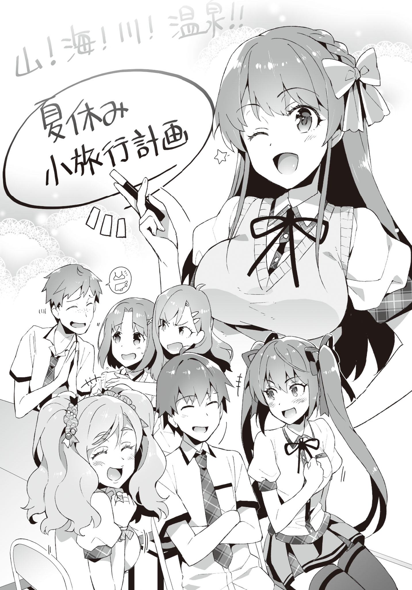

# Epilogue and Afterword
> Disqus volume 3 on [this page](https://potla1995.github.io/Chuuko-demo-Koi-ga-Shitai/3/). Feel free to join [my discord server](https://discord.gg/Srvv9nzyQT) as well.

## Epilogue

Around two weeks after the happenings from last time,

"It's the closing ceremony~! Summer vacations start tomorrow!"

"Su-Suwama-sa~n.
Homeroom is still not over, so don't make frolic already~"

Ibu's jovial shout troubled our homeroom teacher Oohara-sensei.

Well, the semester exams have ended, and like Ibu said, the summer vacation starts tomorrow.
We also got back our report cards, so no wonder she's in high spirits.

Not just Ibu, everyone in the class seemed to be trying their best not to run wild.

"Well then, everyone,
Without forgetting that you're students, please enjoy the once-in a lifetime summer vacation of your second year of high school to your fullest.
Make sure not to get into trouble."

Everyone gave a half-hearted response, and that ended the homeroom.

"That was dangerous... If I got that problem wrong, I'd have failed in math..."

Ayame's face was still pale; apparently she was yet to recover from the exam spell.

Somehow no one failed a single subject.
Everyone avoided the make-up lessons.

There are some days when we have to show up, but not until mid-August.

"You can be relieved already.
But, we still have homework, so don't set all loose."

"...Yeah, we sure got a lot of that."

Ayame drops her shoulders.

What a busybody.

"How will you do your homework, Aramiya?
Little by little everyday?"

"I'll finish it in two days."

"...For real?"

"I must finish it all before the software I was talking about earlier gets on sale so that I won't have anything to worry about.
I'll definitely finish the homework first.
In order to complete the software!"

"Maybe I should do the same..."

While talking about such stuff, the usual members head towards the classroom.

As we get out of the classroom and head towards the club building,

"Kotoko-saaan!"

Kiyomi showed up,

"I-I've been in your care, senpai..."

And the library committee member Saitani peeked from behind.

Today, on the final club activity of the semester, we had decided on discussing a certain topic in the clubroom.
And Saitani also has a huge role in that discussion.

"Well, let's discuss stuff in the clubroom.
Since we all have things to say and things to ask."

"I don't really have a lot to say, yes!"

Cute.

His habit of joining his hands in front of his chest is super destructive.
He must be aiming for your heart.

"Still, it's so peaceful...
I wonder how things reached such a calm ending."

If I think back, I could have even gotten expelled in the worst case earlier.

Well, maybe expulsion was taking it too far, but suspension was definitely possible.

My rumor also faded away at the speed of light after that day's happenings.

While being overcome with strong feelings, we notice three silhouettes standing in front of the club building's entrance."

"How do you do."

It was the student council president and her two minions.

Every one of us switched to alert mode.
Except for Saitani and Kiyomi, the air around everyone else strained.

"Is anything the matter?"

Ayame takes the first hit and asks.
The pressure rising in her pupils were not to be trifled.
It's fine if you don't glare at them that hard.

"No,..."

The president's gaze shifted from Ayame to me.

"I've something to talk about."

"...Okay, okay."

Ayame's face stiffened in anxiety.

"It's fine.
It's not like she'll try anything funny after all this time.
Take the keys and go ahead to the clubroom.
Our talk will end pretty fast anyway."

"Yeah, let me promise.
I'll keep these two stationed over here."

Transferring the key over to Ayame, I walk a bit away from the club building with the president.

In the desolate backside of the building, we face each other. 

Then, the president opens up her folding fan and points it towards me.

"I've not given up on Ayame yet.
Her beauty is unparalleled.
That's all I wanted to say."

"That again?
Well, do as you like."

"Of course, I'll respect her own will.
But, for the next eight months, I'll go on the offensive until I graduate."

"Like I said, do as you please."

"...Goodness.
You're worthless as a rival."

"I have no intention to fight over her, so..."

It's bothersome, after all.

Heaving a deep sigh, the president hands over something.

"Accept this."

It was an envelope.
Its contents were - probably money.

"Because she caused you problems.
It's for your Y-shirt and T-shirt."

"Is it the student council's money?"

"No, it's my pocket money.
I'll never use the student council funds for my personal matters."

...This person's pocket money?

Well, let's accept it for now.

There's no reason to associate deeply, and it's questionable to have her indebted for my uniform.
Plus, having my parents pay for it is also ridiculous.

"Well, the student council budget will be used to protect your club.
Let's try to accommodate your club's budget.
As that's directly related to preserving Ayame-san's otherworldly beauty."

"Are you serious?"

"I am.
I pushed the topic into the student council's plans."

"...Isn't that extraordinary as an apology for causing inconvenience?"

"Yes. That's why I have a condition."

"What is it?"

What kind of a condition will you put up now?

&nbsp;

"...Let me play 18+ games in your clubroom as well."

&nbsp;

What's she talking about... Wait, what?

"Are you crazy?"

"I'm perfectly sane!
I have to play them while not having any safe haven, you know!?
I want a space where I can feel completely unconstrained!
That's a similarity amongst us.
It was a space that I had my eyes set on, but while I was occupied with other things..."

"President was also starving, I see."

"Shut it!
My lifestyle is completely restrained at home and at school, so it can't be helped, right!
I need a place where I can show all the lust on my face!"

Hmmph!
She averts her eyes with folded arms.

Her face was bright red.
It might be the first time that she showed an adorable expression.

"And with that, we won't owe each other anything."

"Well, you do have my thanks, president.
That I got cleared of suspicion from the teachers and my rumor dying out was both the president's doing, right?"

After that incident, the talks about clubroom inspection also died out along with my rumors.
It was as if everyone lost interest with a snap of someone's fingers.

President telling the principal that it wasn't required was a huge help.
She doesn't have authority, but she is highly trusted.

"You understood that well."

"There was no other possibility."

"Well, I also was involved in the rumors.
I made up the yuri rumor, after all."

As expected.

"Well, I didn't think it would affect the reputation of your personality."

Eh?

"What did you just say?"

"I didn't expect people would start bending that rumor to degrade your personality."

"...Wait a second."

Something is off.

"It wasn't you who spread that second rumor about my debauchery or whatever?"

"Of course I wouldn't.
What merit do I have in doing that anyway?
I did spread a rumor about Ayame-san and others being yuri, but I didn't even touch your topic.
That your rumor got faded was just a side product of deleting the yuri rumor."

"Wait... then who spread the rumor about me?"

"Who knows?
I haven't figured out that much.
But well, I felt some evil directed at you while investigating... so tread carefully, so that you don't make Ayame-san feel sad."

With that, the president takes her leave.

My initial suspicion was absolutely right.

The president was behind the yuri rumor of Ayame.

But, someone completely different seems to have set their eyes upon me.

That someone is still spreading their net inside our school.

"In other words, it's not the end."

The bright summer sun mercilessly fries the skin.

"...Let's go back to the clubroom, I guess."

While I'm still very uneasy, standing around in thought here is not useful in any way.

Right as I enter the clubroom, everyone looks up at me worriedly.
Except Kiyomi.

"What did you talk about?"

"She apologized for tearing my Y-shirt, and discussed about the usage of the clubroom..."

No lies there.
It's okay to think about whether the president can use this room later on next term.
Bringing it up right now is really bothersome, after all.

Let's also not talk about our conversation about Ayame.
There's no need to go out of my way to bring it up.

"Plus, we talked about club expenses.
Not sure about how much they'll pay."

"This club will get grants?
Is that okay!?"

Tozaki interrogated in a quizzical tone.

"Well, if the president herself says so, it should be fine, right?"

"But when she graduates and quits, the club will definitely be investigated, right?"

Of course.
Well, maybe it's fine to just give up the grant at that point.

"How about just have Ayamecchi become the next council president～"

Ibu's comment was outrageous even as a joke.
Her thoughts are at a huge scale.
Well, it might be interesting if it actually happens, though.

"Then you'll completely rule the school, Ayame-san!"

"I won't do that!"

Ayame chided Kiyomi in response to her idiotic comment.
My sister has a nonfunctional brain.

"Well well, everyone.
Haven't you all forgotten about the topic of today's discussion?"

The acting chairman, Hatsushiba, grabs everyone's attention by tapping at the table.

That's right.
We gathered on the graduation day because ー
"We need to hammer out the details of our excursion during summer vacation!"

Together with our advisor Kiriko-neesan, we'll be going on an excursion this summer.
Saitani was forcefully added in as a guest to the roster by Kiyomi.

"But, will we really be going..."

"Of course, Aramiya-kun!
With every one!
To the river, ocean, and hot springs!
It's an extremely rare opportunity, after all!"

"That's right, Aramiya.
Just holing yourself up indoors all day isn't good; you should spread your wings outdoors sometimes too."

...This bastard Tozaki, just cause we're going with Hatsushiba, he's getting all excited.

The previous promise of going to the sea together somehow transformed itself into an excursion.
One of Hatsushiba's acquaintances owns a pension, which apparently comes complete as a set with the mountains, the sea, a river, and hot springs.

Since I made a promise already, it can't be helped...
But I never thought it would be such a long trip...

"I-is it really fine? For someone like me to tag along..."

Saitani speaks up with discomfort in his tone.

Kiyomi slaps his back in order to encourage him.
It probably hurt, as the sound that echoed wasn't small at all.

"It's fine!
After all, Hatsushiba-san has agreed to it!"

"It's a bother to both Hatsushiba and Saitani, though."

"We've taken proper permission from Hatsushiba-san, and Ryouma isn't really against it either ー"

My advice fell on empty ears.
That attitude pisses me off.

"It's fine, Aramiya-kun.
The more the merrier!"

Hatsushiba is a nice person.

"Plus, she's Aramiya-kun's little sister.
How can Yuuka not listen to her request?"

> _TL Note_: Recall that Hatsushiba (first name Yuuka) refers to herself in third person.
> The original text slightly differs.

...What's this feeling.

It was just a normal sentence, but I feel like there's something more behind it.
Is my heart getting dirtier day by day?

"That being said, we'll share a room with Sai-nyan...
What should I do..."

Tozaki is as gross as ever.

If Saitani isn't boarded in a room different from us, his chastity might be in danger.
That being said, he'll probably not like to be in the same room as the girls, so... what to do?

Well, let's think about that when the time comes.

"I'm super excited!
What should we do over there, Aramiya?"

"We'll think about that right now."

Ayame looked as excited as a rabbit.

Even though I have VNs to complete within the first week of the vacations...

Well, they do say that these things are the most fun to plan.

"Then, let's discuss on what to do using the whiteboard!"

Ayame's rumors are still deep-rooted, and we have no clue about who the perpetrator is.

But somehow... I end up thinking that with these members, we'll definitely be okay.

I'm not saying that they're all... dependable.
Neither am I overestimating myself.
It's a strange feeling.

No matter what comes our way, we'll be fine.

At this moment, let's forget about all these worries and solidify our plans for the summer vacation!

---

## Author's Afterword

Hello dear GA Bunko readers, it's been a while.
I'm Oota Gakutata, or rather, Tao Noritake.

"Chuuko demo Koi ga Shitai!" has published three volumes already.
Thanks to the popularity this title received from everyone, I've been able to continue writing.
It's difficult for series nowadays to continue without support from the readers, so you have my sincere thanks.

&nbsp;

The main focus this time was the date with Ayame (in Seiichi's eyes, it was an outing).

Initially, I was pondering on how a date would look like after the serialization in "Let's become a novelist!" (syosetsu)
But it really felt like the two would end up playing games cooped up in a room...
That's why I was having trouble bringing the story upto that point.

But, during the initial serialization, there was a character who didn't play a significant role.

It was Kiyomi, the sister.
At that time, even her name wasn't fixed, and her only role was to despise the protagonist and call him a virgin all the time (It's prohibited to say that she plays the same role now too).

Since I was asked to make her into a main character, I gave her a name,
and pondered on whether she should be a middle school girl or a first year high schooler.
But, it's really helpful that her chemistry is good with Ayame.
I plan on explaining her circumstances little by little in the future too, so please look over her warmly.

&nbsp;

Plus, I think it's mentioned on the obi, but the production of a drama CD has been decided!
I won't announce the dates or the cast (even if you're interested in it), but please wait while looking forward to it!

&nbsp;

Well then, it's time for my thanks.

ReDrop-sama, thank you for your work as always!
I feel like the illustrations get refined every time they come.
It makes me very happy to see the already attractive characters become more and more lively.

Thank you to M-sama, my editor, as well.
Although our schedule was tight this time as well, thank you very much for everything!
I hope you can help with the production of the drama CD as well!

In addition, my warm gratitude to everyone involved in the publication of this book.

Also my thanks to everyone who keep encouraging me on syosetsu.
I also think the same way about Twitter, but I'm slightly bad at replying, and end up keeping silent.
But I really have so much to say that I can't express in words, so please be lenient on me.

Then, at last.
My heartfelt gratitude to everyone who took their time reading this book.

&nbsp;

2015/8/18

---

## Translator's Afterword

To everyone who read this far: thank you for your time, and as usual, please support the author by buying his books on [Amazon](https://www.amazon.co.jp/s?k=%E4%B8%AD%E5%8F%A4%E3%81%A7%E3%82%82%E6%81%8B%E3%81%8C%E3%81%97%E3%81%9F%E3%81%84%21&__mk_ja_JP=%E3%82%AB%E3%82%BF%E3%82%AB%E3%83%8A&ref=nb_sb_noss_2) or [Rakuten Kobo](https://books.rakuten.co.jp/search?sitem=%E4%B8%AD%E5%8F%A4%E3%81%A7%E3%82%82%E6%81%8B%E3%81%8C%E3%81%97%E3%81%9F%E3%81%84%EF%BC%81&g=101&l-id=ebook-pc-search-box&x=0&y=0) or any other source.

I have a great news for you all: I've finished almost all requirements for my doctoral degree!
My dissertation still needs to be defended, but after that, I'm going to join work in Tokyo.
This is a great opportunity for me not only to get better at Japanese, but also to learn a lot more in my field of work.

That being said, Volume 3 feels like  it was a pretty rough ride.
Not only was it my first time translating a light novel, my English was also quite awkward at the beginning.
There are clear grammatical errors which I did not get the time to get back to and fix later on.

That being said, I'd like to thank everyone who joined my discord server, commented on the disqus section and patiently kept waiting for the new chapters.
You guys are awesome; thank you for your support! 
Really, job search during covid times was quite depressing.
But, here we are! Finally, after a year, Volume 3 is finished.
Together with my doctoral journey haha.

Please note that I don't like to ask for donations since the LN is not my creation, and my RL schedule is hectic at times, meaning slow and irregular releases.
I plan on keeping this site donation-free in the foreseeable future.

Do I plan on continuing this series?
Yes!
But, it might be good to have another helping hand to work on my English, which is an area which could really see some improvement.
If you wish to proofread/edit my translations, please join my discord group and DM me.

What if I get a legal notice, or the author requests me to bring down the site?
Every single translated document will be brought down immediately, together with the github repository.
I'll contact the author via Twitter to ask for their permission soon, but in case I get a non-favorable reply, I'd like to take the liberty of stopping translating.
Please check my discord for updates on the status and the future of this series.

&nbsp;

Potla  
2021/03/31

> Expect Volume 4 to be started in a month.