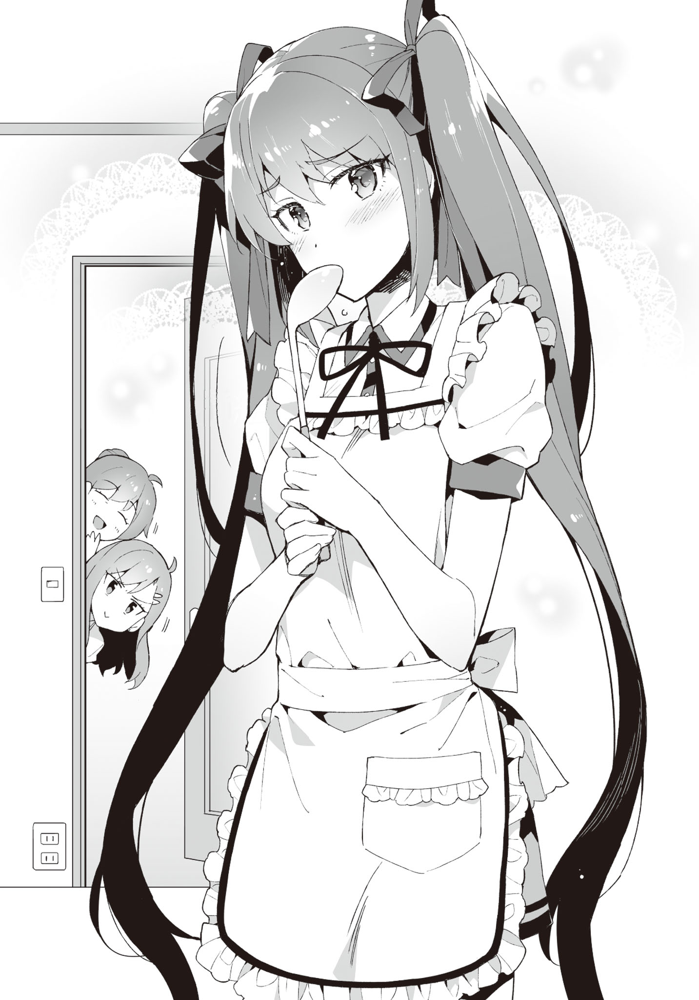

# Prologue

A strange premonition suddenly shook my consciousness out of a doze.

As if waking up from a nightmare, I forcefully raise my upper half.

I cautiously check my surroundings without leaving any gaps.

The floor, walls, ceiling... are all fine.

No one is in the room. Not even a single insect.

Except for the dust particles dancing in the sunlight peeking through the gaps of the curtains.

Since it was June, almost summer, the closed off room was mercilessly ascending in temperature.

It's hot.

My pajamas and shirt were soaked in sweat.

"...I woke up not because of the premonition, but because of the temperature?"

Getting off the bed, I opened the curtain and windows.
The gentle breeze pushed out the stagnant air from the room.

It was around time to wanting to start using the AC, but I still had reservations as it was still June.
If the body got used to the AC at this season, it will be hard to bear the actual summer heat.
I decided to endure not using it.

As I switched on the electric fan kept beside the window, strong wind started circulating inside the room.
Setting it to oscillate quickened the displacement of air.

"It's already summer, eh."

Recollecting the memories of the past hot days, I was enjoying the gentle breeze coming in through the window and the man-made strong winds, when -

A knocking sound reverbated through the room.

Who is it?

My family members don't even bother knocking anyway.

They don't listen no matter how much you tell them to knock before coming in.
Honestly, I want to put on a lock.
It's troubling when you can't play your eroge in peace.

Time kept passing by as I was fed up wondering who came by.
I couldn't think of words to reply with.

And then, the door slowly opened... as if it couldn't be helped since there was no response.
They were very considerate to not make any sound.
Judging from this, they were definitely not any of my family members.

The person who entered the room was,

"Oh? Were you awake?"

Ayame.

Ayame Kotoko,a classmate.
The sharp glint of her eyes had toned down quite a bit compared to before, and seemed to be more gentle now.
Her hair had also grown, making the twintails slightly longer than before.

However, the facial expression on the healthy looking skin was that of puzzlement, or maybe discontent.
It seemed like she was not satisfied about something.

"Good morning, Aramiya."

"...Good morning, Ayame."

I said so without much thought, but it wasn't the time to exchange greetings.

Why is she at my house as if it's natural?
It's not as if she's freeloading here.

... Nope, not even worth thinking.

It's probably my sister, Kiyomi wo called her in.
I know her pretty well.

"Although I thought I could wake you up today as well..."

"That's unfortunate."

As if one would be woken up early as easily an eroge protagonist!

Is it that?
Did I wake myself up from the premonition that she was about to come?

It's bad for my heart if she's the first thing I see in the morning.
Waking up on alarm is the best.

"Tch. Then at least reply when I knock."

Well, that couldn't be helped since I was bewildered about who had come to visit.

More than that, I was curious about something.

"Ayame"

"Hmm?"

Ayame was wearing her uniform as usual.

It was not the modified uniform that she used to wear.
Moreover, it was the season for the change of clothes, and she was in her summer uniform.
It was designated by the school.

It's almost summer, and there was no mistake since it was a half day.
The problem was -

"Why are you wearing an apron?"

She had a cute looking white apron with frills on.
While holding a ladle.

Apron on top of uniform, is just too much like an eroge situation.
Have some prudence!

"Oh, this? I was making breakfast, that's why."

"Hmm? Breakfast? Where of?"

"Your house's."

"Why?"

"It was a request from your mom."

"......"

Whoa, hang on!

This was a bit intense for a wake up prank.

It was more shocking than being woken up in the morning.

"Seiichi, wake up fast~"
"Wake up already, you damn virgin!"

My mom and sister Kiyomi peered into my room together.

Mom with a satisfied smile on her face, Kiyomi with an apparent dissatisfaction on her face.

"Why are you making her cook breakfast?"

"I tasted it a little, it was delicious~"

I wasn't asking about the taste!
Rather, I already know about her skills!

"Actually, aren't you also a happy person to have such a girl making breakfast for you!"

"This virgin doesn't deserve all this. My first time believing that god is unfair."

"No no no! What kind of nerves do you have, making my classmake cook breakfast!?
Or rather, why do we have something like a frilled apron!"

Think about your age!
Not that I could say that out loud.

"We didn't really force her to do this?"

Mom gave a wink.
So frivolous unfitting her age...

"Ah, I can guarantee that it's tasty?"

Ayame appealed to me while concealing her mouth with her ladle, showing a lack of confidence.

Where have I seen this scene before?

This... is she trying to mimic some eroge sprite?
No, that's not it.
This composition was that of a special CG.

"OK OK, Seiichi. Quickly change and come downstairs. The plates are already set up."

"Virgin, you have too much blessings, so at least move briskly to not inconvenience others."

The two climbed downstairs after saying whatever they liked.

"T-then, I'll finish up cooking. Come down fast, OK?"

"Ah, Okay..."

And then Ayame left my room.

After all that hustle-bustle unimaginable for my life until now, it became quiet again.

The only thing that came out was a long sigh.

To think my house would be thrown into this much disarray...

I probably should have dad say something strict about this.
For my own morning peace.

While heading towards the living room after changing,

"Ohh, this is tastier than our household! Where did you pick up cooking?"

"Hmm, from looking at mom's recipe notes... and also elder sister taught me some."

"We'll be happy if you come over as our bride..."

Ayame turned deep red after being told that.

Dad seemed to have been completely enticed.

"D-dad? It might be better to think about our appearances a little..."

I whisper so as to not being heard by others.

"What are you saying?
It is definitely good to have a girl with good relationship during school days.
Otherwise your marriage might get delayed.
God knows what would have happened to me had I not met your mom.
Make sure to maintain a pure and proper relationship from now on too."

I guess I should express thanks for his opinions stemming from personal experience.

It was not an atmosphere where one could declare something like "I'll marry a 2D girl, so please give up on me getting a lover or a successor".

If I said that, the three of my family members would make me listen to heart scraping lectures while sitting in seiza.

"H-how is it, Aramiya? I made sure the seasoning is according to your preferences."

Ayame asked me with a mixture of confidence and unease on her face.

And, the three others sent me death stares that conveyed "you know what'll happen if you say it's bad, right?".
You're all scary!

"...It's delicious, really!"

"I'm glad!"

Ayame showed a broad smile.

It was also troubling that the breakfast was tastier than usual.

This was probably how Toyotomi Hideyori felt while filling up the outer ring of motes around his castle. 

_TL Note:_ check out [this article on britannica](https://www.britannica.com/biography/Toyotomi-Hideyori).
Here is the important part.
